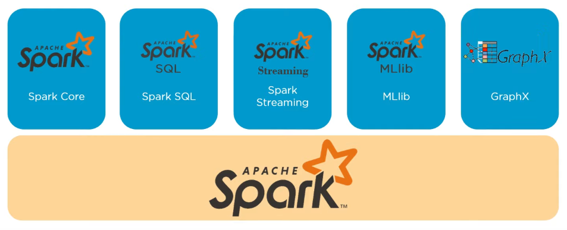

# Introduction To Spark
---
## Big Data and Spark
- Open source data processing engine
- Process data in real-time
- Covers a wide range of workloads
- Interactive algorithms, queries and streaming
- Runs on hadoop clusters, YARN or as a standalone
- Better than Hadoop MapReduce

--- 
## Why spark and who uses it ?

#### Fast Processing
- In memory, parallel computation which results in faster processing speed
- Utilizes Resilient Distributed Datasets (RDD) 

#### In - Memory Computing
- Data is stored in RAM so it can access the data quickly

#### Flexibility
- APIs for Scala, Python and Java

#### Fault Tolerance
- RDDs that a designed to handle the failure of worker nodes in the cluster

#### Better Analytics
- Wide range of libraries including SQL, ML, streaming and graph processing

#### Who uses it ?
- Data scientists
	- Analyze models to obtain insights
	- Transforming data and performing statistical analysis, SQL queries, ML
- Engineers
	- Develop data processing systems or applications
	- Inspect and tune applications
	- Programming with the Spark's API
- ETC

---
## Spark Stack

### Components
- The core component of spark that takes care of processing and has RDDs
- Spark SQLs for structured data  
- Spark streaming for apps that stream data, or constantly being generated
- ML lib, libraries for ML algorithims and analytics
- GraphX was network related data, or data with a network graph structure

### Spark core
- Large scale parallel distributed processing
- Responsible for memory mangemenet
- Fault Recovery
- Scheduling, distributing and monitoring jobs on a cluster
- Interacting with strorage systems
- Spark itself does not have its storage, it relies on storage from other systems

### Resilient Distributed Dataset
- Spark core is embedded with RDDs
- They are fault tolerant, distributed collection of objects that operates in parallel
- Transformations
	- Operators such has map, filter, join that is performed on an RDD that yields a new RDD
	- Creates a DAG (Direct Acyclic Graphs)
- Action
	- Operations such as reduce, first, sum, count, etc, that return a value after running on an RDD
- All transformations are execution logic, or a series of steps that are executed after an action is invoked.
- If it does not fit in memory it will spill to disk