# AWS Cloud notes

## Contents
  - [Module 1 : Cloud Concepts Overview](#module-1--cloud-concepts-overview) [[awsCloudNotes#Module 1 Cloud Concepts Overview|obs --> link]]
  - [Module 2 : Cloud Economics & Billing](#module-2--cloud-economics--billing) [[awsCloudNotes#Module 2 Cloud Economics Billing|obs --> link]]
  - [Module 3 : AWS Global Infrastructure Overview](#module-3--aws-global-infrastructure-overview) [[awsCloudNotes#Module 3 AWS Global Infrastructure Overview|obs --> link]]
  - [Module 4 : AWS Cloud Security](#module-4--aws-cloud-security) [[awsCloudNotes#Module 4 AWS Cloud Security|obs --> link]]
  - [Module 5 : Networking and Content Delivery](#module-5--networking-and-content-delivery) [[awsCloudNotes#Module 5 Networking and Content Delivery|obs --> link]]
  - [Module 6 : Compute](#module-6--compute)
  - [Module 7 : Storage](#module-7--storage)
  - [Module 8 : Databases](#module-8--databases)
  - [Module 9 : Cloud Architecture](#module-9--cloud-architecture)
  - [Module 10 : Auto-Scaling and Monitoring](#module-10--auto-scaling-and-monitoring)

---

## Module 1 : Cloud Concepts Overview

[ To the top ](#contents)

### Cloud Computing
- It is the on demand delivery of computing power, DB storage, and other resources
- Pay-as-you-go pricing
- Using computers/resources owned by the service provider
- Think of it as software not hardware
- Removes undifferentiated heavy lifting

### Hardware vs Software

<h4 style="color:#f08f18"> Hardware </h4>

- Requires space, staff, security, planning, and capital expenditure, as it's physical
- Takes a long time to acquire, provision and maintain the physical infrastructure
- If full capacity of hardware not being used --> money wasted.
- If you require more capacity --> downtime on services while upgrading 

<h4 style="color:#f08f18"> Software </h4>

- Thinking of it as software, select services that match needs required 
- Pay for what you use, and use it when you need to
- Flexible with scaling capacity  

### Cloud Service Models
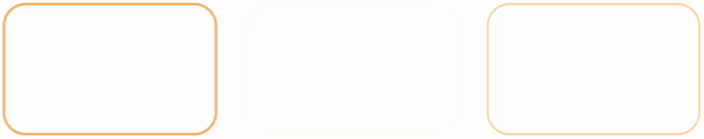

<ul>
	<li><b style="color:#f08f18">IaaS</b></li>
	<ul>
		<li>Services for cloud IT such as networking features or data storage space</li>
		<li>Provides you with the highest level of flexibility and control of your resources</li>
	</ul>
	<li><b style="color:#f08f18">PaaS</b></li>
	<ul>
		<li>Services that reduce the need to manage underlying infrastructure (hardware and OS)</li>
		<li>Allows you to focus on the deployment of you applications</li>
	</ul>
	<li><b style="color:#f08f18">SaaS</b></li>
	<ul>
		<li>Services that provide you with a completed product that the provider manages</li>
		<li>An example would be web-based-email where you do not manage extra features or maintain the servers and OS</li>
	</ul>
</ul>

### Deployment models
<ul>
	<li><b style="color:#f08f18">Cloud</b></li>
	<ul>
		<li>Fully deployed in the cloud</li>
		<li>Can be built on low level infrastructure or higher-level services that provide abstraction</li>
	</ul>
	<li><b style="color:#f08f18">Hybrid</b></li>
	<ul>
		<li>A way to connect infrastructure & applications between cloud based models</li>
		<li>Allows you to focus on the deployment of you applications</li>
	</ul>
	<li><b style="color:#f08f18">On-premises</b></li>
	<ul>
		<li>Deploying resources on premise ("private cloud")</li>
		<li>Does not [</li>
	</ul>
</ul>

### Advantages of Cloud Computing
<ul>
	<li><b style="color:#f08f18">Trade capital expense for variable expense</b></li>
	<ul>
		<li>Pay only for when you use and consume resource and save on physical hardware</li>
	</ul>
  <li><b style="color:#f08f18">Massive Economies of Scale</b></li>
	<ul>
		<li>Benefit from the aggregate usage from all customers, pass savings onto customers</li>
	</ul>
  <li><b style="color:#f08f18">Variable Capacity</b></li>
	<ul>
		<li>Scale up/down as required</li>
	</ul>
  <li><b style="color:#f08f18">Speed & Agility</b></li>
	<ul>
		<li>Resources that are required are obtainable within minutes as opposed to weeks</li>
	</ul>
  <li><b style="color:#f08f18">No spending on running/maintaining physical DCs</b></li>
	<ul>
		<li>All handled by the cloud DCs</li>
	</ul>
  <li><b style="color:#f08f18">Global</b></li>
	<ul>
		<li>Deploy applications globally</li>
	</ul>
</ul>


### What are web services
- A piece of software that makes itself available of the internet
- Uses a standardized format such as <text style="color:#f08f18">XML</text> or <text style="color:#f08f18">JSON</text> for API responses

### What is AWS
- A secure cloud platform that offers cloud-based products
- Flexible and services work together as building blocks

### Categories of AWS services and covered in the course
<p>
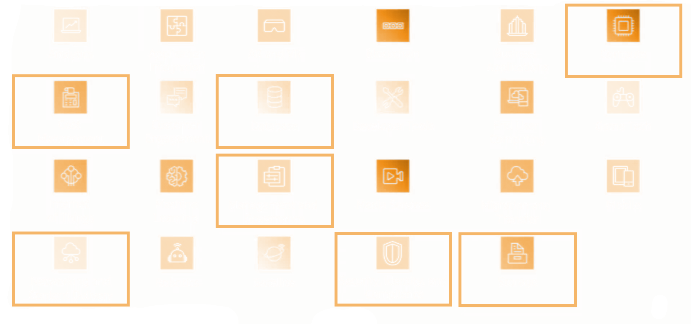
</p>

### Ways to interact with AWS
- AWS Management Console
- Command Line Interface (AWS CLI)
- SDKs

### AWS Cloud Adoption Framework (CAF)
- People, process and technology must be in alignment
- For business to migrate to the cloud, they must understand different states within the businesses
- AWS CAF provides guidance and best practices to help build a successful approach to cloud computing 

<h4 style="color:#f08f18"> Business </h4>

- Stakeholders ensure strategies and goals align with IT 

<h4 style="color:#f08f18"> People </h4>

- HR/managers/etc prioritize staffing, training and organizational change 

<h4 style="color:#f08f18"> Governance </h4>

- CIO, enterprise architects, BAs, etc use AWS to align goals and minimize risk

<h4 style="color:#f08f18"> Platform </h4>

- CTO, IT managers, solutions architects must understand nature of IT systems and relationships.
- Describe the environment in detail

<h4 style="color:#f08f18"> Security </h4>

- CISO, IT security, can use AWS framework to meet whatever security objectives they need

<h4 style="color:#f08f18"> Operations </h4>

- IT operations/support managers, support define how business will be conducted

--- 

## Module 2 : Cloud Economics & Billing

[ To the top ](#contents)

### AWS pricing model
<ul>
	<li><b style="color:#f08f18">Compute</b></li>
	<ul>
		<li>Charged per hour/second</li>
    <li>Varies by instance</li>
	</ul>
  <li><b style="color:#f08f18">Storage</b></li>
	<ul>
		<li>Charged typically per GB</li>
	</ul>
  <li><b style="color:#f08f18">Data Transfer</b></li>
	<ul>
		<li>Outbound aggregated and charged</li>
    <li>Inbound no charge</li>
    <li>Charged typically per GB</li>
	</ul>
</ul>

### Paying for AWS
- Pay for what you use
- Pay less when you reserver
- Pay less when you use more (Tiered pricing)
- No upfront expenses

### Total Cost of Ownership (TCO)

This is the financial estimate to help identify direct and indirect cost of a system.
The considerations are
- Server Costs
- Storage Costs
- Network Costs
- IT Labor Costs

### Pricing calculator
- The estimates and costs of everything for AWS cloud
- A bunch of benefits from reduced spending to agile business processes 

### AWS Organizations
- Account management service for multiple AWS accounts
- OU - A branch for multiple accounts
- Apply security and service polices for accounts
- Create Organization -> Create Organization units -> Create service control policies -> Test restrictions
- Can be accessed from AWS management console, AWS CLI, SDKs and APIs

### AWS Billing
- Just tools to look at billing with various tools that show what you are using
- Tools : AWS -/ Budgets / Cost and Usage Report  / Cost Explorer

### AWS Support
- Account assistance
  - AWS support concierge
- Best practices
  - AWS Trusted Advisor
- Proactive guidance
  - Technical Account manager
- Support Plans : Basic, Dev, Business and Enterprise

--- 

## Module 3 : AWS Global Infrastructure Overview

[ To the top ](#contents)

### Global Infrastructure
- Designed and built to deliver a flexible, reliable, scalable and secure cloud computing environment
- Provides high quality global network performance

### AWS Region
- A geographical area
- Consist of two or more Availability zones
- An availability zone contains 1 ore more DC
- Data is not replicated outside the given region

### Selecting a Region
- Consider the data governance and legal requirements restricts regions
- Proximity to customers affect latency
- Not all AWS services are available in every region
- Costs vary by region

### Availability Zones
- Each zone is an isolated partition of the AWS infrastructure
- Consists of discrete data centers
- Designed for fault isolation
- Interconnected by a private network
- Recommend replicating data/resources across zones

### AWS Data Centers
- They are designed for security
- Where data lives and is processed
- Each DC is separate and has redundant power, networking and connectivity
- 50k - 80k physical servers

#### DCs Design
- Mitigate environmental risk
- Anticipates and tolerates failure
- Critical components are backed up across multiple AZs
- DC locations are confidential
- If failure occurs, the traffic of data is diverted

### Points of Presence
- PoP locations around the globe
- Consists of edge locations and regional edge caches
- Routes requests by measuring connectivity, performance and computing
- Provides better real-time user experience
- Content that is not used frequently is absorbed by regional edge caches

### AWS infrastructure features
<ul>
	<li><b style="color:#f08f18">Elasticity and scalability</b></li>
	<ul>
		<li>Dynamically adjust capacity and scalable to accommodate growth</li>
	</ul>
  <li><b style="color:#f08f18">Fault Tolerance</b></li>
	<ul>
		<li>Continues to operate in the presence of a failure</li>
    <li>Built in redundancy</li>
	</ul>
  <li><b style="color:#f08f18">High Availability</b></li>
	<ul>
		<li>High level of operational performance</li>
    <li>Minimal downtime</li>
    <li>Little to no human intervention</li>
	</ul>
</ul>

### Key takeaways
- Global Infrastructure consists of Regions and AZs
- Choice of Region depends on your needs such as compliance requirements or to reduces latency
- Each AZ is physically independent of one another
- Performance for users is improved by caching content 

### AWS Storage Service Category
<ul>
	<li><b style="color:#f08f18">Amazon S3</b></li>
	<ul>
		<li>Service that offers scalability, data availability, security and performance</li>
	</ul>
  <li><b style="color:#f08f18">Amazon EBS</b></li>
	<ul>
		<li>High performance block storage designed to be used with EC2 for intensive workloads</li>
	</ul>
  <li><b style="color:#f08f18">Amazon EFS</b></li>
	<ul>
		<li>Scalable elastic network file system</li>
	</ul>
  <li><b style="color:#f08f18">Amazon Glacier</b></li>
	<ul>
		<li>Low cost AWS S3 storage class for data archiving and long term backup</li>
	</ul>
</ul>

### AWS Compute Service Category
<ul>
	<li><b style="color:#f08f18">Amazon EC2</b></li>
	<ul>
		<li>Resizable compute capacity as VMs in the cloud</li>
	</ul>
  <li><b style="color:#f08f18">Amazon EC2 Auto Scaling</b></li>
	<ul>
		<li>Automatically add or remove EC2 instances as desired</li>
	</ul>
  <li><b style="color:#f08f18">Amazon ECS</b></li>
	<ul>
		<li>Scalable containers that support docker containers</li>
	</ul>
  <li><b style="color:#f08f18">Amazon EC2 Registry</b></li>
	<ul>
		<li>Make it easier to store, manage and deploy docker containers</li>
	</ul>
  <li><b style="color:#f08f18">Amazon Elastic Beanstalk</b></li>
	<ul>
		<li>Deploying and scaling web applications</li>
	</ul>
  <li><b style="color:#f08f18">Amazon EKS</b></li>
	<ul>
		<li>For applications that use Kubernetes on AWS</li>
	</ul>
  <li><b style="color:#f08f18">AWS Lambda</b></li>
	<ul>
		<li>Run code without provisioning or managing servers</li>
	</ul>
  <li><b style="color:#f08f18">AWS Fargate</b></li>
	<ul>
		<li>For ECS to run containers without managing clusters or servers</li>
	</ul>
  <li><b style="color:#f08f18">Amazon Lightsail</b></li>
	<ul>
		<li>Launch a straightforward simple web application</li>
	</ul>
  <li><b style="color:#f08f18">AWS Outposts</b></li>
	<ul>
		<li>When you want to run AWS infrastructure in on-premise DCs</li>
	</ul>
</ul>

### AWS Database Service Category
<ul>
	<li><b style="color:#f08f18">Amazon Relational DB (RDB) Service</b></li>
	<ul>
		<li>RDB in the cloud</li>
	</ul>
  <li><b style="color:#f08f18">Amazon Aurora</b></li>
	<ul>
		<li>MySQL and postgresSQL compatible RDB</li>
	</ul>
  <li><b style="color:#f08f18">Amazon Redshift</b></li>
	<ul>
		<li>Enables to run analytical queries against large sets of data</li>
	</ul>
  <li><b style="color:#f08f18">Amazon DynamoDB</b></li>
	<ul>
		<li>A K-V document noSQL DB</li>
	</ul>
</ul>

### AWS Networking & Content Delivery Service Category
<ul>
	<li><b style="color:#f08f18">Amazon VPC</b></li>
	<ul>
		<li>Launch AWS resources in a virtual network you define</li>
	</ul>
  <li><b style="color:#f08f18">Elastic Load Balancing</b></li>
	<ul>
		<li>Automatically distribute incoming traffic across multiple targets such as EC2 or lambda</li>
	</ul>
  <li><b style="color:#f08f18">Amazon CloudFront</b></li>
	<ul>
		<li>A CDN that delivers data, videos, APIs, and more globally</li>
	</ul>
  <li><b style="color:#f08f18">AWS Transit Gateway</b></li>
	<ul>
		<li>Connect VPC and on-premise network to a centrally managed gateway</li>
	</ul>
  <li><b style="color:#f08f18">Amazon Route 53</b></li>
	<ul>
		<li>Cloud domain name system used to route end users to internet applications</li>
	</ul>
  <li><b style="color:#f08f18">AWS Direct Connect</b></li>
	<ul>
		<li>A dedicated private network connection from your own DCs to AWS</li>
	</ul>
  <li><b style="color:#f08f18">AWS VPN</b></li>
	<ul>
		<li>A VPN to the AWS global network</li>
	</ul>
</ul>

^4cce0e

### AWS Security, Identity & Compliance Service Category
<ul>
	<li><b style="color:#f08f18">AWS IAM</b></li>
	<ul>
		<li>Securely access AWS services and resources</li>
	</ul>
  <li><b style="color:#f08f18">AWS Organizations</b></li>
	<ul>
		<li>Manage multiple AWS accounts and restrict and manage services for accounts</li>
	</ul>
  <li><b style="color:#f08f18">Amazon Cognito</b></li>
	<ul>
		<li>Add user authentication to web and mobile applications</li>
	</ul>
  <li><b style="color:#f08f18">AWS Artifact</b></li>
	<ul>
		<li>Provides access to AWS security reports and online agreements</li>
	</ul>
  <li><b style="color:#f08f18">AWS Key Management Service</b></li>
	<ul>
		<li>Create and manage encryption keys, control encryption for all applications and services</li>
	</ul>
  <li><b style="color:#f08f18">AWS Shield</b></li>
	<ul>
		<li>Protection for DDoS on applications running on AWS</li>
	</ul>
</ul>

### AWS Cost Management Service Category
<ul>
	<li><b style="color:#f08f18">AWS Cost and Usage Report</b></li>
	<ul>
		<li>Comprehensive AWS service costs and usage data</li>
	</ul>
  <li><b style="color:#f08f18">AWS Budgets</b></li>
	<ul>
		<li>Set custom budgets for AWS services and alerts</li>
	</ul>
  <li><b style="color:#f08f18">AWS Cost Explorer</b></li>
	<ul>
		<li>Visualize, understand and manage AWS service usage overtime</li>
	</ul>
</ul>

### AWS Management & Governance Service Category
<ul>
	<li><b style="color:#f08f18">AWS Management Console</b></li>
	<ul>
		<li>Web based user interface used to manage your AWS account</li>
	</ul>
  <li><b style="color:#f08f18">AWS Config</b></li>
	<ul>
		<li>Track service inventory and changes</li>
	</ul>
  <li><b style="color:#f08f18">Amazon CloudWatch</b></li>
	<ul>
		<li>Monitor resources and applications</li>
	</ul>
  <li><b style="color:#f08f18">AWS Auto Scaling</b></li>
	<ul>
		<li>Automatically scale resources to meet demand</li>
	</ul>
  <li><b style="color:#f08f18">AWS CLI</b></li>
	<ul>
		<li>Unified tool to manage AWS services</li>
	</ul>
  <li><b style="color:#f08f18">AWS Trusted Advisor</b></li>
	<ul>
		<li>Optimize performance and security</li>
	</ul>
  <li><b style="color:#f08f18">AWS Well-Architected Tool</b></li>
	<ul>
		<li>Provides help to review and manage workloads</li>
	</ul>
  <li><b style="color:#f08f18">AWS Cloud Trail</b></li>
	<ul>
		<li>Tracks user activity and API usage across accounts</li>
	</ul>
</ul>

--- 

## Module 4 : AWS Cloud Security

[ To the top ](#contents)

<p>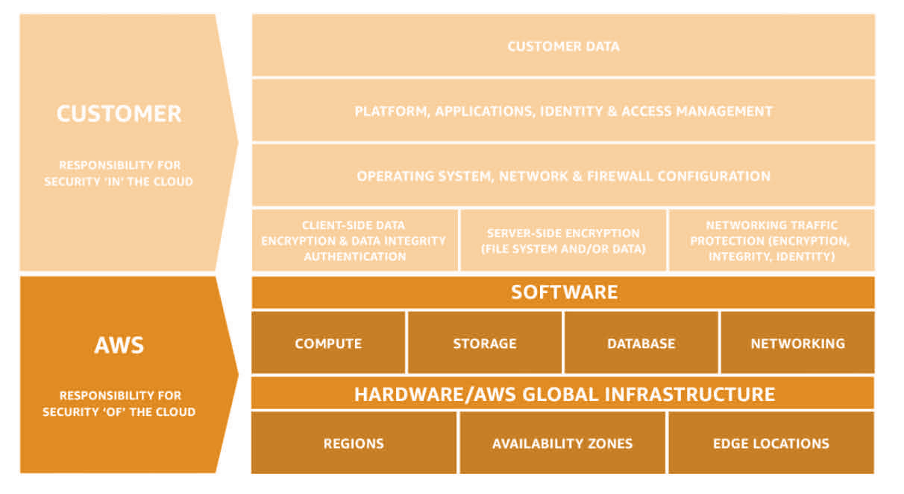</p>

### AWS responsibility: Security of the cloud
AWS are responsible for protecting ...
<ul>
	<li><b style="color:#f08f18">Physical security of data centers</b></li>
	<ul>
		<li>Controlled, need-based access</li>
	</ul>
  <li><b style="color:#f08f18">Hardware and software infrastructure</b></li>
	<ul>
		<li>Storage decommissioning, host operating system; access logging and auditing</li>
	</ul>
  <li><b style="color:#f08f18">Network Infrastructure</b></li>
	<ul>
		<li>Intrusion detection</li>
	</ul>
  <li><b style="color:#f08f18">Virtualization Infrastructure</b></li>
	<ul>
		<li>Instance Isolation between customer workload</li>
	</ul>
</ul>

### Customer responsibility: Security in the cloud
Customers are responsible for protecting ...
<ul>
	<li><b style="color:#f08f18">Amazon EC2 OS</b></li>
	<ul>
		<li>Securing the OS of the instance including patching and maintenance</li>
	</ul>
  <li><b style="color:#f08f18">Applications</b></li>
	<ul>
		<li>Passwords, role-based access, etc</li>
	</ul>
  <li><b style="color:#f08f18">OS or host based firewalls</b></li>
	<ul>
		<li>Including intrusion detection or prevention systems</li>
	</ul>
  <li><b style="color:#f08f18">Network Configurations</b></li>
  <li><b style="color:#f08f18">Account management</b></li>
	<ul>
		<li>Login and permission settings for users</li>
	</ul>
</ul>


### Service characteristics and security responsibility
<ul>
	<li><b style="color:#f08f18">Infrastructure as a Service (IaaS)</b></li>
	Customers have...
  <ul>
		<li>Flexibility over networking and storage config settings</li>
    <li>Responsibility for managing more aspects of the security</li>
    <li>Access to access controls and can configure it</li>
    <li>Example services : Amazon EC2/EBS/VPC</li> 
  </ul>
  <li><b style="color:#f08f18">Platform as a Service (PaaS)</b></li>
	Customers...
  <ul>
		<li>Do not manage the underlying infrastructure</li>
    <li>Do not handle the OS, DB patching or firewall configs and disaster recovery</li>
    <li>Focus on managing code or data</li>
    <li>Example services : Amazon RDS, AWS Lambda/Elastic Beanstalk</li>
	</ul>
  <li><b style="color:#f08f18">Security as a Service (SaaS)</b></li>
  <ul>
		<li>Software is centrally hosted</li>
    <li>Licensing is Subscription or pay-as-you-go</li>
    <li>Accessed via web/mobile app or an API</li>
    <li>Customers do manage the infrastructure that supports the service</li>
	</ul>
</ul>

### AWS Identity and Access Management (IAM)

<ul>
	<li><b style="color:#f08f18">Free to use</b></li>
  <li><b style="color:#f08f18">Use IAM to manage access to AWS resources</b></li>
  <ul>
		<li>A resource is an entity in an AWS account that you can work with</li>
    <li>Example resources; An Amazon EC2 instance or an Amazon S3 bucket</li>
  </ul>
  <li><b style="color:#f08f18">Control who can terminate Amazon EC2 Instances</b></li>
  <li><b style="color:#f08f18">Define detailed access rights</b></li>
  <ul>
		<li>Who, Which, How .. can manipulate and use resources</li>
	</ul>
</ul>

### Essential Components
<ul>
	<li><b style="color:#f08f18">User</b></li>
  <ul>
		<li>A person/application that can authenticate with an AWS account, a unique no-space name and a way to identify themselves</li>
	</ul>
  <li><b style="color:#f08f18">Group</b></li>
  <ul>
		<li>A group with specific settings in which you can add users to auto assign the polices defined by the group</li>
  </ul>
  <li><b style="color:#f08f18">Policy</b></li>
  <ul>
		<li>A document that defines which resources can be accessed and can be attached to a user</li>
	</ul>
  <li><b style="color:#f08f18">Role</b></li>
  <ul>
		<li>Grants temporary access to the defined permissions.</li>
	</ul>
</ul>

### Authenticate as an IAM user
When an IAM user is defined, YOU must select the type of access the user is permitted to use.
You can assign both types of access.
<ul>
	<li><b style="color:#f08f18">Programmatic Access</b></li>
  <ul>
		<li>Authenticate using an access key ID & secret access key</li>
    <li>Provides AWS CLI, & AWS SDK access</li>
	</ul>
  <li><b style="color:#f08f18">AWS Management Console Access</b></li>
  <ul>
		<li>Authenticate using Account ID/alias & IAM user/pass</li>
    <li>Can also use MFA (multi-factor-authentication) if enabled (recommended to be enabled)</li>
  </ul>
</ul>

### Authorization
<ul>
	<li><b style="color:#f08f18">Assign permissions by creating an IAM policy</b></li>
  <li><b style="color:#f08f18">Perms are used to let users access resources and operations</b></li>
  <ul>
		<li>All denied by default - must enable which ones are allowed</li>
    <li>Explicitly denied = Never allowed</li>
  </ul>
  <li><b style="color:#f08f18">Principle of Least Privilege</b></li>
  <ul>
		<li>Only allow the absolute minimum that is required for the user to complete task</li>
  </ul>
  <li><b style="color:#f08f18">Scope for IAM service configs is global across AWS Regions</b></li>
</ul>

^42dea5

### Policies
<ul>
	<li><b style="color:#f08f18">A JSON document that lists and defines permissions</b></li>
  <li><b style="color:#f08f18">Identity-based policies</b></li>
	<ul>
		<li>Attach a policy to any IAM entity (user, group or role)</li>
    <li>Policy defines actions that may/or may not be performed by the entity</li>
    <li>Policy --> Multiple Entities</li>
    <li>Entity --> Multiple Policies</li>
	</ul>
  <li><b style="color:#f08f18">Resource-based polices</b></li>
  <ul>
		<li>Attached to a resource (S3 Bucket, etc)</li>
	</ul>
</ul>

#### Policy Example
Denies take precedence over allows
```JSON
{
  "Version" : "2012-10-17",
  "Statement" : [
    {
      "Effect" : "Allow",
      "Action" : ["DynamoDB:*", "s3:*"],
      "Resource" : [
        "arn:aws:dynamodb:region:account-number:table/table-name",
        "arn:aws:s3:::bucket-name",
        "arn:aws:s3:::bucket-name/*"
      ]
    },
    {
      "Effect" : "Deny",
      "Action" : ["DynamoDB:*", "s3:*"],
      "NotResource" : [
        "arn:aws:dynamodb:region:account-number:table/table-name",
        "arn:aws:s3:::bucket-name",
        "arn:aws:s3:::bucket-name/*"
      ]
    }
  ]
}
```

#### Policy Structure Explanation
The basic structure of the statements in an IAM Policy is:
- Effect says whether to Allow or Deny the permissions.
- Action specifies the API calls that can be made against an AWS Service (eg cloudwatch:ListMetrics).
- Resource defines the scope of entities covered by the policy rule (eg a specific Amazon S3 bucket or Amazon EC2 instance, or * which means any resource).

#### Permission flowchart
<p>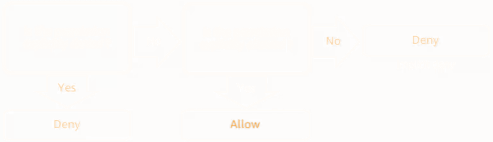</p>

### IAM Groups
- A collection of IAM users
- Used to grant the same perms to all users in the group
- A user can belong to many groups
- No default groups
- No nested groups

### IAM Roles
- An IAM identity with specific permissions
- Attach permission polices to it
- To be assumable by a service, application or person
- Provides temporary security credentials

### Securing a new AWS Account

<h4 style="color:#f08f18"> Root User </h4>

- Do not use the AWS root user except when necessary
- Has access to all resources
- Privileges cannot be controlled

<h4 style="color:#f08f18">Steps to stop using the root user account</h4>

1. Create an <b> IAM user </b> for yourself while logged in as the root user.
   - Enable MFA for root user for more security
2. Create an <b> IAM group </b>, add the user(you) to the group and give full admin perms
3. If your account has <b>root access keys</b>, disable and remove them ^9310af
4. <b>Enable</b> a <b>password policy</b> for all users
   - Recommended to have MFA requirement enabled for all users
5. Sign in with the <b>IAM user</b> credentials (the one you created in the first step)
6. Safely and securely store your <b>root account</b> user credentials

<h4 style="color:#f08f18">Cloud Trail</h4>

- Use CloudTrail to track user activity on the account and basic version is free
- Keeps a log for up to 90 days, and can create alerts
- Can configure which uses have access to logs

<h4 style="color:#f08f18">Billing Reports</h4>

- Can use billing report to see estimated and actual costs for AWS resources
- Reports are tracked and updated daily

### AWS Organizations

<h4 style="color:#f08f18">Security Features</h4>

- Group AWS accounts into organizational units (OUs) and attach different polices to each OU
- Integration and support for IAM
  - Perms for a user is the intersection of the User account & OU
- Have control over the AWS services and API actions that each AWS can access

<h4 style="color:#f08f18">Control Policies</h4>

- Ensures that accounts comply with access control guidelines
- Similar to IAM perms,  they do not grant perms but specify max perms for organizations

### AWS Key Managment Service
- Enables you to create and manage encryption keys
- Can also import your own encryption infrastructure 
- Control encryption across all AWS services and applications
- AWS CloudTrail to log all key usage

### Amazon Cognito
- Add user sign-up/in and control access to web/mobile applications
- Scales with users
- Supports sign-in with major social (Google, FB, etc) and enterprise (Microsoft via SAML) identity providers 
- Helps meet multiple security and compliance requirements including highly 

### AWS Shield
- Is a managed DDoS protection service
- Safeguards applications running on AWS
- Provides always on detection automatic mitigation, which minimize application downtime and latency
- Protection against UDP/TCP SYN/ HTTP GET/POST floods
- Free and advance versions

### Securing Data

### Encryption

<h4 style="color:#f08f18">Data At Rest</h4>
Data at rest is the physical data that is stored on disk
<ul>
	<li><b style="color:#">Encryption of data at rest</b></li>
	<ul>
    <li>Encodes the data and makes it unreadable to anyone who does not have the secret key</li>
    <li>AWS KMS manages secret keys</li>
	</ul>
  <li><b style="color:#">Encrypt any data stored in any service supported by AWS</b></li>
</ul>

<h4 style="color:#f08f18">Data in Transit</h4>
Data that is moving across a network
<ul>
	<li><b style="color:#">Encryption of data in transit</b></li>
	<ul>
		<li>Accomplished using an open standard protocol TLS (SSL)</li>
    <li>AWS Certificate manager provides a way to manage, deploy and renew TLS or SSL certs</li>
	</ul>
  <li><b style="color:#">Secure HTTPS </b></li>
</ul>

### Securing Amazon S3 buckets
- New S3 buckets are private and protected by default
- In order to share, change the perms, follow the PoLP and use encryption
- Lots of tools to control S3 data access
  - Amazon S3 block public access
  - Bucket policies must be written carefully 
  - Access control lists
  - AWS Trusted Advisor

### AWS compliance programs
Compliance programs can be categorized as
<ul>
	<li><b style="color:#f08f18">Certifications and attestations</b></li>
	<ul>
		<li>Assessed by a third-party, independent auditor (ISO)</li>
	</ul>
  <li><b style="color:#f08f18">Laws, regulations and privacy</b></li>
	<ul>
		<li>AWS provides security features and legal agreements to support compliance (EU GDPR, HIPAA)</li>
	</ul>
  <li><b style="color:#f08f18">Alignments and frameworks</b></li>
	<ul>
		<li>Industry or function specific security or compliance requirements</li>
		<li>Examples : CIS, EU-US Privacy Certified</li>
	</ul>
</ul>

### AWS Config
- Assess audit and evaluate the configs of AWS resources
- Review config changes and histories of configs
- Used to monitor and evaluate configs

### AWS Artifact
- Is a resource for compliance-related information
- Provides access to security and compliance reports, and select online agreements
- Access AWS artifact from the AWS management console

--- 

## Module 5 : Networking and Content Delivery

[ To the top ](#contents)

### Networking Concepts

<h4 style="color:#f08f18"><b>IP Address</b></h4>
<ul>
  <li>A unique 4 decimal number separated by dots</li>
  <li>IPv4 - 32 bit address - 192.168.0.1</li>
  <li>IPv6 - 128 bit address - 2600:1af2: ... :00FF</li>
</ul>

<h4 style="color:#f08f18"><b>Classless Inter - Domain Routing (CIDR)</b></h4>
<ul>
  <li>A way to express a group of ip address consecutive to each other</li>
</ul>
<p>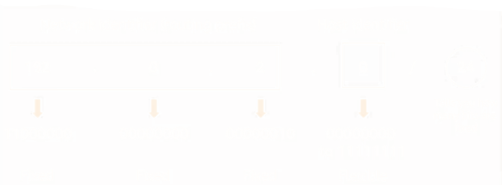</p>

<h4 style="color:#f08f18"><b>Open System Interconnection (OSI) model</b></h4>
<ul>
  <li>Used to explain how communication takes place in the cloud and in the network</li>
</ul>
<p>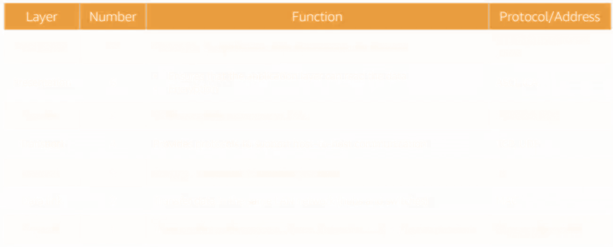</p>

### Amazon VPC
<ul>
  <li>Launch AWS resources in a virtual network that is a logically isolated section of the AWS cloud </li>
  <li>Control over you VN resources such as IP range, subnets and configs of route tables and network gateways</li>
  <li>Use multiple layers of security</li>
</ul>

### VPCs & Subnets
<p>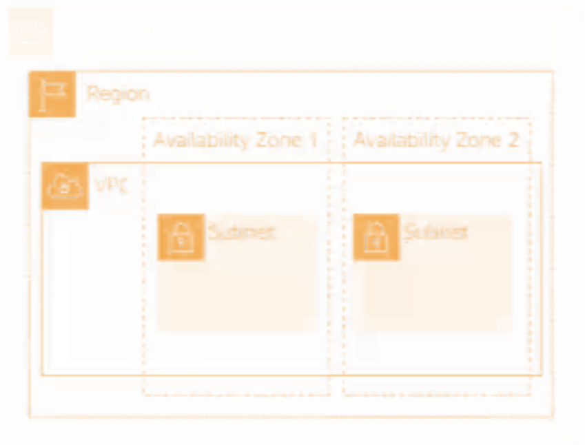</p>
<h4 style="color:#f08f18">VPCs</h4>
<ul>
	<li>Logically Isolated from other VPCs</li>
  <li>Dedicated to you AWS account</li>
  <li>Single AWS region - multiple AZs</li>
</ul>

<h4 style="color:#f08f18">Subnets</h4>
<ul>
	<li>Range of IP addresses that divide a VPC</li>
  <li>Single AZ</li>
  <li>Public or Private</li>
</ul>

### IP Addressing
<ul>
	<li>After creating a VPC, assign it to an IPv4 CIDR block (range of private IP address)</li>
  <li>Cannot be change range after creating the VPC</li>
  <li>IPv4 CIDR block size : min (/28) and max (/16) </li>
  <li>IPv6 is supported </li>
  <li>CIDR blocks of subnets cannot overlap </li>
</ul>

### Reserved IP Address
<p>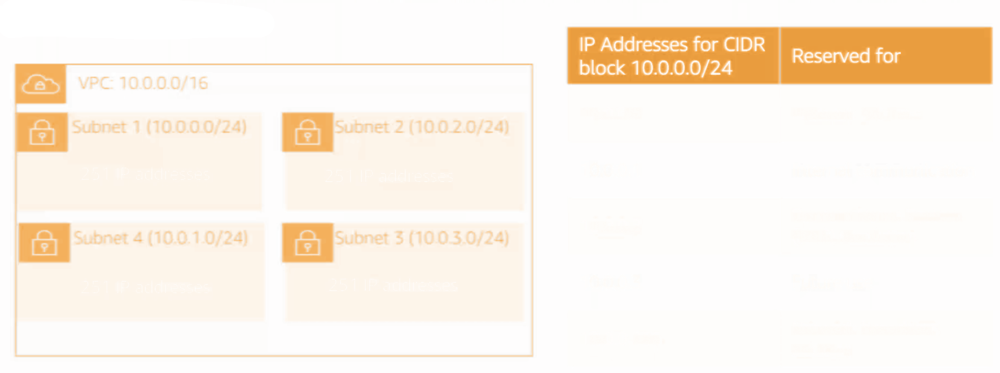</p>


### Public IP Address types
<h4 style="color:#f08f18">Public IPv4</h4>
<ul>
	<li>Manually assigned through an elastic ip address</li>
  <li>Automatically assigned at the subnet level by modifying properties</li>
</ul>

<h4 style="color:#f08f18">Elastic IP address</h4>
<ul>
	<li>A static public IPv4 address</li>
  <li>Associated with an AWS account</li>
  <li>Can be allocated and remapped anytime</li>
  <li>Additional costs may apply, so release when no longer in use</li>
</ul>

### Elastic network interface
<ul>
	<li>A VN interface that you can ...</li>
  <ul>
		<li>Attach to an instance</li>
    <li>Detach from an instance and attach to another in order to redirect network traffic</li>
	</ul>
  <li>Its attributes follow when re-attached</li>
  <li>Each instance in your VPC has a default network interface that is assigned a private IPv4 address from a valid range</li>
</ul>

### Route Tables
<ul>
	<li>Contains configurable rules (routes) to direct network traffic</li>
  <li>Specifies destination (VPC CIDR block) and a target</li>
  <li>Every table contains a local route for internal communication within the VPC</li>
  <li>Each subnet mus be associated with at most 1 route table</li>
  <li>Multiple subnets can be assigned to a route table</li>
</ul>

### Creating an Amazon VPC
Note that steps vary depending on requirements
1. Create an elastic IP that is static and can be readable by the internet
   - `Elastic IPs` ==> `Allocate new address`
2. Create the VPC itself using the wizard 
   - `VPC Dashboard` ==> `VPC with Public and Private Subnets`
3. Fill in the required fields
   - `VPC name` ==> fill in CIDRs, AZs & Subnet names ==> Fill in EIP from Step 1 ==> `Create VPC`


### VPC networking

### Internet Gateway
Allows for communication between instance in VPC and the public internet
<ul>
	<li>Provides a target in route tables for internet traffic</li>
  <li>Perform network address translations to instances that were assigned public IPs</li>
  <li>Attach an internet gateway to the VPC then add a route table associated with the subnet</li>
</ul>

<p>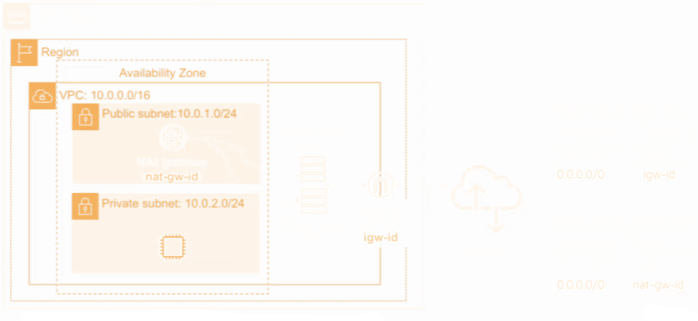</p>

### Amazon Route 53
<ul>
	<li>Is a highly available and scalable DNS web service</li>
  <li>Routes end users to internet apps by translating domain names into IP addresses</li>
  <li>Compliant with IPv4 and IPv6</li>
  <li>Connects requests to infrastructure running in and outside of AWS</li>
  <li>Features traffic flow</li>
  <li>Enables you to register domain names</li>
</ul>

### Amazon Route 53 Supported Routing
<ul>
	<li><b style="color:#f08f18">Simple</b></li>
  <p>Used in single server environments</p>

  <li><b style="color:#f08f18">Weighted</b></li>
  <p>Assign weights to resource record sets to specify the frequency</p>
  
  <li><b style="color:#f08f18">Latency</b></li>
  <p>Helps improve global applications</p>

  <li><b style="color:#f08f18">Geo-location</b></li>
  <p>Route traffic based on location of your users</p>

  <li><b style="color:#f08f18">Geo-proximity</b></li>
  <p>Route traffic based on location of your resources</p>

  <li><b style="color:#f08f18">Failover</b></li>
  <p>Fail over to a backup site if your primary site becomes unreachable</p>
  
  <li><b style="color:#f08f18">Multi-value answer</b></li>
  <p>Respond to DNS queries with up to eight healthy records selected at random</p>
</ul>

### Amazon Route 53 DNS Failover
<ul>
	<li>Configure backup and failover scenarios for your own apps</li>
  <li>Routes end users to internet apps by translating domain names into IP addresses</li>
  <li>Enable multi-region architecture on AWS</li>
  <li>Create health checks</li>
</ul>

### Amazon CloudFront
<ul>
	<li>Fast, global and secure CDN service</li>
  <li>Global network of edge locations and regional edge caches</li>
  <li>Self service model and pay-as-you-go</li>
</ul>

### Amazon CloudFront Infrastructure
<ul>
	<li><b style="color:#f08f18">Edge Locations</b></li>
	<ul>
		<li>Network of data centers that CloudFront uses to serve popular content quickly</li>
	</ul>
  <li><b style="color:#f08f18">Regional Edge Cache</b></li>
	<ul>
		<li>CloudFront location that caches content that is not popular enough</li>
	</ul>
</ul>

--- 

## Module 6 : Compute

[ To the top ](#contents)


### Categorizing compute services
<p>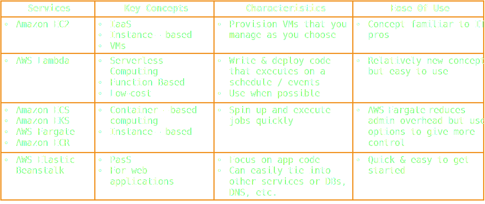</p>

#### Choosing the optimal compute services
<ul>
	<li><b style="color:#f08f18">Depends on use case</b></li>
  <li><b style="color:#f08f18">Some Aspects to Consider</b></li>
	<ul>
		<li>What is  your application design ?</li>
    <li>What are you usage patterns ?</li>
    <li>What config settings do you want to manage</li>
	</ul>
  <li><b style="color:#f08f18">Selecting the wrong solution can lead to lower performance</b></li>
</ul>

### Amazon EC2 Overview
<ul>
	<li><b style="color:#f08f18">Amazon EC2</b></li>
	<ul>
		<li>Provides VMs referred to as EC2 instances in the cloud</li>
    <li>Gives you full control over the guest OS on each instance</li>
    <li>What config settings do you want to manage</li>
	</ul>
  <li><b style="color:#f08f18">Launch instance of any size into an AZ </b></li>
  <ul>
		<li>Launch instance from AMI and ready in minutes</li>
	</ul>
  <li><b style="color:#f08f18">Can control traffic to and from instances</b></li>
</ul>

### Amazon EC2 Launch Wizard

<h4><b> 1. Select an AMI </b></h4>
<ul>
	<li><b style="color:#f08f18">Amazon Machine Image AMI</b></li>
	<ul>
		<li>A template used to create an EC2 instance (a VM that runs in the AWS cloud)</li>
    <li>Windows or Linux OS</li>
    <li>Some software pre-installed</li>
	</ul>
  <li><b style="color:#f08f18">AMI choices</b></li>
  <ul>
		<li>Quick Start - Linux and Windows OS provided by AWS</li>
    <li>MY AMIs - Your own AMI</li>
    <li>AWS Marketplace - Pre-configured templates from third parties</li>
    <li>Community AMIs = AMIs shared by others</li>
	</ul>
</ul>
Creating an AMI
<p></p>

<h4><b> 2. Select an instance type </b></h4>
<ul>
	<li><b style="color:#f08f18">Consider you use case</b></li>
	<ul>
		<li>How will it be used ?</li>
	</ul>
  <li><b style="color:#f08f18">Instance ype that you choose determine</b></li>
  <ul>
		<li>Memory (RAM)</li>
    <li>Processing POwer (CPU)</li>
    <li>Disk Space and Type (Storage) </li>
    <li>Network Performance</li>
	</ul>
  <li><b style="color:#f08f18">Instance type categories</b></li>
  <ul>
		<li>General purpose, Compute/Memory/Storage Optimized, Accelerated computing</li>
	</ul>
  <li><b style="color:#f08f18">Instance type offer family generation and size</b></li>
</ul>

#### Use case of an instance type
<ul>
	<li><b style="color:#f08f18">General Purpose</b></li>
	<ul>
		<li>Baseline CPU performance, web apps, dev environments, code repositories </li>
	</ul>
  <li><b style="color:#f08f18">Compute Optimized</b></li>
  <ul>
		<li>Scientific modelling, batch processing, scalable multi-player games, video encoding</li>
	</ul>
  <li><b style="color:#f08f18">Memory Oprtimized</b></li>
  <ul>
		<li>High performance DBs, data  mining and analysis, real time processes of unstructured big data</li>
	</ul>
</ul>

<h4><b> 3. Specify network settings </b></h4>
<ul>
	<li><b style="color:#f08f18">Where should the instance be deployed</b></li>
	<ul>
		<li>Identify the VPC and optionally the subnet</li>
    <li>Can also create VPCs or Subnets for instance</li>
	</ul>
  <li><b style="color:#f08f18">Should a public IP address be automatically assigned ?</b></li>
  <ul>
		<li>To make it internet - accessible</li>
	</ul>
</ul>

<h4><b> 4. Attach an IAM role </b></h4>
<b>Never store AWS credentials on an EC2 instance </b>
<ul>
	<li><b style="color:#f08f18">Will software on the EC2 instance need to interact with other AWS services ?</b></li>
	<ul>
		<li>Yes ? Then attach role</li>
	</ul>
  <li><b style="color:#f08f18">An AWS IAM role attached to EC2 is kept in an instance profile</b></li>
  <li><b style="color:#f08f18">Can also attach a role to an instance that already exists</b></li>
</ul>

<h4><b> 5. User Data Script </b></h4>
<ul>
	<li><b style="color:#f08f18">Optional to define a user data script at launch</b></li>
	<ul>
		<li>Used to automatically install and configure at instance launch</li>
    <li>Like fetch and install software, apply patches, etc</li>
	</ul>
</ul>

<h4><b> 6. Specify Storage </b></h4>
<ul>
	<li><b style="color:#f08f18">Configure the root volume</b></li>
	<ul>
		<li>Where the guest OS is installed</li>
	</ul>
  <li><b style="color:#f08f18">Attach additional storage volumes (optional)</b></li>
	<ul>
		<li>AMI might already include more than one volume</li>
	</ul>
  <li><b style="color:#f08f18">Fore each volume, specify:</b></li>
	<ul>
		<li>The size of the disk (in GB)</li>
    <li>Volume Type (SSDs or HDDs)</li>
    <li>Volume is deleted when instance is terminated</li>
    <li>If encryption should be used</li>
	</ul>
</ul>

<h4> Storage Options </h4>
<ul>
	<li><b style="color:#f08f18">Amazon EBS</b></li>
	<ul>
		<li>Durable block level storage volumes</li>
    <li>Can stop & and start instance and data will still be there</li>
	</ul>
  <li><b style="color:#f08f18">Amazon EC2 Instance store</b></li>
	<ul>
		<li>Storage is provided on disks that are attached to the host computer where the EC2 instance is running</li>
    <li>If the instance stops, the data stored is deleted</li>
	</ul>
  <li><b style="color:#f08f18">Other options, not for root</b></li>
	<ul>
		<li>Mount an Amazon EFS file system</li>
    <li>Connect to Amazon Simple Storage Service S3</li>
	</ul>
</ul>

<h4><b> 7. Add Tags </b></h4>
<ul>
	<li><b style="color:#f08f18">A Label that you can assign to an AWS resource</b></li>
	<ul>
		<li>Consist of a key and an optional value</li>
	</ul>
  <li><b style="color:#f08f18">Tagging is used to attach metadata to an EC2 instance</b></li>
  <li><b style="color:#f08f18">Potential benefits include automation, filtering, access control and cost allocation </b></li>
</ul>


<h4><b> 8. Security Groups </b></h4>
<ul>
	<li><b style="color:#f08f18">A set of firewall rules that control instance traffic</b></li>
	<ul>
		<li>It exists outside the instance's guest OS</li>
	</ul>
  <li><b style="color:#f08f18">Create rules that specify source ports that network communications can use</b></li>
  <ul>
		<li>Specify port number and protocols such as TCP and UDP</li>
    <li>Specify the source for example an IP address or security group that is allowed to use th rule</li>
    <li>By default the security group allows all outbound traffic.</li>
	</ul>
</ul>

^815dd0

<h4><b> 9. Identify or create the key-pair </b></h4>
Optional to include a key-pair before instance is launched.
<ul>
	<li><b style="color:#f08f18">At instance launch, specify an existing key-pair or create a new key pair</b></li>
	<li><b style="color:#f08f18">A key pair consist of - </b></li>
  <ul>
		<li>A public key that AWS stores</li>
		<li>A private key file that you store</li>
	</ul>
  <li><b style="color:#f08f18">It enables secure connections to the instance</b></li>
  <li><b style="color:#f08f18">For Windows</b></li>
  <ul>
		<li>Use private key to obtain the admin password that you need to log into your instance</li>
	</ul>
  <li><b style="color:#f08f18">For Linux</b></li>
  <ul>
    <li>Ise the private key to use SSH to securely connect to your instance</li>
	</ul>
</ul>

### Other EC2 launch options
 - Can use AWS CLI to launch an instance programmatically

### Amazon EC2 Instance lifecycle
<p>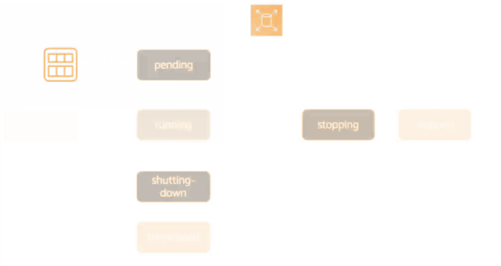</p>

### Consider using an Elastic IP Address
<ul>
	<li><b style="color:#f08f18">Rebooting an instance does not change IP or DNS hostname</b></li>
	<li><b style="color:#f08f18">When an instance is stopped and started again</b></li>
  <ul>
		<li>Public IPv4 address and external DNS hostname will change</li>
		<li>The private IPv4 address and internal DNS hostname do not change</li>
	</ul>
  <li><b style="color:#f08f18">If a persistent public IP is required</b></li>
  <ul>
		<li>Associate an Elastic IP address with the instance</li>
	</ul>
  <li><b style="color:#f08f18">Elastic IP address characteristics</b></li>
  <ul>
		<li>Can be associated with the instance in the region as needed</li>
    <li>Remains allocated to you account until you choose to release it</li>
	</ul>
</ul>

### EC2 instance metadata
<ul>
	<li><b style="color:#f08f18">Data about your instance</b></li>
	<li><b style="color:#f08f18">Can view it</b></li>
  <ul>
		<li>http://169.254.169.254/latest/meta-data/</li>
	</ul>
  <li><b style="color:#f08f18">Can be used to configure or manage a running instance</b></li>
  <ul>
		<li>For example author a config script that reads the metadata and uses it to configure application or OS settings</li>
	</ul>
</ul>

### Amazon CloudWatch for monitoring
<ul>
	<li><b style="color:#f08f18">Used to monitor EC2 instance in real-time and maintains historical data</b></li>
	<li><b style="color:#f08f18">Basic (free) and detailed (payed) monitoring</b></li>
</ul>

### Amazon EC2 Pricing Models

<ul>
	<li><b style="color:#f08f18">On-Demand Instances</b></li>
	<ul>
		<li>Pay by the hour</li>
		<li>No long term commitments</li>
		<li>Eligible for the AWS Free Tier</li>
	</ul>
  <li><b style="color:#f08f18">Dedicated Hosts</b></li>
	<ul>
		<li>EC2 instanced server dedicated for your use</li>
	</ul>
  <li><b style="color:#f08f18">Dedicated Instances</b></li>
	<ul>
		<li>Isolated instances for a single customer that runs on the VPC</li>
	</ul>
  <li><b style="color:#f08f18">Reserved Instances</b></li>
	<ul>
		<li>Prices are fixed with either full, partial or no upfront costs</li>
		<li>Hourly charges are discounted</li>
		<li>1 or 3 year term</li>
	</ul>
  <li><b style="color:#f08f18">Scheduled Reserved Instances</b></li>
	<ul>
		<li>Reserve instances that recur on a daily, weekly or monthly basis</li>
		<li>Only for a 1 year term</li>
	</ul>
  <li><b style="color:#f08f18">Spot Instances</b></li>
	<ul>
		<li>Request unused EC2 instances </li>
		<li>Prices fluctuate that depend on supply and demand</li>
		<li>The instances run when you outbid the market price</li>
		<li>Better to use if you want to save as prices are less than on-demand instances</li>
	</ul>
</ul>

#### Amazon EC2 Pricing Model : Benefits
<ul>
	<li><b style="color:#f08f18">On-Demand Instances</b></li>
	<ul>
		<li>Flexible and low cost</li>
	</ul>
  <li><b style="color:#f08f18">Spot Instances</b></li>
	<ul>
		<li>Large scale at a significantly discounted price</li>
	</ul>
  <li><b style="color:#f08f18">Reserved Instances</b></li>
	<ul>
		<li>For when you have predictable or steady-state compute needs</li>
	</ul>
  <li><b style="color:#f08f18">Dedicated Hosts</b></li>
	<ul>
		<li>When there are licensing restrictions or have compliance or regulatory requirements</li>
	</ul>
</ul>

#### Amazon EC2 Pricing Model : Use Cases
<ul>
	<li><b style="color:#f08f18">On-Demand Instances</b></li>
	<ul>
		<li>Short term workloads</li>
		<li>Application development & testing</li>
	</ul>
  <li><b style="color:#f08f18">Spot Instances</b></li>
	<ul>
		<li>Applications that are flexible and can tolerate short downtimes</li>
		<li>Urgent computing needs for large amounts of additional capacity</li>
	</ul>
  <li><b style="color:#f08f18">Reserved Instances</b></li>
	<ul>
		<li>Long term and predictable workloads</li>
		<li>Applications that you know will run in a consistent way for a long time</li>
	</ul>
  <li><b style="color:#f08f18">Dedicated Hosts</b></li>
	<ul>
		<li>For when you have per - socket/core/VM software licenses</li>
		<li>To control instance placement</li>
	</ul>
</ul>
<p></p>

### Pillars of Cost Optimization
<p>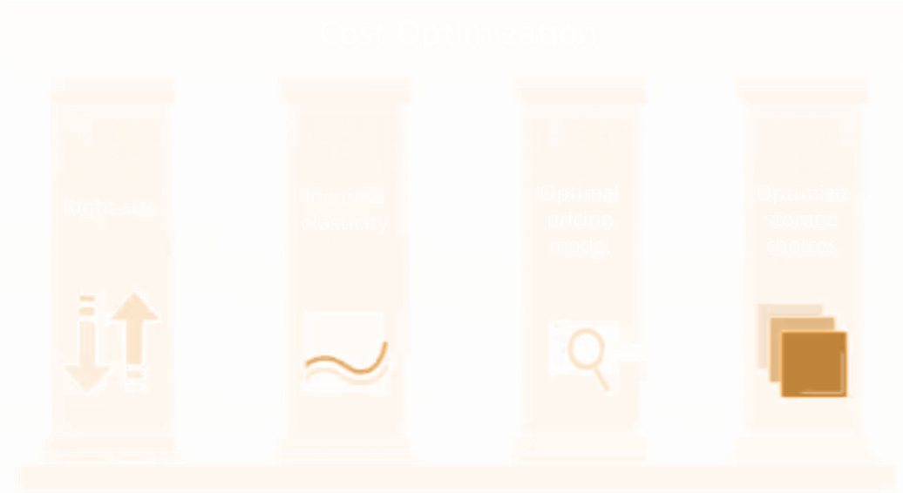</p>


#### Right - Size
There are approximately 60 instance types and sizes so choose the right balance of instance types
<ul>
	<li><b style="color:#f08f18">Provision instances to match needs</b></li>
	<ul>
		<li>Select the most relevant and cheapest instances that meet your needs</li>
		<li>Consider CPU, memory and network throughout and use load-testing to your advantage to size correctly</li>
	</ul>
  <li><b style="color:#f08f18">Amazon CloudWatch metrics</b></li>
	<ul>
		<li>Use this to monitor and downsize unused computing resources and instances</li>
	</ul>
  <li><b style="color:#f08f18">Right Size - Then Reserve</b></li>
</ul>

#### Increase Elasticity
Design you deployments to be elastic in order to reduce the idle time of instances
<ul>
	<li><b style="color:#f08f18">Stop / Hibernate EBS instances that are not in use</b></li>
	<ul>
		<li>Saves costs by stopping non-production or development environments</li>
	</ul>
  <li><b style="color:#f08f18">Use auto-scaling</b></li>
	<ul>
		<li>Automatic scaling policies can help with peak capacity, by dynamically changing sizes</li>
	</ul>
</ul>

#### Optimal Pricing Model
Design you deployments to be elastic in order to reduce the idle time of instances
<ul>
	<li><b style="color:#f08f18">Right pricing model for your use case</b></li>
	<ul>
		<li>Save costs by mix-matching multiple instance types for your needs</li>
	</ul>
  <li><b style="color:#f08f18">Example : </b></li>
	<ul>
		<li>On-Demand/Spot instances for variable workloads</li>
		<li>Reserved instances for predictable workloads</li>
	</ul>
  <li><b style="color:#f08f18">Consider serverless (AWS Lambda)</b></li>
</ul>

#### Optimize storage
Design you deployments to be elastic in order to reduce the idle time of instances
<ul>
	<li><b style="color:#f08f18">Resize EBS volumes</b></li>
	<ul>
		<li>This reduces costs by resizing to suit storage capacity needs</li>
	</ul>
  <li><b style="color:#f08f18">Delete Snapshots</b></li>
	<ul>
		<li>Delete unused or redundant snapshots to save costs</li>
	</ul>
  <li><b style="color:#f08f18">Pick suitable storage option</b></li>
	<ul>
		<li>Can save costs if application is able to use cheaper storage such as S3 instead of EBS</li>
	</ul>
</ul>

#### Measure, monitor and improve
- Use tagging to provide helpful information resource usage
- Use AWS cost explorer to encourage teams to architect with costs in mind
- AWS Trusted Advisor for best practices


### Containers

#### Container Basics
- Containers are a method of operating system virtualization
- Does not contain entire OS, but share virtualized OS and resources are isolated
- Contains all resources for software to run
- Containers are consistent as everything inside a single object
- Quick and easy to launch and terminate application compared to VMs regardless of environment

#### Docker
- Build, test and deploy applications quickly into any environment
- Containers are created from <i>images</i> which are templates
- Contains <text style="color:#f08f18"> bins/libs </text>, <text style="color:#f08f18"> system tools </text>, <text style="color:#f08f18"> code </text>, <text style="color:#f08f18"> runtime environments </text>

#### Containers VS VMs
<p>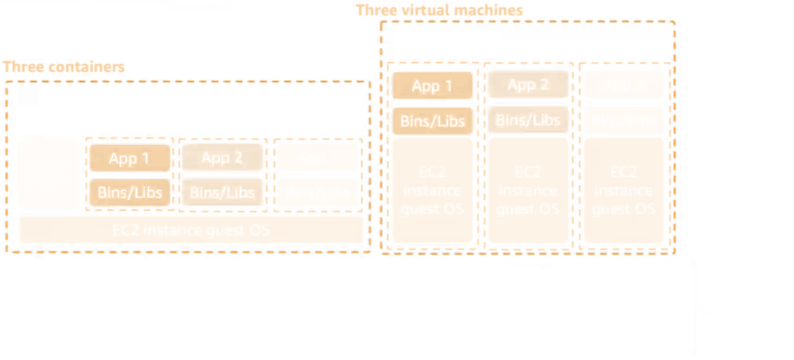</p>

<ul>
	<li><b style="color:#f08f18">Right side of diagram</b></li>
	<ul>
		<li>The EC2 instance has a docker engine and containers</li>
    <li>Each application runs in its own container --> process isolation</li>
    <li>Docker engine manages how containers are run</li>
	</ul>
  <li><b style="color:#f08f18">Left side of the diagram</b></li>
	<ul>
		<li>Each application has its own EC2 instance</li>
		<li>This provides the process isolation as each instance is independent of one another</li>
	</ul>
</ul>

#### Amazon Elastic Container Service
Container management service that supports Docker containers
<ul>
	<li><b style="color:#f08f18">Key benefits</b></li>
	<ul>
		<li>Eliminates complexity of the infrastructure</li>
    <li>Highly-scalable</li>
    <li>Monitor, manage and schedule containers </li>
	</ul>
  <li><b style="color:#f08f18">Integrate features</b></li>
	<ul>
		<li>Elastic Load Balancing</li>
		<li>Amazon EC2 security groups</li>
		<li>Amazon EBS volumes</li>
		<li>IAM roles</li>
	</ul>
</ul>

#### Amazon ECS orchestrates containers
Container management service that supports Docker containers
<ul>
	<li><b style="color:#f08f18">Tasks</b></li>
	<ul>
		<li>Create task defn. that describes container(s)</li>
    <li>Tasks are instantiation of task defn.</li>
    <li>A task runs between 1-10 containers</li>
    <li>Places them on an ECS cluster</li>
	</ul>
</ul>

#### Amazon ECS cluster options
<p>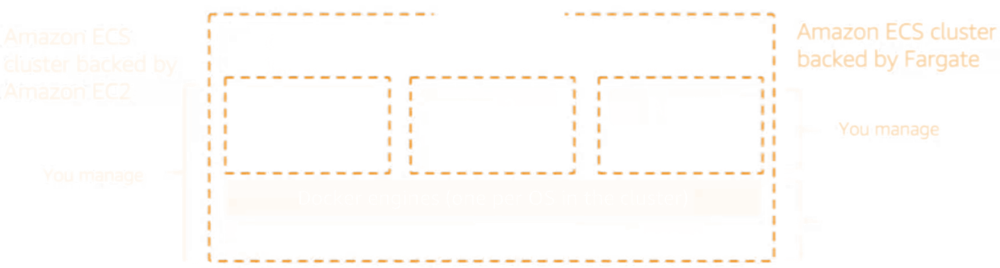</p>

- Amazon ECS cluster backed by EC2 for more control
- Amazon ECS cluster backed by Fargate to focus on your applications

#### Kubernetes
<ul>
	<li><b style="color:#f08f18">An open source software for container orchestration</b></li>
	<ul>
		<li>Can be used on premise or in the cloud</li>
		<li>Manage containerized applications at scale</li>
	</ul>
  <li><b style="color:#f08f18">Complements Docker</b></li>
	<ul>
		<li>Docker enables you to run multiple containers on a single OS</li>
		<li>Kubernetes orchestrates multiple Docker hosts</li>
	</ul>
  <li><b style="color:#f08f18">Automates - </b></li>
	<ul>
		<li>Container provisioning</li>
		<li>Networking</li>
		<li>Load Distribution</li>
		<li>Scaling</li>
	</ul>
</ul>

#### Amazon Elastic Kubernetes Service
- Can run Kubernetes on AWS
- Supports both Linux and Windows containers
- Supports kubernetes addons and community tools
- Manage clusters of EC2 instances
- Run Kubernetes controlled containers on those instances

#### Amazon Elastic Container Registry
- A registry that makes it easy to manage and deploy Docker container images
- Supports team collaboration, access control and third party integration

### AWS Lambda Service
AWS $\lambda$ is a serverless computer service
<p>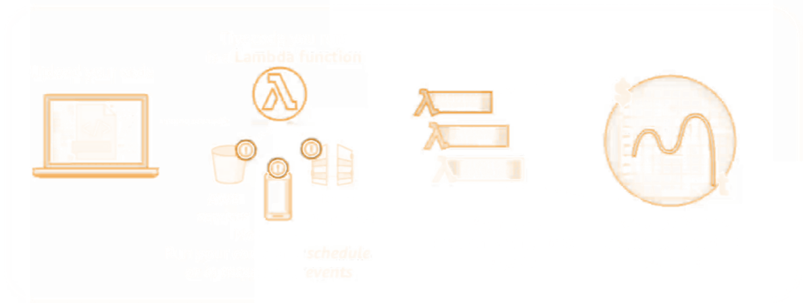</p>

<ul>
	<li><b style="color:#f08f18">Supports multiple programming languages</b></li>
	<ul>
		<li>Java, Go, Powershell, C#, etc.</li>
		<li>Use any native or third party library</li>
	</ul>
	<li><b style="color:#f08f18">Automated administration</b></li>
	<ul>
		<li>Manages infrastructure to run your code</li>
		<li>Does all the admin, maintenance and patches </li>
	</ul>
	<li><b style="color:#f08f18">Run multiple Lambda functions</b></li>
	<ul>
		<li>For complex tasks and workflows by using step functions</li>
		<li>Build stateful, long running processes for applications and backends</li>
	</ul>
  <li><b style="color:#f08f18">Pay for what you use</b></li>
	<ul>
		<li>Billing is in increments of 100ms</li>
		<li>Easy to scale request and make them cost effective</li>
	</ul>
</ul>

#### AWS Lambda Quotas
<ul>
	<li><b style="color:#f08f18">Soft limits per Region</b></li>
	<ul>
		<li>Concurrent executions = 1,000</li>
		<li>Function and layer storage = 75 GB</li>
	</ul>
	<li><b style="color:#f08f18">Hard limits for individual functions</b></li>
	<ul>
		<li>Maximum function memory allocation = 10,240 MB</li>
		<li>Function timeout = 15 mins</li>
		<li>Deployment package size = 250 MB unzipped, including layers</li>
		<li>Container image code package size = 10 GB</li>
	</ul>
</ul>

#### AWS Lambda example
An example that shows the usage of AWS Cloud Watch to start and stop instances at pre-defined times automatically

<p>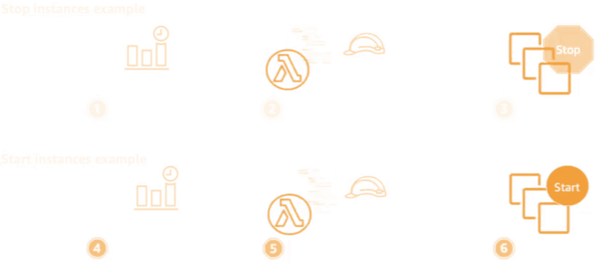</p>


--- 

## Module 7 : Storage

[ To the top ](#contents)

### Amazon EBS
<ul>
	<li>Persistent block storage, retains data (non-volatile storage)</li>
	<li>Scalable within minutes</li>
  <li>Offers block - level storage</li>
  <li>Create individual volumes and attach to EC2 instance</li>
  <li>Volumes are automatically replicated within its AZ</li>
  <li>Can be backed up using Amazon S3 snapshots</li>
  <li>Independently attached --> data won't be erased if it terminates</li>
  <li>Uses AWS KMS with AES-256 Encryption</li>
</ul>

### Block Storage VS Object storage
There are two main storage options
<p>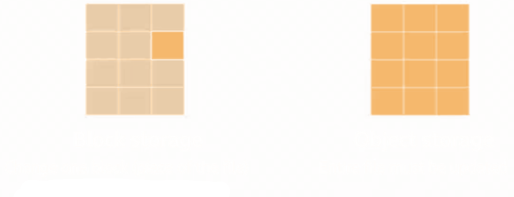</p>

### Amazon Simple Storage Service S3
<ul>
	<li>Data is stored as objects in "buckets"</li>
	<li>Virtually unlimited storage (single object max  is 5TB)</li>
  <li>Designed for 11 9s of durability</li>
  <li>Granular access to bucket and objects</li>
</ul>

### Amazon S3 Storage Classes
<ul>
	<li><b style="color:#f08f18">Standard</b></li>
	<p>For frequently accessed data, and has high performance, durability and availability</p>
  <li><b style="color:#f08f18">Intelligent-Tiering</b></li>
	<p>Moves objects around to other storage classes, works well with data that has unknown access usage</p>
  <li><b style="color:#f08f18">Standard - Infrequent Access</b></li>
	<p>For long term storage and backup of data</p>
  <li><b style="color:#f08f18">Standard - One zone - Infrequent Access</b></li>
	<p>Data that is accessed less frequently but requires rapid access when needed</p>
  <li><b style="color:#f08f18">Glacier</b></li>
	<p>Low cost and durable for data archiving, where retrieval options are between minutes and hours</p>
  <li><b style="color:#f08f18">Glacier Deep Archive</b></li>
	<p>Designed for data that needs to be stored for a long period of time and accessed very rarely</p>
</ul>

### Amazon S3 bucket style
- The path style endpoint is used to accesss objects
- The virtual-hosted endpoint is used as static website data
- Bucket names may only contain letters, numbers and dashes

<p>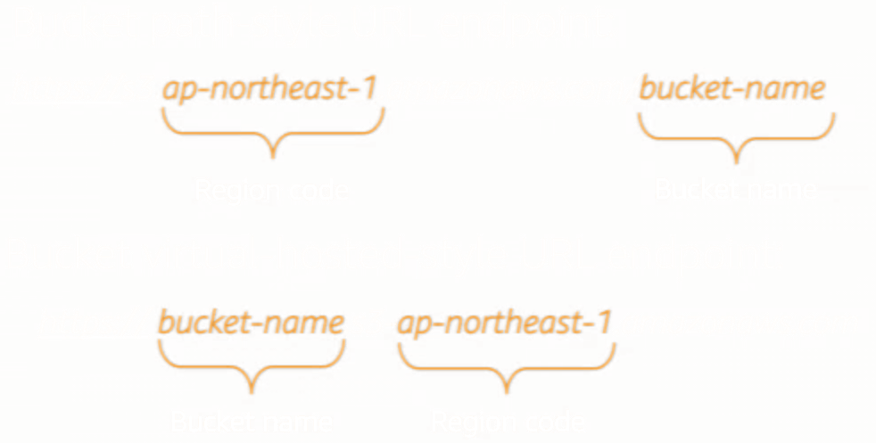</p>

### Amazon S3 Storage Pricing

<ul>
	<li><b style="color:#f08f18">You pay for</b></li>
	<ul>
		<li>GBs per month</li>
		<li>Transfer OUT to other Regions</li>
		<li>PUT, COPY, POST, LIST and GET request</li>
	</ul>
  <li><b style="color:#f08f18">You do not pay for</b></li>
	<ul>
		<li>Transfers IN to S3</li>
		<li>Transfers OUT from S3 to Cloudfront or EC2 in the same region</li>
	</ul>
</ul>

### Amazon EFS
- Shared elastic file storage in the AWS cloud
- Scales easily and pay fo what you use
- Works well for big data and analytics,  workflows, content management, web serving, etc.
- Compatible with all Linux based AMIs for Amazon EC2
- Supports NFS versions 4.0 & 4.1

### Amazon EFS architecture
- Create and mount file systems on EC2 instances
- R/W data to and from file system
- Concurrent access from multiple EC2 instances in VPC
- Can access in the same region with multiple AZs

### Amazon EFS implementation
1. Create your Amazon EC2 resources and launch your Amazon EC2 instance
2. Create your Amazon EFS file system
3. Create you mount targets in the appropriate subnets
4. Connect your Amazon EC2 instances to the mount targets
5. Verify the resources and protection of your AWS account

### Amazon Glacier
Designed for data archiving
- Provides 11 9s of durability
- Supports encryption of data at rest and in transit
- Vault Lock enforces compliance through a policy
- Cannot retrieve immediately
  - Standard (3-5 hours), bulk (5-12 hours), expedited (1-5 minutes)  
- An archive is an object that is stored in the glacier
- A vault is a container is a container for storing archives

### Use cases
- Media assets
- Healthcare information
- Regulatory and Compliance
- Scientific data
- Digital Preservation
- Magnetic tape replacement

### Lifecycle 
Amazon S3 lifecycle policies enable you to delete or move objects based on age

### Storage Classes
<p>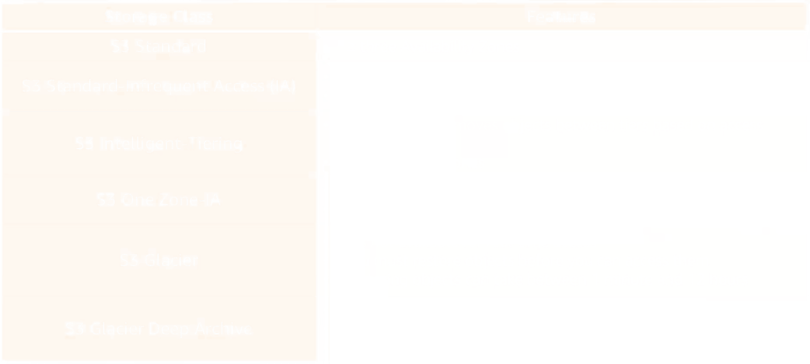</p>


--- 

## Module 8 : Databases

[ To the top ](#contents)

### Amazon RDS
You manage:
- Application optimization

AWS manages :
- OS installation and patches
- DB software installation and patches
- DB backups
- High Availability
- Scaling
- Power and stacking servers
- Server maintenance

### Amazon Dynamo DB
- NoSQL DB tables
- Virtually unlimited storage
- Items can have differing attributes
- Low - latency queries
- Scalable read/write throughput 

#### Core components
- Tables
  - A collection of data
- Items 
  - A group of attributes that is uniquely identifiable 
- Attribute
  - A fundamental element of the table  
- Two keys, primary and partition

### Amazon Redshift
- Fully managed DW
- Allows you to run complex SQL queries in parallel
- Can automate the administrative tasks to manage, monitor and scale
- Compatible with standard SQL connectors and BI tools or directly

### Parallel Processing Architecture
Consist of a  cluster of leader and compute nodes
<ul>
	<li><b style="color:#">Leader Node</b></li>
	<ul>
		<li>Manages communication with client programmes and compute nodes</li>
    <li>Performs operations required to obtain results from complex queries</li>
    <li>Compiles and assigns code to individual compute nodes</li>
	</ul>
  <li><b style="color:#">Compute Node</b></li>
	<ul>
		<li>Runs the compiled code</li>
    <li>Sends the intermediate results to the leader for aggregation</li>
	</ul>
</ul>

<p>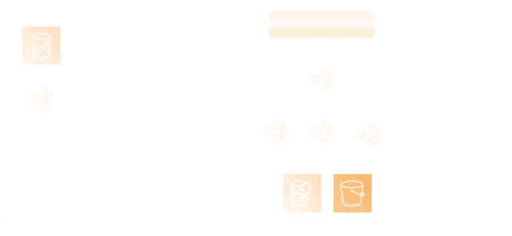</p>

### Amazon Redshift use cases
<ul>
	<li><b style="color:#f08f18">Enterprise data warehouse</b></li>
	<ul>
		<li>Migrate at a pace that customers are comfortable with</li>
    <li>Experiment without a large upfront cost or commitment</li>
    <li>Respond faster to business needs</li>
	</ul>
  <li><b style="color:#f08f18">Big Data</b></li>
	<ul>
		<li>Low price point for small customers</li>
    <li>Managed service for ease of deployment and maintenance</li>
    <li>Focus more on data and less on DB management</li>
	</ul>
  <li><b style="color:#f08f18">SaaS</b></li>
	<ul>
		<li>Scale the DW capacity as demand grows</li>
    <li>Add analytic functionality to applications</li>
    <li>Reduce hardware and software costs</li>
	</ul>
</ul>

### Amazon Aurora
- A MySQL and PostgreSQL compatible DB
- Enterprise-class RDBMS
- Designed to automate time-consuming tasks such as patching, backup, repair, etc.
- Ideal solution for large relational DB sets
- High availability and resilient design, by storing it at multiple AZs
- Designed for instant crash recovery


--- 

## Module 9 : Cloud Architecture

[ To the top ](#contents)

### Pillars

<p></p>

<h4><b style="">Operational Excellence</b></h4>
<ul>
	<li><b style="color:#f08f18">Focus</b></li>
	<ul>
		<li>Run and monitor systems to deliver business value</li>
    <li>Continually improve supporting processes and procedures</li>
	</ul>
  <li><b style="color:#f08f18">Key Topics</b></li>
	<ul>
		<li>Managing and automating changes</li>
    <li>Respond to events</li>
    <li>Defining standards to successfully manage daily operations</li>
	</ul>
</ul>

#### Design Principles
<ul>
	<li><b style="color:#f08f18">Perform operations as code</b></li>
	<p>Define your entire workload as code to limit human error and enable consist responses</p>
	
  <li><b style="color:#f08f18">Annotate Documentation</b></li>
	<p>Annotate after every build</p>
	
  <li><b style="color:#f08f18">Make frequent, small reversible changes</b></li>
	<p>Design workloads to enable components to be updated regularly and be reversible</p>
	
  <li><b style="color:#f08f18">Refine Operations procedures frequently</b></li>
	<p>Improve features and update as they evolve</p>
	
  <li><b style="color:#f08f18">Anticipate failure</b></li>
	<p>Identify potential sources of failure and test them</p>
	
  <li><b style="color:#f08f18">Learn from operational events and failures</b></li>
	<p>Share what has been learnt across teams and organization</p>
</ul>

<h4><b style="">Security</b></h4>
<ul>
	<li><b style="color:#f08f18">Focus</b></li>
	<ul>
		<li>Protect information, systems and assets while delivering business value</li>
    <li>Done through risk assessment and mitigation strategies</li>
	</ul>
  <li><b style="color:#f08f18">Key Topics</b></li>
	<ul>
		<li>Identify and managing who can do what</li>
    <li>Establishing controls to detect security events</li>
    <li>Protecting systems and services</li>
    <li>Protecting confidentiality and integrity of data</li>
	</ul>
</ul> 

#### Design Principles
<ul>
	<li><b style="color:#f08f18">Implement a strong identity foundation</b></li>
	<p>Implement the principle of least privilege</p>
	
  <li><b style="color:#f08f18">Enable Traceability</b></li>
	<p>Monitor, alert and audit changes in realtime using logs</p>
	
  <li><b style="color:#f08f18">Apply security at all layers</b></li>
	<p>Apply defense in depth and security to all layers of architecture</p>
	
  <li><b style="color:#f08f18">Automate security best practices</b></li>
	<p>Automate security mechanisms to securely scale rapidly and cost effectively</p>
	
  <li><b style="color:#f08f18">Protect data in transit and at rest</b></li>
	<p>Classify data into sensitivity levels use mechanisms like encryption or tokenization</p>
	
  <li><b style="color:#f08f18">Keep people away from data</b></li>
	<p>Create tools and mechanisms to remove the direct access to data</p>

^f3bd21

  <li><b style="color:#f08f18">Prepare for security events</b></li>
	<p>Run incident response simulations and tools to detect recovery</p>
</ul>

<h4><b style="">Reliability</b></h4>
<ul>
	<li><b style="color:#f08f18">Focus</b></li>
	<ul>
		<li>Prevent and quickly recover from failures</li>
	</ul>
  <li><b style="color:#f08f18">Key Topics</b></li>
	<ul>
		<li>Setting up</li>
    <li>Cross-project requirements</li>
    <li>Recovery planning</li>
    <li>Handling Change</li>
	</ul>
</ul> 

#### Design Principles
<ul>
	<li><b style="color:#f08f18">Test Recovery Procedures</b></li>
	<p>Test how your systems fails to prepare for real system failure</p>
	
  <li><b style="color:#f08f18">Automatically recover from failure</b></li>
	<p>Monitor systems for key performance indicators and configure systems to auto recover</p>
	
  <li><b style="color:#f08f18">Scale horizontally to increase aggregate system availability</b></li>
	<p>Split a large resource into multiple smaller resources to distribute requests</p>
	
  <li><b style="color:#f08f18">Stop guessing capacity</b></li>
	<p>Automate the capacity to satisfy resource demands</p>
	
  <li><b style="color:#f08f18">Manage change in automation</b></li>
	<p>Use automation to make changes to infrastructure</p>
</ul>

<h4><b style="">Performance efficiency</b></h4>
<ul>
	<li><b style="color:#f08f18">Focus</b></li>
	<ul>
		<li>Use IT and computing resources efficiently to meet system requirements</li>
		<li>Maintain efficiency as demand changes and technologies evolve</li>
	</ul>
  <li><b style="color:#f08f18">Key Topics</b></li>
	<ul>
		<li>Selecting the right resource types and sizes based on workload requirements</li>
    <li>Monitoring Performance</li>
    <li>Making informed decisions to maintain efficiency</li>
	</ul>
</ul> 

#### Design Principles
<ul>
	<li><b style="color:#f08f18">Democratize advanced technologies</b></li>
	<p>Consume technologies as a service</p>
	
  <li><b style="color:#f08f18">Go global in minutes</b></li>
	<p>Deploy systems in multiple AWS regions to provide low latency</p>
	
  <li><b style="color:#f08f18">Use serverless architectures</b></li>
	<p>Remove operational burden of running servers</p>
	
  <li><b style="color:#f08f18">Experiment more often</b></li>
	<p>Perform comparative testing of instances and storage</p>
	
  <li><b style="color:#f08f18">Mechanical Sympathy</b></li>
	<p>Use the best technology approach that aligns to what you need</p>
</ul>

<h4><b style="">Cost optimization</b></h4>
<ul>
	<li><b style="color:#f08f18">Focus</b></li>
	<ul>
		<li>Run systems to deliver business value at the lowest price point</li>
	</ul>
  <li><b style="color:#f08f18">Key Topics</b></li>
	<ul>
		<li>Understanding and controlling when money is being spent</li>
    <li>Selecting the most appropriate and right number of resource types</li>
    <li>Analyzing spending over time</li>
    <li>Scaling to meeting business needs without overspending</li>
	</ul>
</ul> 

#### Design Principles
<ul>
	<li><b style="color:#f08f18">Adopt a consumption model</b></li>
	<p>Pay for only what resources you require</p>
	
  <li><b style="color:#f08f18">Measure overall efficiency</b></li>
	<p>Measure the business output of the workload and the costs for delivering it</p>
	
  <li><b style="color:#f08f18">Stop spending money on data center operations</b></li>
	<p>AWS does it for you</p>
	
  <li><b style="color:#f08f18">Analyze and attribute expenditure</b></li>
	<p>Identify system usage and costs</p>
	
  <li><b style="color:#f08f18">Use managed and application level services to reduce cost of ownership</b></li>
	<p>Reduces the operation burden on some operations</p>
</ul>

#### Reliability
- A measure of you system's ability to provide functionality when desired by the user
- System includes all system components; hardware, firmware and software
- Probability that you entire system will function as intended for a specified period
- Mean time between failures is the total time in service over the number of failures
<p>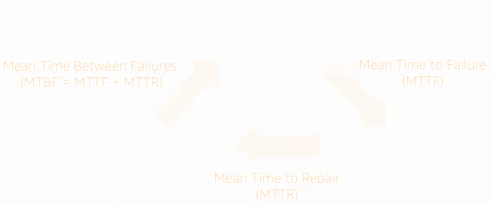</p>

#### Availability
- Normal operation time / total time
- A percentage of uptime over a time period (1 year)
- Number of 9s so 4 9s = 99.99% availability

#### High Availability
- System can withstand some measures of degradation while still remaining available
- Downtime is minimized
- Minimal human intervention is required
<p>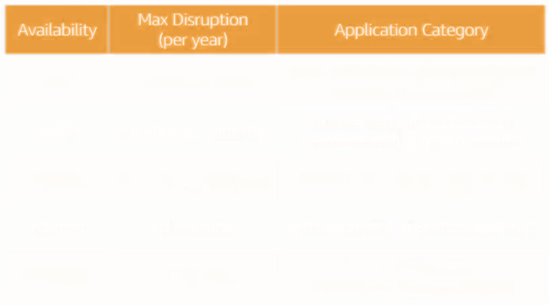</p>


#### Factors that influence availability
<ul>
	<li><b style="color:#f08f18">Fault Tolerance</b></li>
	<p>Built in redundancy of an application's components and its ability to remain operational</p>
	
  <li><b style="color:#f08f18">Scalability</b></li>
	<p>The ability of an application to accommodate increases in capacity needs without changing design</p>
	
  <li><b style="color:#f08f18">Recoverability</b></li>
	<p>The process, policies and procedures that are related to restoring service after a catastrophic event</p>
</ul>

### AWS Trusted Advisors
- Online tool that provides real-time guidance to help you provision your resources following AWS best practices
- Provides insight in the following 5 areas :
  - Cost Optimization 
  - Performance 
  - Security 
  - Fault Tolerance 
  - Service Limits
--- 

## Module 10 : Auto-Scaling and Monitoring

[ To the top ](#contents)

### Elastic Load Balancing
- Distributes incoming application or network traffic across multiple targets in a single or multiple AZs
- Scales your load balancer as traffic to your application changes over time

### Types of Load Balancers
<p>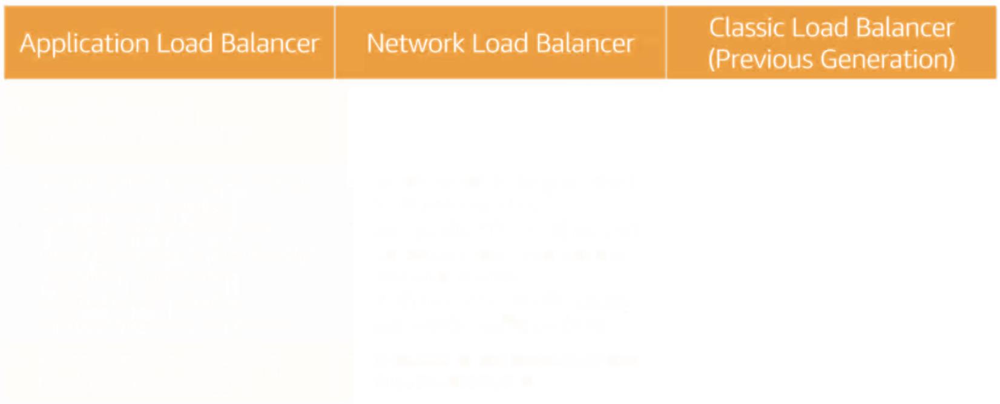</p>

### How they work
- With Application and Network Load Balancers, you register targets in target groups and route traffic to them.
- With Classic Load Balancers, you register instances with the load balancer.
- Load balancer performs health checks to monitor health of registered targets

<p>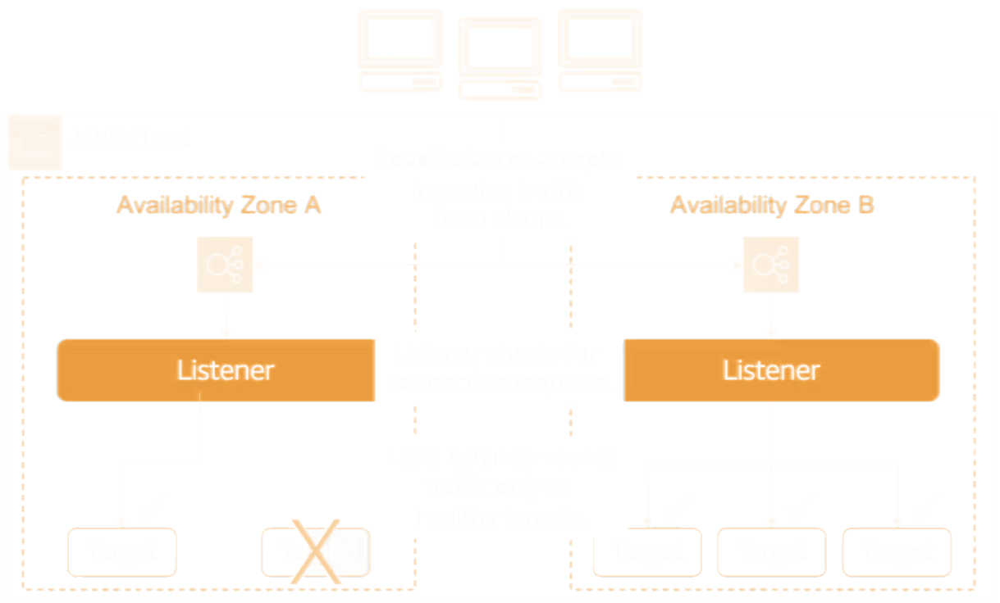</p>

### Elastic Load Balancing use Cases
- Highly available and fault-tolerant applications
- Containerized applications
- Elasticity and scalability
- VPC
- Hybrid Environments
- Invoke Lambda functions over HTTP(s)

### Load balancer monitoring
<ul>
	<li><b style="color:#">Amazon CloudWatch metrics</b></li>
	<p>Used to verify that the system is performing as expected and uses alarms</p>
	
  <li><b style="color:#">Access Logs</b></li>
	<p>Capture detailed information about requests sent to your load balancer</p>
  
  <li><b style="color:#">AWS CloudTrail Logs</b></li>
	<p>Capture the who, what, when and where of API interactions in AWS services</p>
</ul>

### Amazon CloudWatch
<ul>
	<li><b style="color:#">Monitors</b></li>
	<ul>
		<li>AWS resources</li>
		<li>Applications that run on AWS</li>
	</ul>
  <li><b style="color:#">Collects and Tracks</b></li>
	<ul>
		<li>Standard metrics</li>
		<li>Custom metrics</li>
	</ul>
  <li><b style="color:#">Alarms</b></li>
	<ul>
		<li>Send notifications to an Amazon SNS topic</li>
		<li>Perform Amazon EC2 Auto Scaling or actions</li>
	</ul>
  <li><b style="color:#">Events</b></li>
	<ul>
		<li>Define rules to match changes in AWS environment</li>
		<li>Route these events to one or more targe functions or streams for processing</li>
	</ul>
</ul>

### Amazon CloudWatch
<ul>
	<li><b style="color:#">Monitors</b></li>
	<ul>
		<li>AWS resources</li>
		<li>Applications that run on AWS</li>
	</ul>
  <li><b style="color:#">Collects and Tracks</b></li>
	<ul>
		<li>Standard metrics</li>
		<li>Custom metrics</li>
	</ul>
  <li><b style="color:#">Alarms</b></li>
	<ul>
		<li>Send notifications to an Amazon SNS topic</li>
		<li>Perform Amazon EC2 Auto Scaling or actions</li>
	</ul>
  <li><b style="color:#">Events</b></li>
	<ul>
		<li>Define rules to match changes in AWS environment</li>
		<li>Route these events to one or more targe functions or streams for processing</li>
	</ul>
</ul>

^a8c75f

### Amazon EC2 Auto - Scaling
- Helps maintain application availability
- Enables you to automatically add/remove EC2 instances according to defined conditions
- Detects impaired EC2 instances and unhealthy applications and replaces the instances without your intervention
- Provides several scaling options, manual scheduled dynamic or on demand and predictive
- Collection of EC2 instances that are treated as a logical grouping for the purpose of auto scaling and management 

### How it works
<p>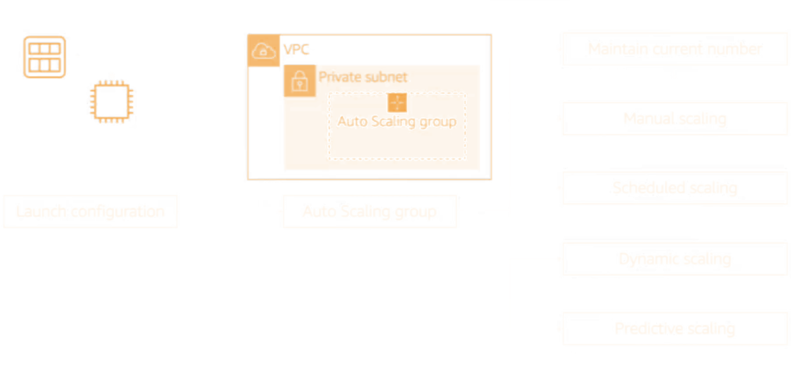</p>


---
