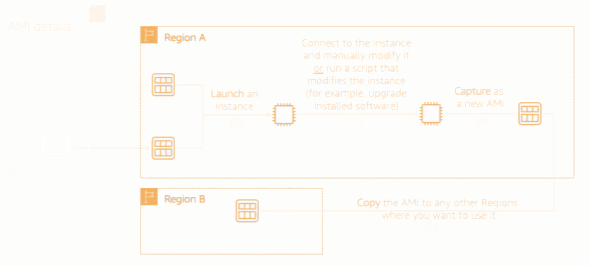

# AWS Cloud notes

## Contents
  - [Module 1 : Cloud Concepts Overview](#module-1--cloud-concepts-overview)
  - [Module 2 : Cloud Economics & Billing](#module-2--cloud-economics--billing)
  - [Module 3 : AWS Global Infrastructure Overview](#module-3--aws-global-infrastructure-overview)
  - [Module 4 : AWS Cloud Security](#module-4--aws-cloud-security)
  - [Module 5 : Networking and Content Delivery](#module-5--networking-and-content-delivery)
  - [Module 6 : Compute](#module-6--compute)
  - [Module 7 : Storage](#module-7--storage)
  - [Module 8 : Databases](#module-8--databases)
  - [Module 9 : Cloud Architecture](#module-9--cloud-architecture)
  - [Module 10 : Auto-Scaling and Monitoring](#module-10--auto-scaling-and-monitoring)

---

## Module 1 : Cloud Concepts Overview

[ To the top ](#contents)

### Cloud Computing
- It is the on demand delivery of computing power, DB storage, and other resources
- Pay-as-you-go pricing
- Using computers/resources owned by the service provider
- Think of it as software not hardware
- Removes undifferentiated heavy lifting

### Hardware vs Software

<h4 style="color:#f08f18"> Hardware </h4>

- Requires space, staff, security, planning, and capital expenditure, as it's physical
- Takes a long time to acquire, provision and maintain the physical infrastructure
- If full capacity of hardware not being used --> money wasted.
- If you require more capacity --> downtime on services while upgrading 

<h4 style="color:#f08f18"> Software </h4>

- Thinking of it as software, select services that match needs required 
- Pay for what you use, and use it when you need to
- Flexible with scaling capacity

### Cloud Service Models


iass : raw resources
pass : taken care of by the platform
sass : infrastructure and platforms are taken

### Advantages of Cloud Computing
<ul>
	<li><b style="color:#f08f18">Trade capital expense for variable expense</b></li>
	<ul>
		<li>Pay only for when you use and consume resource and save on physical hardware</li>
	</ul>
  <li><b style="color:#f08f18">Massive Economies of Scale</b></li>
	<ul>
		<li>Benefit from the aggregate usage from all customers, pass savings onto customers</li>
	</ul>
  <li><b style="color:#f08f18">Variable Capacity</b></li>
	<ul>
		<li>Scale up/down as required</li>
	</ul>
  <li><b style="color:#f08f18">Speed & Agility</b></li>
	<ul>
		<li>Resources that are required are obtainable within minutes as opposed to weeks</li>
	</ul>
  <li><b style="color:#f08f18">No spending on running/maintaining physical DCs</b></li>
	<ul>
		<li>All handled by the cloud DCs</li>
	</ul>
  <li><b style="color:#f08f18">Global</b></li>
	<ul>
		<li>Deploy applications globally</li>
	</ul>
</ul>


### What are web services
- A piece of software that makes itself available of the internet
- Uses a standardized format such as <text style="color:#f08f18">XML</text> or <text style="color:#f08f18">JSON</text> for API responses

### What is AWS
- A secure cloud platform that offers cloud-based products
- Flexible and services work together as building blocks

### Categories of AWS services and covered in the course
<p>

</p>

### Ways to interact with AWS
- AWS Management Console
- Command Line Interface (AWS CLI)
- SDKs

### AWS Cloud Adoption Framework (CAF)
- People, process and technology must be in alignment
- For business to migrate to the cloud, they must understand different states within the businesses
- AWS CAF provides guidance and best practices to help build a successful approach to cloud computing 

<h4 style="color:#f08f18"> Business </h4>

- Stakeholders ensure strategies and goals align with IT 

<h4 style="color:#f08f18"> People </h4>

- HR/managers/etc prioritize staffing, training and organizational change 

<h4 style="color:#f08f18"> Governance </h4>

- CIO, enterprise architects, BAs, etc use AWS to align goals and minimize risk

<h4 style="color:#f08f18"> Platform </h4>

- CTO, IT managers, solutions architects must understand nature of IT systems and relationships.
- Describe the environment in detail

<h4 style="color:#f08f18"> Security </h4>

- CISO, IT security, can use AWS framework to meet whatever security objectives they need

<h4 style="color:#f08f18"> Operations </h4>

- IT operations/support managers, support define how business will be conducted

--- 

## Module 2 : Cloud Economics & Billing

[ To the top ](#contents)

### AWS pricing model
<ul>
	<li><b style="color:#f08f18">Compute</b></li>
	<ul>
		<li>Charged per hour/second</li>
    <li>Varies by instance</li>
	</ul>
  <li><b style="color:#f08f18">Storage</b></li>
	<ul>
		<li>Charged typically per GB</li>
	</ul>
  <li><b style="color:#f08f18">Data Transfer</b></li>
	<ul>
		<li>Outbound aggregated and charged</li>
    <li>Inbound no charge</li>
    <li>Charged typically per GB</li>
	</ul>
</ul>

### Paying for AWS
- Pay for what you use
- Pay less when you reserver
- Pay less when you use more (Tiered pricing)
- No upfront expenses

### Total Cost of Ownership (TCO)

This is the financial estimate to help identify direct and indirect cost of a system.
The considerations are
- Server Costs
- Storage Costs
- Network Costs
- IT Labor Costs

### Pricing calculator
- The estimates and costs of everything for AWS cloud
- A bunch of benefits from reduced spending to agile business processes 

### AWS Organizations
- Account management service for multiple AWS accounts
- OU - A branch for multiple accounts
- Apply security and service polices for accounts
- Create Organization -> Create Organization units -> Create service control policies -> Test restrictions
- Can be accessed from AWS management console, AWS CLI, SDKs and APIs

### AWS Billing
- Just tools to look at billing with various tools that show what you are using
- Tools : AWS -/ Budgets / Cost and Usage Report  / Cost Explorer

### AWS Support
- Account assistance
  - AWS support concierge
- Best practices
  - AWS Trusted Advisor
- Proactive guidance
  - Technical Account manager
- Support Plans : Basic, Dev, Business and Enterprise

--- 

## Module 3 : AWS Global Infrastructure Overview

[ To the top ](#contents)

### Global Infrastructure
- Designed and built to deliver a flexible, reliable, scalable and secure cloud computing environment
- Provides high quality global network performance

### AWS Region
- A geographical area
- Consist of two or more Availability zones
- An availability zone contains 1 ore more DC
- Data is not replicated outside the given region

### Selecting a Region
- Consider the data governance and legal requirements restricts regions
- Proximity to customers affect latency
- Not all AWS services are available in every region
- Costs vary by region

### Availability Zones
- Each zone is an isolated partition of the AWS infrastructure
- Consists of discrete data centers
- Designed for fault isolation
- Interconnected by a private network
- Recommend replicating data/resources across zones

### AWS infrastructure features
<ul>
	<li><b style="color:#f08f18">Elasticity and scalability</b></li>
	<ul>
		<li>Dynamically adjust capacity and scalable to accommodate growth</li>
	</ul>
  <li><b style="color:#f08f18">Fault Tolerance</b></li>
	<ul>
		<li>Continues to operate in the presence of a failure</li>
    <li>Built in redundancy</li>
	</ul>
  <li><b style="color:#f08f18">High Availability</b></li>
	<ul>
		<li>High level of operational performance</li>
    <li>Minimal downtime</li>
    <li>Little to no human intervention</li>
	</ul>
</ul>

### AWS Storage Service Category
<ul>
	<li><b style="color:#f08f18">Amazon S3</b></li>
	<ul>
		<li>Service that offers scalability, data availability, security and performance</li>
	</ul>
  <li><b style="color:#f08f18">Amazon EBS</b></li>
	<ul>
		<li>High performance block storage designed to be used with EC2 for intensive workloads</li>
	</ul>
  <li><b style="color:#f08f18">Amazon EFS</b></li>
	<ul>
		<li>Scalable elastic network file system</li>
	</ul>
  <li><b style="color:#f08f18">Amazon Glacier</b></li>
	<ul>
		<li>Low cost AWS S3 storage class for data archiving and long term backup</li>
	</ul>
</ul>

### AWS Compute Service Category
<ul>
	<li><b style="color:#f08f18">Amazon EC2</b></li>
	<ul>
		<li>Resizable compute capacity as VMs in the cloud</li>
	</ul>
  <li><b style="color:#f08f18">Amazon EC2 Auto Scaling</b></li>
	<ul>
		<li>Automatically add or remove EC2 instances as desired</li>
	</ul>
  <li><b style="color:#f08f18">Amazon ECS</b></li>
	<ul>
		<li>Scalable containers that support docker containers</li>
	</ul>
  <li><b style="color:#f08f18">Amazon EC2 Registry</b></li>
	<ul>
		<li>Make it easier to store, manage and deploy docker containers</li>
	</ul>
  <li><b style="color:#f08f18">Amazon Elastic Beanstalk</b></li>
	<ul>
		<li>Deploying and scaling web applications</li>
	</ul>
  <li><b style="color:#f08f18">Amazon EKS</b></li>
	<ul>
		<li>For applications that use Kubernetes on AWS</li>
	</ul>
  <li><b style="color:#f08f18">AWS Lambda</b></li>
	<ul>
		<li>Run code without provisioning or managing servers</li>
	</ul>
  <li><b style="color:#f08f18">AWS Fargate</b></li>
	<ul>
		<li>For ECS to run containers without managing clusters or servers</li>
	</ul>
  <li><b style="color:#f08f18">Amazon Lightsail</b></li>
	<ul>
		<li>Launch a straightforward simple web application</li>
	</ul>
  <li><b style="color:#f08f18">AWS Outposts</b></li>
	<ul>
		<li>When you want to run AWS infrastructure in on-premise DCs</li>
	</ul>
</ul>

### AWS Database Service Category
<ul>
	<li><b style="color:#f08f18">Amazon Relational DB (RDB) Service</b></li>
	<ul>
		<li>RDB in the cloud</li>
	</ul>
  <li><b style="color:#f08f18">Amazon Aurora</b></li>
	<ul>
		<li>MySQL and postgresSQL compatible RDB</li>
	</ul>
  <li><b style="color:#f08f18">Amazon Redshift</b></li>
	<ul>
		<li>Enables to run analytical queries against large sets of data</li>
	</ul>
  <li><b style="color:#f08f18">Amazon DynamoDB</b></li>
	<ul>
		<li>A K-V document noSQL DB</li>
	</ul>
</ul>

### AWS Networking & Content Delivery Service Category
<ul>
	<li><b style="color:#f08f18">Amazon VPC</b></li>
	<ul>
		<li>Launch AWS resources in a virtual network you define</li>
	</ul>
  <li><b style="color:#f08f18">Elastic Load Balancing</b></li>
	<ul>
		<li>Automatically distribute incoming traffic across multiple targets such as EC2 or lambda</li>
	</ul>
  <li><b style="color:#f08f18">Amazon CloudFront</b></li>
	<ul>
		<li>A CDN that delivers data, videos, APIs, and more globally</li>
	</ul>
  <li><b style="color:#f08f18">AWS Transit Gateway</b></li>
	<ul>
		<li>Connect VPC and on-premise network to a centrally managed gateway</li>
	</ul>
  <li><b style="color:#f08f18">Amazon Route 53</b></li>
	<ul>
		<li>Cloud domain name system used to route end users to internet applications</li>
	</ul>
  <li><b style="color:#f08f18">AWS Direct Connect</b></li>
	<ul>
		<li>A dedicated private network connection from your own DCs to AWS</li>
	</ul>
  <li><b style="color:#f08f18">AWS VPN</b></li>
	<ul>
		<li>A VPN to the AWS global network</li>
	</ul>
</ul>

### AWS Security, Identity & Compliance Service Category
<ul>
	<li><b style="color:#f08f18">AWS IAM</b></li>
	<ul>
		<li>Securely access AWS services and resources</li>
	</ul>
  <li><b style="color:#f08f18">AWS Organizations</b></li>
	<ul>
		<li>Manage multiple AWS accounts and restrict and manage services for accounts</li>
	</ul>
  <li><b style="color:#f08f18">Amazon Cognito</b></li>
	<ul>
		<li>Add user authentication to web and mobile applications</li>
	</ul>
  <li><b style="color:#f08f18">AWS Artifact</b></li>
	<ul>
		<li>Provides access to AWS security reports and online agreements</li>
	</ul>
  <li><b style="color:#f08f18">AWS Key Management Service</b></li>
	<ul>
		<li>Create and manage encryption keys, control encryption for all applications and services</li>
	</ul>
  <li><b style="color:#f08f18">AWS Shield</b></li>
	<ul>
		<li>Protection for DDoS on applications running on AWS</li>
	</ul>
</ul>

### AWS Cost Management Service Category
<ul>
	<li><b style="color:#f08f18">AWS Cost and Usage Report</b></li>
	<ul>
		<li>Comprehensive AWS service costs and usage data</li>
	</ul>
  <li><b style="color:#f08f18">AWS Budgets</b></li>
	<ul>
		<li>Set custom budgets for AWS services and alerts</li>
	</ul>
  <li><b style="color:#f08f18">AWS Cost Explorer</b></li>
	<ul>
		<li>Visualize, understand and manage AWS service usage overtime</li>
	</ul>
</ul>

### AWS Management & Governance Service Category
<ul>
	<li><b style="color:#f08f18">AWS Management Console</b></li>
	<ul>
		<li>Web based user interface used to manage your AWS account</li>
	</ul>
  <li><b style="color:#f08f18">AWS Config</b></li>
	<ul>
		<li>Track service inventory and changes</li>
	</ul>
  <li><b style="color:#f08f18">Amazon CloudWatch</b></li>
	<ul>
		<li>Monitor resources and applications</li>
	</ul>
  <li><b style="color:#f08f18">AWS Auto Scaling</b></li>
	<ul>
		<li>Automatically scale resources to meet demand</li>
	</ul>
  <li><b style="color:#f08f18">AWS CLI</b></li>
	<ul>
		<li>Unified tool to manage AWS services</li>
	</ul>
  <li><b style="color:#f08f18">AWS Trusted Advisor</b></li>
	<ul>
		<li>Optimize performance and security</li>
	</ul>
  <li><b style="color:#f08f18">AWS Well-Architected Tool</b></li>
	<ul>
		<li>Provides help to review and manage workloads</li>
	</ul>
  <li><b style="color:#f08f18">AWS Cloud Trail</b></li>
	<ul>
		<li>Tracks user activity and API usage across accounts</li>
	</ul>
</ul>

--- 

## Module 4 : AWS Cloud Security

[ To the top ](#contents)

### AWS responsibility: Security of the cloud
AWS are responsible for protecting ...
<ul>
	<li><b style="color:#f08f18">Physical security of data centers</b></li>
	<ul>
		<li>Controlled, need-based access</li>
	</ul>
  <li><b style="color:#f08f18">Hardware and software infrastructure</b></li>
	<ul>
		<li>Storage decommissioning, host operating system; access logging and auditing</li>
	</ul>
  <li><b style="color:#f08f18">Network Infrastructure</b></li>
	<ul>
		<li>Intrusion detection</li>
	</ul>
  <li><b style="color:#f08f18">Virtualization Infrastructure</b></li>
	<ul>
		<li>Instance Isolation between customer workload</li>
	</ul>
</ul>

### Customer responsibility: Security in the cloud
Customers are responsible for protecting ...
<ul>
	<li><b style="color:#f08f18">Amazon EC2 OS</b></li>
	<ul>
		<li>Securing the OS of the instance including patching and maintenance</li>
	</ul>
  <li><b style="color:#f08f18">Applications</b></li>
	<ul>
		<li>Passwords, role-based access, etc</li>
	</ul>
  <li><b style="color:#f08f18">OS or host based firewalls</b></li>
	<ul>
		<li>Including intrusion detection or prevention systems</li>
	</ul>
  <li><b style="color:#f08f18">Network Configurations</b></li>
  <li><b style="color:#f08f18">Account management</b></li>
	<ul>
		<li>Login and permission settings for users</li>
	</ul>
</ul>


### Service characteristics and security responsibility
<ul>
	<li><b style="color:#f08f18">Infrastructure as a Service (IaaS)</b></li>
	Customers have...
  <ul>
		<li>Flexibility over networking and storage config settings</li>
    <li>Responsibility for managing more aspects of the security</li>
    <li>Access to access controls and can configure it</li>
    <li>Example services : Amazon EC2/EBS/VPC</li> 
  </ul>
  <li><b style="color:#f08f18">Platform as a Service (PaaS)</b></li>
	Customers...
  <ul>
		<li>Do not manage the underlying infrastructure</li>
    <li>Do not handle the OS, DB patching or firewall configs and disaster recovery</li>
    <li>Focus on managing code or data</li>
    <li>Example services : Amazon RDS, AWS Lambda/Elastic Beanstalk</li>
	</ul>
  <li><b style="color:#f08f18">Security as a Service (SaaS)</b></li>
  <ul>
		<li>Software is centrally hosted</li>
    <li>Licensing is Subscription or pay-as-you-go</li>
    <li>Accessed via web/mobile app or an API</li>
    <li>Customers do manage the infrastructure that supports the service</li>
	</ul>
</ul>

### AWS Identity and Access Management (IAM)

<ul>
	<li><b style="color:#f08f18">Free to use</b></li>
  <li><b style="color:#f08f18">Use IAM to manage access to AWS resources</b></li>
  <ul>
		<li>A resource is an entity in an AWS account that you can work with</li>
    <li>Example resources; An Amazon EC2 instance or an Amazon S3 bucket</li>
  </ul>
  <li><b style="color:#f08f18">Control who can terminate Amazon EC2 Instances</b></li>
  <li><b style="color:#f08f18">Define detailed access rights</b></li>
  <ul>
		<li>Who, Which, How .. can manipulate and use resources</li>
	</ul>
</ul>

### Essential Components
<ul>
	<li><b style="color:#f08f18">User</b></li>
  <ul>
		<li>A person/application that can authenticate with an AWS account, a unique no-space name and a way to identify themselves</li>
	</ul>
  <li><b style="color:#f08f18">Group</b></li>
  <ul>
		<li>A group with specific settings in which you can add users to auto assign the polices defined by the group</li>
  </ul>
  <li><b style="color:#f08f18">Policy</b></li>
  <ul>
		<li>A document that defines which resources can be accessed and can be attached to a user</li>
	</ul>
  <li><b style="color:#f08f18">Role</b></li>
  <ul>
		<li>Grants temporary access to the defined permissions.</li>
	</ul>
</ul>

### Authenticate as an IAM user
When an IAM user is defined, YOU must select the type of access the user is permitted to use.
You can assign both types of access.
<ul>
	<li><b style="color:#f08f18">Programmatic Access</b></li>
  <ul>
		<li>Authenticate using an access key ID & secret access key</li>
    <li>Provides AWS CLI, & AWS SDK access</li>
	</ul>
  <li><b style="color:#f08f18">AWS Management Console Access</b></li>
  <ul>
		<li>Authenticate using Account ID/alias & IAM user/pass</li>
    <li>Can also use MFA (multi-factor-authentication) if enabled (recommended to be enabled)</li>
  </ul>
</ul>

### Authorization
<ul>
	<li><b style="color:#f08f18">Assign permissions by creating an IAM policy</b></li>
  <li><b style="color:#f08f18">Perms are used to let users access resources and operations</b></li>
  <ul>
		<li>All denied by default - must enable which ones are allowed</li>
    <li>Explicitly denied = Never allowed</li>
  </ul>
  <li><b style="color:#f08f18">Principle of Least Privilege</b></li>
  <ul>
		<li>Only allow the absolute minimum that is required for the user to complete task</li>
  </ul>
  <li><b style="color:#f08f18">Scope for IAM service configs is global across AWS Regions</b></li>
</ul>

### Policies
<ul>
	<li><b style="color:#f08f18">A JSON document that lists and defines permissions</b></li>
  <li><b style="color:#f08f18">Identity-based policies</b></li>
	<ul>
		<li>Attach a policy to any IAM entity (user, group or role)</li>
    <li>Policy defines actions that may/or may not be performed by the entity</li>
    <li>Policy --> Multiple Entities</li>
    <li>Entity --> Multiple Policies</li>
	</ul>
  <li><b style="color:#f08f18">Resource-based polices</b></li>
  <ul>
		<li>Attached to a resource (S3 Bucket, etc)</li>
	</ul>
</ul>

#### Policy Example
Denies take precedence over allows
```JSON
{
  "Version" : "2012-10-17",
  "Statement" : [
    {
      "Effect" : "Allow",
      "Action" : ["DynamoDB:*", "s3:*"],
      "Resource" : [
        "arn:aws:dynamodb:region:account-number:table/table-name",
        "arn:aws:s3:::bucket-name",
        "arn:aws:s3:::bucket-name/*"
      ]
    },
    {
      "Effect" : "Deny",
      "Action" : ["DynamoDB:*", "s3:*"],
      "NotResource" : [
        "arn:aws:dynamodb:region:account-number:table/table-name",
        "arn:aws:s3:::bucket-name",
        "arn:aws:s3:::bucket-name/*"
      ]
    }
  ]
}
```

#### Policy Structure Explanation
The basic structure of the statements in an IAM Policy is:
- Effect says whether to Allow or Deny the permissions.
- Action specifies the API calls that can be made against an AWS Service (eg cloudwatch:ListMetrics).
- Resource defines the scope of entities covered by the policy rule (eg a specific Amazon S3 bucket or Amazon EC2 instance, or * which means any resource).

#### Permission flowchart
<p></p>

### IAM Groups
- A collection of IAM users
- Used to grant the same perms to all users in the group
- A user can belong to many groups
- No default groups
- No nested groups

### IAM Roles
- An IAM identity with specific permissions
- Attach permission polices to it
- To be assumable by a service, application or person
- Provides temporary security credentials

### Securing a new AWS Account

<h4 style="color:#f08f18"> Root User </h4>

- Do not use the AWS root user except when necessary
- Has access to all resources
- Privileges cannot be controlled

<h4 style="color:#f08f18">Steps to stop using the root user account</h4>

1. Create an <b> IAM user </b> for yourself while logged in as the root user.
   - Enable MFA for root user for more security
2. Create an <b> IAM group </b>, add the user(you) to the group and give full admin perms
3. If your account has <b>root access keys</b>, disable and remove them
4. <b>Enable</b> a <b>password policy</b> for all users
   - Recommended to have MFA requirement enabled for all users
5. Sign in with the <b>IAM user</b> credentials (the one you created in the first step)
6. Safely and securely store your <b>root account</b> user credentials

<h4 style="color:#f08f18">Cloud Trail</h4>

- Use CloudTrail to track user activity on the account and basic version is free
- Keeps a log for up to 90 days, and can create alerts
- Can configure which uses have access to logs

<h4 style="color:#f08f18">Billing Reports</h4>

- Can use billing report to see estimated and actual costs for AWS resources
- Reports are tracked and updated daily

### AWS Organizations

<h4 style="color:#f08f18">Security Features</h4>

- Group AWS accounts into organizational units (OUs) and attach different polices to each OU
- Integration and support for IAM
  - Perms for a user is the intersection of the User account & OU
- Have control over the AWS services and API actions that each AWS can access

<h4 style="color:#f08f18">Control Policies</h4>

- Ensures that accounts comply with access control guidelines
- Similar to IAM perms,  they do not grant perms but specify max perms for organizations

### AWS Key Managment Service
- Enables you to create and manage encryption keys
- Can also import your own encryption infrastructure 
- Control encryption across all AWS services and applications
- AWS CloudTrail to log all key usage

### Amazon Cognito
- Add user sign-up/in and control access to web/mobile applications
- Scales with users
- Supports sign-in with major social (Google, FB, etc) and enterprise (Microsoft via SAML) identity providers 
- Helps meet multiple security and compliance requirements including highly 

### AWS Shield
- Is a managed DDoS protection service
- Safeguards applications running on AWS
- Provides always on detection automatic mitigation, which minimize application downtime and latency
- Protection against UDP/TCP SYN/ HTTP GET/POST floods
- Free and advance versions

### Securing Data

### Encryption

<h4 style="color:#f08f18">Data At Rest</h4>
Data at rest is the physical data that is stored on disk
<ul>
	<li><b style="color:#">Encryption of data at rest</b></li>
	<ul>
    <li>Encodes the data and makes it unreadable to anyone who does not have the secret key</li>
    <li>AWS KMS manages secret keys</li>
	</ul>
  <li><b style="color:#">Encrypt any data stored in any service supported by AWS</b></li>
</ul>

<h4 style="color:#f08f18">Data in Transit</h4>
Data that is moving across a network
<ul>
	<li><b style="color:#">Encryption of data in transit</b></li>
	<ul>
		<li>Accomplished using an open standard protocol TLS (SSL)</li>
    <li>AWS Certificate manager provides a way to manage, deploy and renew TLS or SSL certs</li>
	</ul>
  <li><b style="color:#">Secure HTTPS </b></li>
</ul>

### Securing Amazon S3 buckets
- New S3 buckets are private and protected by default
- In order to share, change the perms, follow the PoLP and use encryption
- Lots of tools to control S3 data access
  - Amazon S3 block public access
  - Bucket policies must be written carefully 
  - Access control lists
  - AWS Trusted Advisor

### AWS compliance programs
Compliance programs can be categorized as
<ul>
	<li><b style="color:#f08f18">Certifications and attestations</b></li>
	<ul>
		<li>Assessed by a third-party, independent auditor (ISO)</li>
	</ul>
  <li><b style="color:#f08f18">Laws, regulations and privacy</b></li>
	<ul>
		<li>AWS provides security features and legal agreements to support compliance (EU GDPR, HIPAA)</li>
	</ul>
  <li><b style="color:#f08f18">Alignments and frameworks</b></li>
	<ul>
		<li>Industry or function specific security or compliance requirements</li>
		<li>Examples : CIS, EU-US Privacy Certified</li>
	</ul>
</ul>

### AWS Config
- Assess audit and evaluate the configs of AWS resources
- Review config changes and histories of configs
- Used to monitor and evaluate configs

### AWS Artifact
- Is a resource for compliance-related information
- Provides access to security and compliance reports, and select online agreements
- Access AWS artifact from the AWS management console

--- 

## Module 5 : Networking and Content Delivery

[ To the top ](#contents)

### Networking Concepts

<h4 style="color:#f08f18"><b>IP Address</b></h4>
<ul>
  <li>A unique 4 decimal number separated by dots</li>
  <li>IPv4 - 32 bit address - 192.168.0.1</li>
  <li>IPv6 - 128 bit address - 2600:1af2: ... :00FF</li>
</ul>

<h4 style="color:#f08f18"><b>Classless Inter - Domain Routing (CIDR)</b></h4>
<ul>
  <li>A way to express a group of ip address consecutive to each other</li>
</ul>
<p></p>

<h4 style="color:#f08f18"><b>Open System Interconnection (OSI) model</b></h4>
<ul>
  <li>Used to explain how communication takes place in the cloud and in the network</li>
</ul>
<p></p>

### Amazon VPC
<ul>
  <li>Launch AWS resources in a virtual network that is a logically isolated section of the AWS cloud </li>
  <li>Control over you VN resources such as IP range, subnets and configs of route tables and network gateways</li>
  <li>Use multiple layers of security</li>
</ul>

### VPCs & Subnets
<p></p>
<h4 style="color:#f08f18">VPCs</h4>
<ul>
	<li>Logically Isolated from other VPCs</li>
  <li>Dedicated to you AWS account</li>
  <li>Single AWS region - multiple AZs</li>
</ul>

<h4 style="color:#f08f18">Subnets</h4>
<ul>
	<li>Range of IP addresses that divide a VPC</li>
  <li>Single AZ</li>
  <li>Public or Private</li>
</ul>

### IP Addressing
<ul>
	<li>After creating a VPC, assign it to an IPv4 CIDR block (range of private IP address)</li>
  <li>Cannot be change range after creating the VPC</li>
  <li>IPv4 CIDR block size : min (/28) and max (/16) </li>
  <li>IPv6 is supported </li>
  <li>CIDR blocks of subnets cannot overlap </li>
</ul>

### Reserved IP Address
<p></p>


### Public IP Address types
<h4 style="color:#f08f18">Public IPv4</h4>
<ul>
	<li>Manually assigned through an elastic ip address</li>
  <li>Automatically assigned at the subnet level by modifying properties</li>
</ul>

<h4 style="color:#f08f18">Elastic IP address</h4>
<ul>
	<li>A static public IPv4 address</li>
  <li>Associated with an AWS account</li>
  <li>Can be allocated and remapped anytime</li>
  <li>Additional costs may apply, so release when no longer in use</li>
</ul>

### Elastic network interface
<ul>
	<li>A VN interface that you can ...</li>
  <ul>
		<li>Attach to an instance</li>
    <li>Detach from an instance and attach to another in order to redirect network traffic</li>
	</ul>
  <li>Its attributes follow when re-attached</li>
  <li>Each instance in your VPC has a default network interface that is assigned a private IPv4 address from a valid range</li>
</ul>

### Route Tables
<ul>
	<li>Contains configurable rules (routes) to direct network traffic</li>
  <li>Specifies destination (VPC CIDR block) and a target</li>
  <li>Every table contains a local route for internal communication within the VPC</li>
  <li>Each subnet mus be associated with at most 1 route table</li>
  <li>Multiple subnets can be assigned to a route table</li>
</ul>

### Creating an Amazon VPC
Note that steps vary depending on requirements
1. Create an elastic IP that is static and can be readable by the internet
   - `Elastic IPs` ==> `Allocate new address`
2. Create the VPC itself using the wizard 
   - `VPC Dashboard` ==> `VPC with Public and Private Subnets`
3. Fill in the required fields
   - `VPC name` ==> fill in CIDRs, AZs & Subnet names ==> Fill in EIP from Step 1 ==> `Create VPC`


### VPC networking

### Internet Gateway
Allows for communication between instance in VPC and the public internet
<ul>
	<li>Provides a target in route tables for internet traffic</li>
  <li>Perform network address translations to instances that were assigned public IPs</li>
  <li>Attach an internet gateway to the VPC then add a route table associated with the subnet</li>
</ul>

<p></p>

### Amazon Route 53
<ul>
	<li>Is a highly available and scalable DNS web service</li>
  <li>Routes end users to internet apps by translating domain names into IP addresses</li>
  <li>Compliant with IPv4 and IPv6</li>
  <li>Connects requests to infrastructure running in and outside of AWS</li>
  <li>Features traffic flow</li>
  <li>Enables you to register domain names</li>
</ul>

### Amazon Route 53 Supported Routing
<ul>
	<li><b style="color:#f08f18">Simple</b></li>
  <p>Used in single server environments</p>

  <li><b style="color:#f08f18">Weighted</b></li>
  <p>Assign weights to resource record sets to specify the frequency</p>
  
  <li><b style="color:#f08f18">Latency</b></li>
  <p>Helps improve global applications</p>

  <li><b style="color:#f08f18">Geo-location</b></li>
  <p>Route traffic based on location of your users</p>

  <li><b style="color:#f08f18">Geo-proximity</b></li>
  <p>Route traffic based on location of your resources</p>

  <li><b style="color:#f08f18">Failover</b></li>
  <p>Fail over to a backup site if your primary site becomes unreachable</p>
  
  <li><b style="color:#f08f18">Multi-value answer</b></li>
  <p>Respond to DNS queries with up to eight healthy records selected at random</p>
</ul>

### Amazon Route 53 DNS Failover
<ul>
	<li>Configure backup and failover scenarios for your own apps</li>
  <li>Routes end users to internet apps by translating domain names into IP addresses</li>
  <li>Enable multi-region architecture on AWS</li>
  <li>Create health checks</li>
</ul>

### Amazon CloudFront
<ul>
	<li>Fast, global and secure CDN service</li>
  <li>Global network of edge locations and regional edge caches</li>
  <li>Self service model and pay-as-you-go</li>
</ul>

### Amazon CloudFront Infrastructure
<ul>
	<li><b style="color:#f08f18">Edge Locations</b></li>
	<ul>
		<li>Network of data centers that CloudFront uses to serve popular content quickly</li>
	</ul>
  <li><b style="color:#f08f18">Regional Edge Cache</b></li>
	<ul>
		<li>CloudFront location that caches content that is not popular enough</li>
	</ul>
</ul>

--- 

## Module 6 : Compute

[ To the top ](#contents)


### Categorizing compute services
<p></p>

#### Choosing the optimal compute services
<ul>
	<li><b style="color:#f08f18">Depends on use case</b></li>
  <li><b style="color:#f08f18">Some Aspects to Consider</b></li>
	<ul>
		<li>What is  your application design ?</li>
    <li>What are you usage patterns ?</li>
    <li>What config settings do you want to manage</li>
	</ul>
  <li><b style="color:#f08f18">Selecting the wrong solution can lead to lower performance</b></li>
</ul>

### Amazon EC2 Overview
<ul>
	<li><b style="color:#f08f18">Amazon EC2</b></li>
	<ul>
		<li>Provides VMs referred to as EC2 instances in the cloud</li>
    <li>Gives you full control over the guest OS on each instance</li>
    <li>What config settings do you want to manage</li>
	</ul>
  <li><b style="color:#f08f18">Launch instance of any size into an AZ </b></li>
  <ul>
		<li>Launch instance from AMI and ready in minutes</li>
	</ul>
  <li><b style="color:#f08f18">Can control traffic to and from instances</b></li>
</ul>

### Amazon EC2 Launch Wizard

#### Select an AMI
<ul>
	<li><b style="color:#f08f18">Amazon Machine Image AMI</b></li>
	<ul>
		<li>A template used to create an EC2 instance (a VM that runs in the AWS cloud)</li>
    <li>Windows or Linux OS</li>
    <li>Some software pre-installed</li>
	</ul>
  <li><b style="color:#f08f18">AMI choices</b></li>
  <ul>
		<li>Quick Start - Linux and Windows OS provided by AWS</li>
    <li>MY AMIs - Your own AMI</li>
    <li>AWS Marketplace - Pre-configured templates from third parties</li>
    <li>Community AMIs = AMIs shared by others</li>
	</ul>
</ul>
Creating an AMI
<p></p>

#### Select an instance type
<ul>
	<li><b style="color:#f08f18">Consider you use case</b></li>
	<ul>
		<li>How will it be used ?</li>
	</ul>
  <li><b style="color:#f08f18">Instance ype that you choose determine</b></li>
  <ul>
		<li>Memory (RAM)</li>
    <li>Processing POwer (CPU)</li>
    <li>Disk Space and Type (Storage) </li>
    <li>Network Performance</li>
	</ul>
  <li><b style="color:#f08f18">Instance type categories</b></li>
  <ul>
		<li>General purpose, Compute/Memory/Storage Optimized, Accelerated computing</li>
	</ul>
  <li><b style="color:#f08f18">Instance type offer family generation and size</b></li>
</ul>


--- 

## Module 7 : Storage

[ To the top ](#contents)

--- 

## Module 8 : Databases

[ To the top ](#contents)

--- 

## Module 9 : Cloud Architecture

[ To the top ](#contents)

--- 

## Module 10 : Auto-Scaling and Monitoring

[ To the top ](#contents)

---
