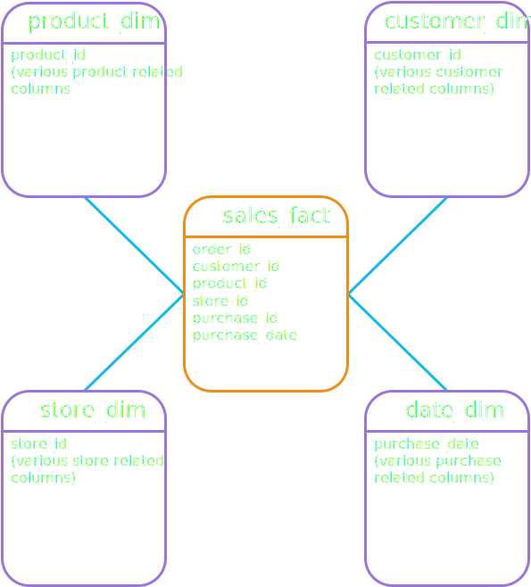
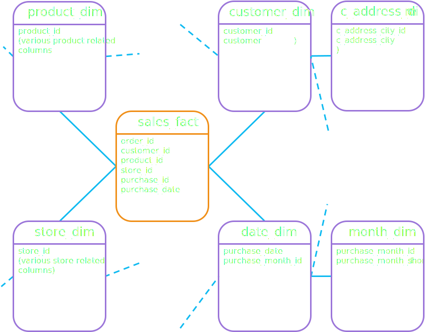

# Data Warehouse Fundamentals for Beginners

## <b>Data warehousing concepts</b>

### <b>What is data warehouse ?</b>
- Essentially just a large store of data accumulated from a wide range of sources
- Data Warehouse <b style="color:Red">&#8800;</b> Database 
- Data is <b style="color:Green;">copied</b> <b>not</b> <b style="color:Red">moved</b>
- Data is <b style="color:#f08f18">restructured</b> and <b style="color:#f08f18">re-organized</b>
- Why ? - To support data driven decision making.
#### <b>Rules for Data warehousing (Bill Inmon 1990)</b>
- <b style="color:#0FBAF1">Integrated</b> 
  <p>data from multiple source systems --> data warehouse</p>
- <b style="color:#0FBAF1">Subject Oriented</b> 
  <p>Regardless of data , must be re-organized.</p>
- <b style="color:#0FBAF1">Time Variant</b> 
  <p>Contains current and historical data. Look at change over time</p>
- <b style="color:#0FBAF1">Non - Volatile </b> 
  <p>Remains stable between refreshes and does not change</p>

### <b>Reasons to build a data warehouse</b>
- <b style="color:#0FBAF1">Data Driven Decisions</b>
  <p>Need a view of past, present, future and the unknown for business decisions. Tell something important from the data. Also known as <b>BI</b></p> 
- <b style="color:#0FBAF1">One stop Shopping</b>
  <p>Easier to access data as the data is <b b style="color:#f08f18">integrated</b> from multiple sources</p>

### <b>Data Virtualization</b>
- <b style="color:#0FBAF1">Read only</b>
  <p>Cannot change the data at the source</p>
- <b style="color:#0FBAF1">Do not copy</b>
  <p>Data accessed at source whenever needed and manipulated</p>
<p>Useful when there are 
  <b b style="color:#f08f18">simple transformations</b>,
  <b b style="color:#f08f18">small # of data sources</b> and a
  <b b style="color:#f08f18">relaxed response time</b>  
</p>

### <b>Data Lake VS Data Warehouse</b>
<p>To simply put it, a data lake is vast pool of <b style="color:#f08f18">raw, unstructured</b> data and a data warehouse has <b b style="color:#f08f18">structured</b> processed data</p>

- <b style="color:#0FBAF1">Data Warehouse</b>
  <p>A data warehouse is built on-top of RDBMS or MDBMS </p>

- <b style="color:#0FBAF1">Data Lake</b>
  <p>A data lake is built on-top of a big data environment</p>

### <b> Big Data and 4Vs </b>
#### <b>The four Vs for Big Data</b>
- <b style="color:#0FBAF1">Volume</b>
  <p>Helps handle extremely large volumes of data</p> 
- <b style="color:#0FBAF1">Velocity</b>
  <p>Supports the rapid intake of big data</p> 
- <b style="color:#0FBAF1">Variety</b>
  <p>Different variety in the types of data, such as audio files, emails and complex documents</p>
- <b style="color:#0FBAF1">Veracity</b>
  <p>The quality of the data to be analyzed, how <b style="color:#f08f18">reliable/significant</b> the data is</p>
<p>Data warehousing typically deal with more structured data like dates or small character strings but it can deal with other types of data with the help of extra tools</p>

### <b> Data Warehousing + Lakes + Virtualization </b>
- <p>Warehousing along with Lakes and Virtualization can all be a part of decision making and analytics</p>

### <b> Simple End to End data warehousing environment </b>
<p> Data from sources is copied and transformed to a data warehouse via a process called <b style="color:#f08f18">ETL</b></p>

- <b style="color:#0FBAF1">Extract</b> the data from the source by copying
- <b style="color:#0FBAF1">Transform</b> Transform the data to make it understandable and useable
- <b style="color:#0FBAF1">Load</b> Load the data into systems, creating a warehouse to be used by end users

----

## <b>Data warehousing Architecture</b>
### <b>Centralized data warehouse</b>
- A single data warehousing environment
- All data goes into a <b style="color:#f08f18"> single </b> database
- Advantage is that it's all together in one place
### <b>Data Mart</b>
- <b style="color:#f08f18"> Dependent </b> data marts depend on the data warehouse to obtain specific data
- <b style="color:#f08f18"> Independent </b> data marts does not require a data warehouse and draws from 1 or more sources.
  | <b style="color:#0FBAF1">Dependent</b> | <b style="color:#0FBAF1">Independent</b> |
  | -------------------------------------- | ---------------------------------------- |
  | data from warehouse                    | data from applications / systems         |
  | uniform                                | not uniform                              |
  | architecturally straightforward        | "spaghetti" architecture                 |

### <b>Data Warehouse VS Independent Data Mart</b>
They are basically the same except for the number of data sources
  | <b style="color:#0FBAF1">Data Warehouse</b> | <b style="color:#0FBAF1">Data Mart</b> |
  | ------------------------------------------- | -------------------------------------- |
  | Many sources (```50+```)                    | Few sources (```1-6```)                |

### <b>DW Architectural Options</b>
dataWarehouseTree.png

#### <b> Centralized </b>
- Default option, one stop shopping, modern tech
- High cross-org cooperation, data governance, ripple effects

#### <b> Centralized - EDW </b>
- Building a DW to satisfy the analytical needs for an enterprise
- Can go further to use relational or specialized databases

#### <b> Centralized - Data Lake </b>
- Sometimes a Data Lake is required
- Platforms such has Hadoop, AWS S3


#### <b> Component-Based </b>
- Divide data into multiple components, isolating environments from changes
- Mix-match tech
- Bolt together components 
- Inconsistent data, difficult to cross-integrate.

#### <b> Component-Based - Architected</b>
- Built with DWs + DMs or just DMs
- With DWs + DMs, the DMs would be dependent or front-end DMs (reverses order of data flow for DMs and DWs)  

#### <b> Component-Based - Un Architected</b>
- Built with DMs
- DW Bus , follows conformed dimensions, follows apples ->  to apples
- Considers all DMs in decision making.

### <b>Cube and MDBMS</b>
- Not a relational database (RDBMS)
- Dimensionally aware
- Fast query times
- "modest" data volumes (`<100GB`>)
- less flexible data structures
- nowadays take advantage of both RDBMS and MDBMS and can be used together

### <b>Operational Data Store (ODS)</b>
- Similar to a DW but only focuses on current operational data
- Realtime data comes in, instead of waiting for the next data refresh to update the database.
- <i>"Tell me what is happening right now"</i> is the focus of an ODS
- ODS and DW can coexist and users would pick depending on their needs
- Another option would be data would go into ODS then to a DW
- Can be used with all the other options (DWs, DLs and DVs)

### <b>The layers in a DW</b>
<p> A data warehouse has the following two layers <p>
<ul>
  <li> <b style="color:#0FBAF1">Staging</b> </li>
  <p> A <i>"landing zone"</i> for incoming data from the source</p>
  <li> <b style="color:#0FBAF1">User Access</b> </li>
  <p> Where users access the DW and DMs to obtain data for analytics and decision making</p>
</ul>

#### <b> The Staging Layer </b>
<ul>
  <li>Data needs to be pulled from source systems quickly and non-intrusively </li>
  <li>Focus on the <b style="color:#f08f18">E</b> more than <b style="color:#f08f18">T</b> of <b style="color:#f08f18">ETL</b> when integrating data from the source </li>
</ul>

#### <b> Different types of staging layers </b>
<ul>
  <li> <b style="color:#0FBAF1">Non - Persistent</b> </li>
  <p> After ETL and the user access layer has the data, the staging layer is emptied out </p>
  <p> Less storage but would require to go back to source if QA is required </p>
  <li> <b style="color:#0FBAF1">Persistent</b> </li>
  <p> The same as non - persistent except the data in the staging layer is kept </p>
  <p> More storage but do not need to go back to source however there is a risk of ungoverned access </p>
</ul>

---

## <b>Bring Data into your Data Warehouse </b>

### <b>E</b> <b style="color:#f08f18">T</b> <b style="color:#9b75d9">L</b>
<ul>
  <li><b style="color:#0FBAF1">Extract</b></li>
  <ul>
    <li>Quickly pull data from sources</li>
    <li>Done in <i>"batches"</i>, so at set intervals such as every week/day/hours</li>
    <li>In a raw form, may contain errors as well</li>
    <li>Goes into the Staging Layer</li>
  </ul>
  <li><b style="color:#0FBAF1">Transform</b></li>
  <ul>
    <li>Data from multiple sources may differ from one another, stored differently structurally</li>
    <li>Prepare the data, and turn it as uniform as possible</li>
    <li>Can be <b>very</b> complex</li>
  </ul>
  <li><b style="color:#0FBAF1">Load</b></li>
  <ul>
    <li>After the data is prepared, it will be stored in the user access layer</li>
    <li>Significant data <b style="color:#f08f18">analysis</b> & <b style="color:#f08f18">modeling</b> is required <b>before</b> storing data</li>
  </ul>
</ul>

### <b>E</b> <b style="color:#9b75d9">L</b> <b style="color:#f08f18 " >T</b>
<p> Flip the order for T & L, so extract and load the data in first as is, then apply transformations when needed. </p>
<ul>
  <li><i>"Blast"</i> the data into a low level storage bucket such as Hadoop or AWS S3 where structure is irrelevant </li>
  <li>Use the computing power in the large data environments , improves performance for extremely large volumes of data</li>
  <li>"Schema on read" vs. "Schema on write", schema is deferred until the data is available for analytic usage</li>
</ul>

### <b>When to use ETL or ELT</b>
<ul>
  <li>Traditional DW built upon RDBMS or cubes (MDBMS) then use ETL</li>
  <li>Data lake or DW - DL hybrid, then an ELT would be better to use</li>
</ul>

### <b>Initial ETL</b>
<ul>
  <li>Before DW goes live, get all data transform and load it, typically only happens once</li>
  <li>Only bring in <b>relevant</b> data for BI and analytics</li>
  <li>It is possible to redo the entire DW  if it gets corrupted etc.</li>
  <li>Data that is <b>definitely</b> needed, <b>probably</b> needed and <b>historical</b> data</li>
</ul>

### <b>Incremental ETL</b>
<ul>
  <li>Data in the DW is incrementally "refreshed" at set intervals to keep DW up to date</li>
  <li>New data or modified data is brought in</li>
  <li>Deleted data is specially handled, usually kept for historical purposes</li>
</ul>

#### <b>Four Major Incremental ETL patterns</b>
<ul>
	<li><b style="color:#0FBAF1">Append</b> (normally used today)</li>
	<p>Any new data gets appended to the DW onto whatever that is already there</p>
  
  <li><b style="color:#0FBAF1">In-place update</b> (normally used today) </li>
	<p>Not appending, but making changes in existing data</p>
  
  <li><b style="color:#0FBAF1">Complete Replacement</b></li>
	<p>A portion of the DW is overridden even if the changes are small</p>
  
  <li><b style="color:#0FBAF1">Rolling append</b></li>
	<p>Whenever there is new update, you wipe out the oldest equivalent data in the given time period where the time window keeps rolling</p>
</ul>

### <b>Explore the role of Data transformation</b>

#### <b>Data transformation goals</b>
<ul>
	<li><b style="color:#0FBAF1">Uniformity</b></li>
	<p>Data has to be kept uniform as it may originally not be</p>

  <li><b style="color:#0FBAF1">Restructuring</b></li>
	<p>Raw data is un-organized so it needs to be restructured to be </p>
</ul>

### <b>Common Transformation models</b>
<ul>
	<li><b style="color:#0FBAF1">Data value unification</b></li>
	<p>Unify data inconsistent data values</p>

  <li><b style="color:#0FBAF1">Data type and size unification</b></li>
	<p>Unify the data type and size for data values</p>

  <li><b style="color:#0FBAF1">De - duplication</b></li>
	<p>Remove duplicate data coming in from multiple data sources</p>

  <li><b style="color:#0FBAF1">Dropping columns (vertical slicing) </b></li>
	<p>Drop columns for information that is not required for the given purpose</p>

  <li><b style="color:#0FBAF1">Value-based row filtering (horizontal slicing)</b></li>
	<p>Drop rows for information that is not required for the given purpose</p>

  <li><b style="color:#0FBAF1">Correct known errors</b></li>
	<p>If the existence of errors is known, they are corrected on its way to the DW</p>
</ul>

### <b>Multiple ETL feeds</b>
<ul>
	<li>Many ETL feeds going into one DW where each feed will be a mix & match approach</li>
	<li>Each ETL feed will be different in how frequently the data is updated or what transformation pattern it uses</li>
  <li>Going further into the feed, at a tabular level, each table may have different patterns on how the data is updated or brought into the overall DW </li>
</ul>
<p><b>Design and build what makes sense for your environment</b></p>

---

## <b>Data Warehousing building blocks </b>

### <b>Deciding what your DW will be used for </b>
Ever DW is used to make Data driven decisions but depends on the type of BI
<table>
  <tr style="color:#0FBAF1">
    <th>BI Category</th>
    <th>Data Model</th>
  </tr>
  <tr>
    <td>Basic Reporting</td>
    <td>Dimensional</td>
  </tr>
  <tr>
    <td>Online analytical processing</td>
    <td>Dimensional</td>
  </tr>
  <tr style="color:#9c9c9c">
    <td>Predictive Analysis</td>
    <td>Data mining / Specialized</td>
  </tr>
  <tr style="color:#9c9c9c">
    <td>Exploratory</td>
    <td>Data mining / Specialized</td>
  </tr>
</table>

### <b>Principles of Dimensionality</b>

#### <b>Making data - driven decisions</b>
<ul>
	<li><b>One ore more </b> <b style="color:#9b75d9">measurements</b> </li>
	<p>Measurements are required in order to be used for analysis</p>
  <li><b style="color:#f08f18">Dimensional context</b> <b>for each measurement</b></li>
	<p>Context is required for a measurement a number that has no symbol or words could mean anything</p>
</ul>

#### <b>Providing dimensional context with <b style="color:#0FBAF1">by</b> and <b style="color:#0FBAF1">for</b></b>

<table>
  <tr>
    <th>Wording</th>
    <th>Usage</th>
  </tr>
  <tr>
    <td style="color:#0FBAF1"><b>By</b></td>
    <td>"Sliced and grouped" by values of the entire dimension</td>
  </tr>
  <tr>
    <td style="color:#0FBAF1"><b>For</b></td>
    <td>One or more specific values from within the entire dimension</td>
  </tr>
</table>

<p>Some examples of both implicit and explicit examples given below for dimensional context</p>
<ul>
	<li><b style="color:#0FBAF1">By</b></li>
	<p>What is the <b style="color:#9b75d9">average annual revenue</b> <b style="color:#f08f18">by product type, by brand.</b></p>
  
  <li><b style="color:#0FBAF1">For</b></li>
	<p>What is the <b style="color:#9b75d9">average annual revenue</b> <b style="color:#f08f18">for brand_A by product type</b></p>

  <li><b style="color:#0FBAF1">Implied and swapped wording</b></li>
	<p>What is the <b style="color:#9b75d9">average annual salary</b> <b style="color:#f08f18">last year for all assistant mangers at every branch</b></p>
</ul>
<p>The critical lesson is that we have to organize data by measurements, filtered and organized by context, which will help when making data driven decisions</p>

### <b>Compare Facts, Fact tables, Dimensions, Dimension Tables.</b>
<ul>
	<li>Measurements = facts</li>
  <li>Dimensional context = dimensions</li>
</ul>

#### <b>Facts</b>
<ul>
	<li>Numerical & quantifiable</li>
  <li>Think "measurement", (salary, money, #students in a course) </li>
  <li>Not the same as a logical fact</li>
  <li>Facts are stored in fact tables</li>
  <li>Fact <b style="color:Red">&#8800;</b> Fact table</li>
</ul>

#### <b>Dimensions</b>
<ul>
	<li>Context for a fact</li>
  <li>Example a student, employee, a building</li>
  <li>Dimensions are stored in dimension tables</li>
  <li> Dimensions and dimension table are interchangeable but different</li>
</ul>

### <b>Additivity in facts</b>
<p>A DW fact can be ...</p>
<ul>
	<li><b style="color:#0FBAF1">Additive</b></li>
	<p>An additive fact can be added under all circumstances</p>

  <li><b style="color:#0FBAF1">Non - Additive</b></li>
	<p>A fact that cannot be added, for example, averages, ratios</p>
  <ul>
		<li>Store the underlying component of the fact in fact table</li>
    <li>Use underlying components to calculate the averages, ratios, etc </li>
	</ul>

  <li><b style="color:#0FBAF1">Semi - Additive</b></li>
	<p>In-between sometimes you can add and sometimes you can't</p>
</ul>
<p><b>Additivity relates solely to the "ability to add"</b></p>

### <b>Star and Snowflake Schemas</b>
<p>Same dimensions different table representation</p>
<table>
  <tr style="color:#0FBAF1">
    <th>Start Schema </th> 
    <th>Snowflake Schema</th>
  </tr>
  <tr>
    <td>All dimensions in a hierarchy in a single dim table </td>
    <td>Each dimension level in its own dim table</td>
  </tr>
  <tr>
    <td>One level away from a fact table along each hierarchy </td>
    <td>One or more levels away from a fact table along each hierarchy</td>
  </tr>
  <tr>
    <td>Fewer DB joins </td>
    <td>More DB joins</td>
  </tr>
  <tr>
    <td>DB primary key relationship --> foreign key straightforward</td>
    <td>DB primary key relationship --> foreign key complex</td>
  </tr>
  <tr>
    <td>More DB storage needed for dimensional data</td>
    <td>Less DB storage needed for dimensional data</td>
  </tr>
  <tr>
    <td>More repeating data</td>
    <td>Less repeating data</td>
  </tr>
</table>

#### <b>Star Schema</b>


#### <b>Snowflake Schema</b>


### <b>Database Keys for DW</b>

#### <b style="color:#0FBAF1">Primary Key</b>
<ul>
	<li>A unique identifier for each row in a database table</li>
  <li>Might have more than one column to uniquely identify each row</li>
  <li>An example would be an ID column where each ID is unique</li>
</ul>

#### <b style="color:#0FBAF1">Foreign Key</b>
<ul>
	<li>This column would point to another tables' Primary key</li>
  <li>Indicates Logical relationships</li>
  <li>Improves query performance and enforces data integrity</li>
</ul>

#### <b style="color:#0FBAF1">Natural Key</b>
<ul>
	<li>May or may not be understandable, can infer what the key means</li>
  <li>Natural keys are not generated but already exist from the source system</li>
</ul>

#### <b style="color:#0FBAF1">Surrogate Key</b>
<ul>
	<li>No "business meaning" and is usually just a random string of numbers</li>
  <li>DB itself will generate the keys</li>
</ul>

#### <b style="color:#0FBAF1">DW and natural keys</b>
<table>
  <tr style="color:#0FBAF1">
    <th>Question/Decision </th> 
    <th>Guidance</th>
  </tr>
  <tr>
    <td>Use surrogate keys as primary and foreign keys ? </td>
    <td>Add surrogate keys as data comes into DW</td>
  </tr>
  <tr>
    <td>Keep or discard natural keys in DTs ? </td>
    <td>Keep as "secondary keys"</td>
  </tr>
  <tr>
    <td>Keep or discard natural keys in FTs ? </td>
    <td>Best practice is to discard</td>
  </tr>
</table>

---

## <b>Design Facts, Fact Tables, Dimensions and Dimension Tables </b>

### <b>Foundational Concepts</b>
<ul>
	<li>Dimension <b style="color:#0FBAF1">&#8594;</b> Context for measurements (facts)</li>
  <li>Dimension <b style="color:Red">&#8800;</b> Dimension Table </li>
  <li>"Table" <b style="color:#0FBAF1">&#8594;</b> relational database </li>
  <li>RDBMS table require primary keys </li>
  <li>DW primary key = surrogate key </li>
</ul>

### <b>Dimension Table ground rules</b>
<ul>
	<li><b style="color:#0FBAF1">Use surrogate keys as primary keys to replace natural keys</b></li>
	<p> <code> &lt;name&gt;_ID </code> Is a natural key, <code> &lt;name&gt;_key </code> is a surrogate primary key </p>
  
  <li><b style="color:#0FBAF1">Key DW subject areas</b></li>
	<p>Areas that provide context to measurements</p>
  
  <li><b style="color:#0FBAF1">Provide meaningful information</b></li>
	<p>These dimension tables become "One-stop-shopping" subjects</p>
</ul>


### <b>Design Dimension Tables for Star Schemas</b>
<ul>
	<li><b style="color:#0FBAF1">A single table</b></li>
	<p>For a hierarchy with multiple dimensions, there is just a single table</p>
  
  <li><b style="color:#0FBAF1">Dimension table setup</b></li>
  Each dimension table will have only 1 primary surrogate key, and multiple natural keys which correspond to the dimensions in the hierarchy

</ul>

### <b>Design Dimension Tables for Snowflake Schemas</b>
<ul>
	<li><b style="color:#0FBAF1">1 table for each level of a hierarchy</b></li>
	<p>Each table relates to its own dimension</p>
  
  <li><b style="color:#0FBAF1">Every non-terminal dimension has</b></li>
	<ul>
		<li>Primary Key which is a surrogate Key</li>
    <li>A foreign key which is a primary/surrogate key of one level above table</li>
	</ul>

  <li><b style="color:#0FBAF1">Every terminal dimension has</b></li>
	<ul>
		<li>Primary Key which is a surrogate Key</li>
    <li>No higher foreign key as there is no higher level</li>
	</ul>
</ul>

### <b>Four Types of DW Fact Tables</b>
<ul>
	<li><b style="color:#0FBAF1">Transaction Fact Table</b></li>
	<p>Records facts (measurements) from transactions in source systems</p>

  <li><b style="color:#0FBAF1">Periodic Fact Table</b></li>
	<p>Track some sort of periodic measurements at regular intervals</p>

  <li><b style="color:#0FBAF1">Accumulating Snapshot Fact Table</b></li>
	<p>Track the progress of a well defined process through various changes</p>

  <li><b style="color:#0FBAF1">Fact-less Fact Table</b></li>
	<p>Record the occurrence of a transaction or coverage of eligibility of relationships</p>
</ul>

### <b>Transaction Fact Table</b>
<ul>
	<li><b style="color:#0FBAF1">Transaction-grained fact table</b></li>
	<p>There is a lot of detail</p>

  <li><b style="color:#0FBAF1">Heart of the dimensional model</b></li>
	
  <li><b style="color:#0FBAF1">Store facts from transactions</b></li>
  <p>There is a lot of detail</p>

  <li><b style="color:#0FBAF1">Number of facts</b></li>
  <p>More facts can be stored but there are rules which govern which can/cannot be stored</p>
</ul>

### <b>Rules governing fact and transaction fact tables</b>
<p>We can store more than 2 facts in the same fact table if and only if </p>
<ul>
	<li><b style="color:#0FBAF1">Facts available at the same level of detail (grain) </b></li>
	<p>The dimensions must include facts that are related and analyzed at the same grain</p>

  <li><b style="color:#0FBAF1">Facts occur simultaneously </b></li>
  <p>The process must occur at the same time</p>
</ul>

<p>The reason both these points must apply is that </p>
<ul>
	<li>Complicates Data Analysis if facts are parts of different business processes</li>
  <li>Requires SQL workarounds</li>
</ul>

#### <b>Keys in Transactional Fact Tables</b>
<ul>
	<li><b style="color:#0FBAF1">Primary Key</b></li>
	<p>Combination of <b style="color:#f08f18">all foreign keys</b> that correspond to the dimension table even if the fact table has a natural key</p>
</ul>

### <b>Periodic snapshot fact tables</b>
<p>Take and record regular periodic measurements = levels</p>
<ul>
	<li><b style="color:#0FBAF1">Aggregated result of "regular" transactions</b></li>
  <p>For example taking periodic measurements of balances at the end of each week</p>

  <li><b style="color:#0FBAF1">Levels are  not related to "regular" transactions</b></li>
  <p>An example would be tracking the volume of water in a reservoir at a specific interval</p>
</ul>

### <b>Periodic snapshot fact tables and semi-additive facts</b>
<p>An example of a periodic snapshot table with semi-additive facts. <p>
<p>Let's say you were tracking periodically tracking the volume of water in multiple tanks every week. These tanks are independent of one another (ie in different locations).</p>
<p>For a single tank you cannot add all the periodically measure volumes, but you can use it to find an average for that tank over a time period </p>

### <b>Accumulating snapshot fact table</b>
<ul>
	<li><b style="color:#0FBAF1">Measure the elapsed time spent for each phase</b></li>
	
  <li><b style="color:#0FBAF1">Include both completed and in-progress phases</b></li>
  <p>At any given time we can look at a fact table to see where one or more business processes are</p>

  <li><b style="color:#0FBAF1">Can also track other measurements along with the cycle</b></li>

  <li><b style="color:#0FBAF1">Multiple relationships from fact table to a single dimension table</b></li>
</ul>

### <b>Fact-less fact table</b>
<ul>
	<li><b style="color:#0FBAF1">An event that needs to be tracked but nothing significant about it</b></li>
	<p>For example a webinar where students can register their interests</p>

  <li><b style="color:#0FBAF1">Include both completed and in-progress phases</b></li>
</ul>

#### <b>1st Type of fact-less fact table</b>
<ul>
	<li>The "measurement" is actually the occurrence of the event</li>
  <li>The presence of a row in the (fact-less) fact table is the measurement itself</li>
  <li>Can count rows with or without filters</li>
  <li>Fact-less fact table has PK/FK columns only</li>
  <li>A tracking fact can be used to count rows and the value is 1</li>
</ul>

#### <b>2nd Type of fact-less fact table</b>
<ul>
	<li>Record a particular relationship or association among multiple parties</li>
  <li>Transactions do not occur</li>
  <li>Typically starting and ending time or date</li>
  <li>An example would be an advisor assigned to a student</li>
</ul>

### <b>Structure of Fact tables in schemas</b>

#### <b>Star Schema</b>
<ul>
	<li>The main fact table will have the primary key as the foreign key for the corresponding dimension table</li>
  <li>All the information for all hierarchies related to the foreign key is accessible in the corresponding dimension table</li>
</ul>

#### <b>Snowflake Schema</b>
<ul>
	<li>Only store the lowest level of PK-FK relationship in the fact table </li>
  <li>The lowest dimension table will link to the one above in the hierarchy</li>
</ul>


---

## <b>Managing Data Warehouse History Through Slowly Changing Dimensions (SCD) </b>

### <b>SCD</b>
<ul>
	<li>Techniques used to manage history within data warehouse</li>
  <li>Multiple techniques based on various historical data policies</li>
  <li>Enables DW to manage history regardless of policies in transactional applications</li>
</ul>

#### <b>Polices for historical data</b>
<ul>
	<li>Overwrite old data - no history retention</li>
  <li>Maintain unlimited history</li>
  <li>Maintain limited history</li>
</ul>

<table>
  <tr>
    <th>SCD Type</th>
    <th>Technique</th>
    <th>Implications</th>
  </tr>

  <tr>
    <td>Type 0</td>
    <td>Always retain original values</td>
    <td>?</td>
  </tr>

  <tr>
    <td>Type 1</td>
    <td>In place update</td>
    <td>Simple but no history</td>
  </tr>

  <tr>
    <td>Type 2</td>
    <td>Create new dim table row for each version</td>
    <td>Complex but robust</td>
  </tr>

  <tr>
    <td>Type 3</td>
    <td>Small dim table columns for multiple versions</td>
    <td>Switch back & forth "as-is" and "as-was"</td>
  </tr>

  <tr>
    <td>Type 4</td>
    <td>Some columns change more than others do</td>
    <td>?</td>
  </tr>
</table>


### <b>Type 1 SCD</b>
<ul>
	<li>Replace old value with new value</li>
  <li>Main usage us to correct errors and when the old value is not needed</li>
  <li>A simple overwrite</li>
</ul>

<table>
  <tr>
    <th>Advantages</th>
    <th>Disadvantages</th>
  </tr>
  <tr>
    <td>Simple & Straightforward</td>
    <td>Might want history of errors</td>
  </tr>
  <tr>
    <td>Errors gone forever</td>
    <td>DA can change before and after error</td>
  </tr>
  <tr>
    <td>Best case for when you "don't need historical data</td>
    <td>Tendency to overuse Type 1 over Type 2</td>
  </tr>
</table>

### <b>Type 2 SCD</b>

#### <b>Method for type 2 SCD</b>
<ul>
	<li>Existing row is kept, new row added</li>
  <li>New row reflects current state of all attributes</li>
  <li>Complications with reporting and analytics</li>
</ul>

#### <b>Why Type 2 SCD</b>
<ul>
	<li>Needed to accurately reflect state of data for reporting & analytics</li>
  <li>Could include NKs but not recommended as it takes a lot of storage</li>
  <li>Use "multi - step" SQL queries</li>
</ul>

#### <b>Maintain correct order of data</b>
<p>The base version of type 2 change maintains limitless versions but does not indicate order</p>
<p>Solution include...</p>
<ul>
	<li>To add a flag column, with T/F data</li>
  <li>If multiple changes, then another solution is effective - exp date</li>
  <p>This row of data from date, to expiration date. If data changes, exp date is changed to when it changes and new row is added with the exp date.</p>
  <li>A combination of flags and eff-exp date can be used as well</li>
</ul>

### <b>Type 3 SCD</b>

#### <b>Method for type 3 SCD</b>
<ul>
	<li>Adding a new column to reflect changes (old/new) columns</li>
  <li>Supports back - and - forth switching for flexible reporting & analytics</li>
  <li>Useful if all data in same dimension being re-organized</li>
  <li>Not limited to 2 columns, but past 4 better to change to Type 2 SCDs</li>
</ul>

#### <b>Limitations</b>
<ul>
	<li>Use cases where every row in a dim  table will change at the same time </li>
  <li>classic use case</li>
  <li>Not suited for random changes, for a single row</li>
</ul>

---

## <b>Designing Your ETL </b>

### <b>Build ETL from ETL Architecture</b>

#### <b>Best practice and guidelines</b>
<ul>
	<li><b style="color:#0FBAF1">Limit amount of incoming data to be processed</b></li>
	<p>Limit it to a small subset, so data that's not in the DW or update information</p>

  <li><b style="color:#0FBAF1">Process dimension tables before fact tables</b></li>
	<p>This is because keys in fact tables need to be able to access the data in the DIM tables</p>

  <li><b style="color:#0FBAF1">Opportunities for parallel processing</b></li>
	<p>To save time process multiple dimension tables at a time</p>
</ul>

### <b>ETL for Dimension table (star schema example)</b>
<p>For snowflake schemas you  would need to deal with dependencies from other tables</p>
<ul>
	<li><b style="color:#">Step 1: Data Preparation</b></li>
  <li><b style="color:#">Step 2: Data Transformation</b></li>
  <li><b style="color:#">Step 3: Process new dimension rows</b></li>
  <li><b style="color:#">Step 4: Process SCD type 1 changes</b></li>
  <li><b style="color:#">Step 5: Process SCD type 2 changes</b></li>
</ul>


#### <b>Step 1 : data preparation - "change data capture"</b>
<p>Ideally you want to detect at the source before latter stages of ETL or in the DW to check if data is new or old.</p>
<ul>
	<li><b style="color:#">Transactional data timestamps</b></li>
	<p>Data has timestamps on each row of data, by comparing timestamps before the last ETL run, can skip if timestamp has not changed</p>

  <li><b style="color:#">Database Logs</b></li>
	<p>Compare the actual data in the database logs</p>

  <li><b style="color:#">Last-resort</b></li>
	<p>Compare inside the DW by scanning and comparing</p>
</ul>

#### <b>Step 2 : Data transformation"</b>
Refer back to transformation models

#### <b>Step 3: "Dimension Rows"</b>
For each row that will be coming in for consideration into the DW
<ul>
	<li>If new: add to DIM table</li>
  <li>If not new: process any Type 1 & 2 changes</li>
</ul>

#### <b>Step 4: Process SCD Type 1 to a DIM table</b>
<ul>
	<li>Might need to apply Type 1 change to multiple rows (occurs after a prior T2 change)</li>
  <li>Done by looking for all DIM table rows with NKs</li>
</ul>


#### <b>Step 5: Process SCD Type 2 to a DIM table</b>
<ul>
	<li>A basic append with a new (generated) surrogate key by using a NK as a guide</li>
</ul>


### <b>Design ETL for Fact tables</b>
<p>Watch out for complications with all dimension and fact table data during ETL</p>

---

## <b>Selecting Your Data Warehouse Environment </b>