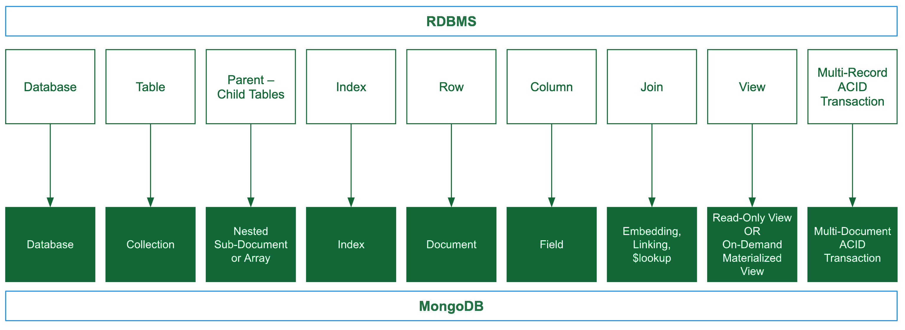
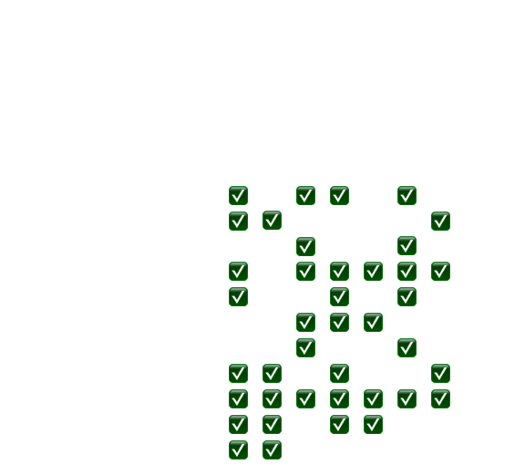

# MongoDB M001 Notes

## <b>Chapter 1 - What is MongoDB</b>

### <b>What is MongoDB</b>
<ul>
	<li><b style="color:#32a852">NoSQL DB</b></li>
	<p>A DB with no related tables of data</p>

  <li><b style="color:#32a852">NoSQL Document DB</b></li>
	<p>Data in MongoDB is stored as documents</p>

  <li><b style="color:#32a852">Collection of Documents</b></li>
	<p>Data in MongoDB is stored as documents</p>
</ul>

### <b>What is a document in MongoDB</b>
<ul>
	<li><b style="color:#32a852">Document</b></li>
	<p>Organize and store data as field - value pairs</p>

  <li><b style="color:#32a852">Collection</b></li>
	<p>Organized store of documents with common fields between documents</p>
</ul>

### <b>MongoDB Atlas</b>
<ul>
	<li><b style="color:#32a852">MongoDB Atlas</b></li>
	<p>A cloud DB with mongoDB at its core</p>

  <li><b style="color:#32a852">Clusters</b></li>
	<p>Groups of servers that store your data</p>

  <li><b style="color:#32a852">Replica Set</b></li>
	<p>A set of connected mongoDB instances that store the same data.
  <br>This is because if one instance becomes unusable, the remaining instance are still there</p>

  <li><b style="color:#32a852">Instance</b></li>
	<p>A single machine locally or in the cloud running a certain software</p>
</ul>

---

## <b>Chapter 2 Importing, Exporting & Querying Data</b>

### <b>What is a Valid JSON document</b>
<ul>
	<li><b style="color:#32a852">Document - JSON</b></li>
	<ul>
    <li>Start and end with <code>{}</code></li>
    <li>Separate <b style="color:#32a852">key</b> and <b style="color:#32a852">value</b> with  <code>:</code> </li>
    <li>Separate <b style="color:#32a852">key : value </b> pairs with  <code>,</code> </li>
    <li><b style="color:#32a852">keys</b> surrounded by <code>" "</code> </li>
  </ul>
</ul>

### <b>Pros and Cons</b>
<table>
  <tr style="color:#32a852">
    <th>Advantages</th>
    <th>Disadvantages</th>
  </tr>
  <tr>
    <td>Friendly</td>
    <td>Text-Based</td>
  </tr>
  <tr>
    <td>Readable</td>
    <td>Space-Consuming</td>
  </tr>
  <tr>
    <td>Familiar</td>
    <td>Limited</td>
  </tr>
</table>

### <b>BSON</b>
Bridges the gap between binary representation of the JSON format
<table>
  <tr style="color:#32a852">
    <th></th>
    <th>JSON</th>
    <th>BSON</th>
  </tr>
  <tr>
    <th style="color:#32a852">Encoding</th>
    <td>UTF-8 String</td>
    <td>Binary</td>
  </tr>
  <tr>
    <th style="color:#32a852">Data</th>
    <td>String, Bool, Number, Array</td>
    <td>String, Bool, Number(Data Types), <br> Array, Date, Binary</td>
  </tr>
  <tr>
    <th style="color:#32a852">Readability</th>
    <td>Human & Machine</td>
    <td>Machine Only</td>
  </tr>
</table>

### <b>Import and Export</b>

#### <b>Export</b>
- BSON
  ```
  mongodump --uri "<Atlas Cluster URI>"
  ```
- JSON
  ```
  mongoexport --uri "<Atlas Cluster URI>"
              --collection = <collection name>
              --out = <filename>.json
  ```
  
  ```
  mongoimport --db dfx --collection trainees --file dfxDataImport.json
  ```

### <b>Some Commands</b>
<ul>
	<li><code>show dbs</code></li>
	<p>Shows all dbs in the clusters</p>
  
  <li><code> use &lt;dbName&gt; </code></li>
	<p>Switches to the database of the dbName provided</p>

  <li><code> show collections</code></li>
	<p>shows all collections in the current db </p>

  <li><code> db.&lt;collectionName&gt;.find({"&lt;key&gt;" : "&lt;value&gt;"}, ...) </code></li>
	<p>finds the documents which depend on the filter in find</p>

  <li><code> it </code></li>
	<p>iterates through a cursor which is a pointer to a result set of a query</p>

  <li><code> .count()</code></li>
	<p>append on a <code>.find()</code> to count the number of documents which match the criteria</p>

  <li><code> .count()</code></li>
	<p>append on a <code>.find()</code> to count the number of documents which match the criteria</p>

  <li><code> .pretty()</code></li>
	<p>append on a <code>.find()</code> to make result shown look easier to read</p>

  <li><code> db.&lt;collectionName&gt;.findOne() </code></li>
	<p>finds the first document in the collection</p>

  <li><code> db.&lt;collectionName&gt;.insert({"&lt;key&gt;" : "&lt;value&gt;", ...}, ...) </code></li>
	<p>Insert documents into the collection, cannot insert something with the same <code>_id</code></p>

  <li><code> ...updateMany({"&lt;key&gt;" : "&lt;value&gt;", ...}, {"$&lt;operator&gt;" : {"&lt;key&gt;" : "&lt;value&gt;", ...}}) </code></li>
	<p>Update many matching documents with the new document values and corresponding operator</p>

  <li><code> ...updateOne({"&lt;key&gt;" : "&lt;value&gt;", ...}, {"$&lt;operator&gt;" : {"&lt;key&gt;" : "&lt;value&gt;", ...}}) </code></li>
	<p>Update one matching documents with the new document values and corresponding operator</code></p>

  <li><code> ...deleteOne({"&lt;key&gt;" : "&lt;value&gt;", ...}) </code></li>
	<p>Update one matching documents with the new document values and corresponding operator</code></p>

  <li><code> ...deleteMany({"&lt;key&gt;" : "&lt;value&gt;", ...}) </code></li>
	<p>Update one matching documents with the new document values and corresponding operator</code></p>
</ul>

---

## <b>Chapter 3 - Creating and Manipulating Documents</b>

### <b>ObjectID</b>
<ul>
	<li><b style="color:#32a852">_id</b></li>
	<p>Every document has a unique <b style="color:#32a852">_id</b> value</p>
  
  <li><b style="color:#32a852">ObjectID()</b></li>
	<p>Default value for the <b style="color:#32a852">_id</b> field unless specified</p>
</ul>

```JSON
    {"_id" : ObjectID("52cdef7c4bab8bd675297d8a")}
    {"_id" : "123-ABC-45"}
  ```
### <b>Inserting multiple documents</b>
<ul>
	<li>When inserting multiple documents, they are inserted in the order that is listed in the arguments of the insert command</li>

  <li>If there is an error in the data being inserted, like a duplicate <code>_id</code>, the documents that come after the duplicate, are not inserted</li>

  <li>Can add <code>{[{...},{...}...], {"ordered": false}}</code> to continue inserting documents with unique <code>_id</code></li>  
</ul>

### <b>Updating documents</b>

### <b>Updating operators</b>
<ul>
	<li><b style="color:#32a852">$inc</b></li>
	<p>Increment a field(s) by a specified amount</p>
</ul>

```JSON
{"$inc" : {"<field1>" : <value>, ... }}
```
<ul>
	<li><b style="color:#32a852">$set</b></li>
	<p>Set a field(s) by the  specified amount. Any typos will result in an implicit creationn</p>
</ul>

```JSON
{"$set" : {"<field1>" : <value>, ... }}
```

<ul>
	<li><b style="color:#32a852">$push</b></li>
	<p>Adds an element to an array field</p>
</ul>

```JSON
{"$push" : {<field1> : <value1>, ... }}
```

### <b>Delete documents</b>

---

## <b>Chapter 4 - Advanced CRUD operations</b>

### <b>Query Operators</b>
All query operators used the same syntax as
```JSON
{"<field>" : {"$<operator>" : <value>}, ...}
```
<code>$eq</code> issued as the  default operator when an operator is not specified
<table>
	<tr>
		<th>Operator</th>
    <th>Meaning</th>
	</tr>
  <tr>
		<td>$eq</td>
    <td>=</td>
	</tr>
  <tr>
		<td>$ne</td>
    <td>&#8800;</td>
	</tr>
  <tr>
		<td>$gt</td>
    <td>&gt;</td>
	</tr>
  <tr>
		<td>$lt</td>
    <td>&lt;</td>
	</tr>
  <tr>
		<td>$gte</td>
    <td>&geq;</td>
	</tr>
  <tr>
		<td>$lte</td>
    <td>&leq;</td>
	</tr>
</table>


### <b>Logic Operators</b>
<table>
	<tr>
		<th>Operator</th>
    <th>Meaning</th>
    <th>Syntax</th>
	</tr>
  <tr>
		<td>$and</td>
    <td>Match all</td>
    <td><code>{&lt;operator> : [{statement1}, {...},...]}</code></td>
	</tr>
  <tr>
		<td>$or</td>
    <td>At least one</td>
    <td><code>{&lt;operator> : [{statement1}, {...},...]}</code></td>
	</tr>
  <tr>
		<td>$nor</td>
    <td>Fail to match</td>
    <td><code>{&lt;operator> : [{statement1}, {...},...]}</code></td>
	</tr>
  <tr>
		<td>$not</td>
    <td>Negate</td>
    <td><code>{&lt;operator> : {statement1}}</code></td>  
	</tr>
</table>


---

# MongoDB - M100 Notes

## <b>Chapter 1 - Concepts of RMDBS and MongoDB</b>
### <b>Database Terminology</b>


### <b>ACID</b>
MongoDB supports ACID. A transaction guarantees ACID for multiple document writes
<ul>
	<li><b style="color:#32a852">Atomicity</b></li>
	<p>Transactions are all or nothing</p>
  <li><b style="color:#32a852">Consistency</b></li>
	<p>Only valid data is saved</p>
  <li><b style="color:#32a852">Isolation</b></li>
	<p>Transactions do not affect each other</p>
  <li><b style="color:#32a852">Durability</b></li>
	<p>Written data will not be lost</p>
</ul>
Summary
<ul>
	<li>Fewer transactions means minimal performance impact</li>
  <li>Avoid long running transactions</li>
  <li>Prefer the document model to limit updates to a single document to achieve ACID over transactions</li>
</ul>

### <b>Read/Write Operation Guarantees</b>
A guarantee that a write will not be lost is called durability
<ul>
	<li><b style="color:#32a852">writeConcern</b></li>
	<p>The durability guarantee for a write operation</p>
  <li><b style="color:#32a852">readConcern</b></li>
	<p>The guarantee that a read operation will get durable data</p>
  <li><b style="color:#32a852">readPreference</b></li>
	<p>is the preferred node to read from</p>
</ul>

---
## <b>Chapter 2 - Modelling for mongoDB</b>

### <b>Flexible modeling for a traditional Relational Database</b>

### <b>Simple Methodology</b>
<ul>
	<li><b style="color:#32a852">Phase 1: Describe the workload</b></li>
	<ul>
		<li>What operations are we modeling for</li>
    <li>Quantify and qualify the read/write operations</li>
    <li>outputs are the list of operations and which of these are important</li>
	</ul>
  <li><b style="color:#32a852">Phase 2: Model the relationships</b></li>
	<ul>
		<li>Identify the one-to-one, one-to-many, many-to-many relationships</li>
    <li>Pick between embed or linking documents for one/many - to  many </li>
	</ul>
  <li><b style="color:#32a852">Phase 3: Apply Patterns</b></li>
	<ul>
		<li>Recognize and apply any patterns that can be used</li>
    <li>Addresses problems in performance, maintenance or simplicity requirements</li>
	</ul>
</ul>

#### <b>Describing the Workload</b>
<ul>
	<li><b style="color:#32a852">Understand the workload</b></li>
	<ul>
		<li>What Query ?</li>
    <li>Quantify the query (reads-writes/time)</li>
    <li>Tolerance for the read-writes</li>
	</ul>
  <li><b style="color:#32a852">Data Staleness</b></li>
	Identify the type of staleness for the tolerance
  <ul>
		<li>Must access latest version</li>
    <li>Staleness is acceptable</li>
    <li>Staleness as product from a secondary server or computation</li>
	</ul>
  <li><b style="color:#32a852">Sizing</b></li>
	<ul>
		<li>Calculate the size of the data set, how long to hold data for, r-w operations</li>
	</ul>
</ul>

#### <b>Relationships</b>
Need to identify if to embed or reference/link.
<ul>
	<li><b style="color:#32a852">Embedding</b></li>
	<ul>
		<li>No Foreign Key</li>
    <li>No Integrity check needed</li>
    <li>Cascading deletes is implicit</li>
	</ul>
  <li><b style="color:#32a852">Referencing/Linking</b></li>
	<ul>
		<li>Similar to RDBMS</li>
    <li>Use <code>$lookup</code> to join documents</li>
    <li>Use sub queries for the second collection</li>
	</ul>
</ul>

#### <b>Rules</b>
<ul>
	<li><b style="color:#32a852">Constraint - physical constraints</b></li>
	<ul>
		<li>Reference - if "many" relationship is large</li>
    <li>Reference - physical disk limitations</li>
	</ul>
  <li><b style="color:#32a852">Integrity - R-W to maintain consistency</b></li>
	<ul>
		<li>Embed - for read operations</li>
    <li>Embed - for one-to-one & one-to-many relationships</li>
    <li>Reference - for many-to-many relationships </li>
	</ul>
  <li><b style="color:#32a852">Data Expiration</b></li>
	<ul>
		<li>Embed - data that is deleted together at a given time</li>
	</ul>
  <li><b style="color:#32a852">Default - Embed > Reference </b></li>
</ul>

#### <b>Applying Patterns - GOTO M320</b>
Just used to improve performance and migrate schemas. However be careful of data duplication and staleness

### <b>Validation</b>
<ul>
	<li>Uses JSON schemes for validation</li>
  <li>Includes the option to have required fields/types/values</li>
  <li>Validate documents with multiple versions of schemas</li>
  <li>Arrays and sub-documents are supported</li>
</ul>


### <b>Sharding</b>
<ul>
	<li>Shards contain a partition of the overall data</li>
  <li>Contains the shard key to identify which shard to r/w operations from</li>
  <li>Queries that do not use keys, will not scale</li>
  <li>Consider when to use for r/w operation and how to scale</li>
</ul>

### <b>Data Integrity</b>
<ul>
	<li>Maintaining the accuracy and freshness of the data</li>
  <li>Entities will always have a unique primary key assigned automatically</li>
  <li>No support for foreign keys across collections</li>
  <li>Foreign keys are not required in relationships modeled by embedding</li>
  <li>Data is restricted to a type and set of values</li>
  <li>Change streams for integrity checks automatically triggered on any changes</li>
</ul>

---
# MongoDB - M320 Notes

## <b>Patterns</b>
---
### <b>Attribute Pattern</b>

#### <b style="color:#32a852">What is the pattern for ? </b>
<ul>
	<li>Lots of similar fields</li>
  <li>Want to search across many fields at once</li>
  <li>Fields present in only a small subset of documents</li>
</ul>

#### <b style="color:#32a852">How to use pattern ? </b>
<ul>
	<li>Break the field/value pairs into a document</li>
</ul>

```JSON
{
  {"colour" : "red", "size" : "large"},
  {"colour" : "blue", "size" : "small"}
}
/* gets transformed into */
{[
  {{"k" : "color", "v":"blue"},{"k" : "size", "v":"large"}},
  {{"k" : "color", "v":"red"},{"k" : "size", "v":"small"}}
]}
```

#### <b style="color:#32a852">Use case Examples? </b>
<ul>
	<li>Characteristics of a product</li>
  <li>Set of fields all having the same value type</li>
</ul>

#### <b style="color:#32a852">Pros/Cons </b>
<ul>
	<li>Easier to index</li>
  <li>Allow for non-deterministic field names</li>
  <li>Ability to qualify the relationship of the original field and value</li>         
</ul>

#### <b style="color:#32a852">Summary </b>
<ul>
	<li>Orthogonal Pattern to Polymorphism</li>
  <li>Organization for</li>
  <ul>
    <li>Common fields that need to be searched across</li>
    <li>Fields that are rare or to help manage an influx of unpredictable fields</li>
  </ul>
  <li>Reduces the number of indexes</li>  
  <li>Transpose the key/values as an array of sub-documents</li>       
</ul>

---
### <b>Extended Reference Pattern</b>

#### <b style="color:#32a852">How to manage Duplication </b>
<ul>
	<li><b style="color:#">Minimize</b></li>
	<ul>
		<li>Select the fields that do not change often</li>
    <li>Bring only fields you need</li>
	</ul>
  <li><b style="color:#">After source is updated</b></li>
	<ul>
		<li>What extended references to be changed</li>
    <li>When should the extended references be updated</li>
	</ul>
  <li><b style="color:#">Sometimes duplication may be better than a unique reference</b></li>
</ul>

#### <b style="color:#32a852">What is the pattern for ? </b>
<ul>
	<li>To avoid joining data at query time, data is pre-joined</li>
</ul>

#### <b style="color:#32a852">How to use pattern </b>
<ul>
	<li>Identify the fields on the lookup side</li>
  <li>Append those fields into the main object</li>
</ul>

#### <b style="color:#32a852">Use Case Examples ? </b>
<ul>
	<li>Mobile Applications</li>
  <li>Real-time Analytics</li>
</ul>

#### <b style="color:#32a852">Pros/Cons </b>
<ul>
	<li>Faster Reads, as the documents required are embedded in the main object</li>
  <li>Reduces the number of joins and lookups</li>
  <li>May introduce lots of duplication if extended reference fields that change a lot</li>
</ul>

---

### <b>Subset Pattern</b>
#### <b style="color:#32a852">What is the pattern for ? </b>
<ul>
	<li>To reduce the size of the working set that is too large to fit in RAM</li>
  <li>Usually, a large subset of the data from a document is rarely needed</li>
</ul>

#### <b style="color:#32a852">How to use pattern </b>
<ul>
	<li><b style="color:#">Split collection into 2 sub collections</b></li>
	<ul>
		<li>Most used part (small size) and least used part (larger size) of documents</li>
	</ul>
  <li><b style="color:#">Duplicate part of a 1-N or N-N relationships</b></li>
</ul>

#### <b style="color:#32a852">Use Case Examples ? </b>
<ul>
	<li>Lists of anything that contains a lot of data to process or read or take a substantial amount of memory</li>
  <li>For example a list of reviews</li>
</ul>

#### <b style="color:#32a852">Pros/Cons </b>
<ul>
	<li>Smaller working sets so documents retrieved faster</li>
  <li>More round trips from and to server, with more space used in disk as data is duplicated</li>
</ul>

#### <b style="color:#32a852">Summary </b>
<ul>
	<li>Reduces working set by splitting information</li>    
</ul>

---

### <b>Computed Pattern</b>

#### <b style="color:#32a852">Types of operations </b>
<ul>
	<li><b style="color:#">Mathematical Operations</b></li>
	<ul>
		<li>An example would be if you had to sum numerical data that changes/gets updated</li>
    <li>To reduce computations, sum data as it comes in (rolling sum) instead of calculating it from scratch</li>
    <li>Reduces the number of read and write operations</li>
	</ul>
  <li><b style="color:#">Fan Out Operations</b></li>
  To do many tasks to represent one logical task
  <ul>
		<li>It is better to fan out on writes by grouping data at write time so during read time, it does not need to fan out.</li>
  </ul>
  <li><b style="color:#">Roll up Operations</b></li>
  Merge data together
  <ul>
		<li>Grouping categories such as time based data from smaller to larger intervals </li>
    <li>Mathematical computations are roll-ups as well </li>
    <li>Doing these operations at write time, saves computational costs at read time </li>
  </ul>
</ul>

#### <b style="color:#32a852">What is the pattern for ? </b>
<ul>
	<li>To avoid repeating computational tasks at read time, especially if they are expensive</li>
  <li>Executed on data that is frequent and produces the same result</li>
</ul>

#### <b style="color:#32a852">How to use pattern </b>
<ul>
	<li>Perform the operations at write times, and store the result in an appropriate document and collection </li>
  <li>Keep the sources of data for computation if required later on, or for analytics </li>
</ul>

#### <b style="color:#32a852">Use Case Examples ? </b>
<ul>
	<li>IOT</li>
  <li>Event Sourcing</li>
  <li>Time Series Data</li>
  <li>Frequent Aggregation Framework queries</li>
</ul>

#### <b style="color:#32a852">Pros/Cons </b>
<ul>
	<li>Read queries are faster</li>
  <li>Saving on resource such as CPU and disk</li>
  <li>Use it when you need it, as it may add complexity</li>
</ul>

#### <b style="color:#32a852">Summary </b>
<ul>
	<li>Avoid performing similar operations many times</li>    
</ul>

---

### <b>Bucket Pattern</b>

#### <b style="color:#32a852">What is the pattern for ? </b>
<ul>
	<li>To avoid too many documents, or large documents</li>
  <li>A 1 to many relationship that can't be embedded if the many side is boundless</li>
</ul>

#### <b style="color:#32a852">How to use pattern </b>
<ul>
	<li>Define the optimal amount of information to group together</li>
  <li>Use arrays to store information</li>
  <li>An embedded 1 to many relationship where N documents have average of many/n sub documents</li>
</ul>

#### <b style="color:#32a852">When not to use </b>
<ul>
	<li>If there are random insertions/deletions in buckets</li>
  <li>If you need to sort across buckets</li>
  <li>Works best when the "complexity" is hidden in the application</li>
</ul>

#### <b style="color:#32a852">Use Case Examples ? </b>
<ul>
	<li>IOT</li>
  <li>DW</li>
  <li>Lots of information associated to one object</li>
</ul>

#### <b style="color:#32a852">Pros/Cons </b>
<ul>
	<li>Balance between number of data and access and size of data returned</li>
  <li>Makes data more manageable</li>
  <li>Leads to poor query results if designed incorrectly or too complex for BI tools if</li>
</ul>

#### <b style="color:#32a852">Summary </b>
<ul>
	<li>Alternative to fully embedding or fulling linking a 1 to many relationship</li>
  <li>Need a good understanding of the workload</li>    
</ul>

---

### <b>Schema Versioning Pattern</b>
Used when there is a need to require no downtime when updating schema. The basic idea is that the schema has a version number field to indicate the version of the schema, in order for the application using it to know how to handle the data.

#### <b style="color:#32a852">Application Lifecycle</b>

On the application side of things...

<ul>
	<li style="color:#32a852">Modify Application</li>
	<ul>
		<li>The application is able to read/write all versions of documents</li>
    <li>Different handlers per version</li>
    <li>Re-shape documents before processing it</li>
	</ul>
  <li style="color:#32a852">Update all application servers</li>
	<ul>
		<li>Install updated application</li>
    <li>Remove old processes</li>
	</ul>
  <li style="color:#32a852">Once migration completed</li>
	<ul>
		<li>Can remove code that processed old schema versions</li>
	</ul>
</ul>

#### <b style="color:#32a852">Document Lifecycle</b>

On the document side of things...

<ul>
	<li style="color:#32a852">New Documents</li>
	<ul>
		<li>Any new documents are written in the latest schema version</li>
	</ul>
  <li style="color:#32a852">Existing Documents</li>
	<ul>
		<li>Update documents to transform to latest version</li>
    <li>Can be done in batches, so time is not a problem</li>
    <li>Can keep old version of documents if process is long, so can use both while updating</li>
	</ul>
</ul>

#### <b style="color:#32a852">What is the pattern for ? </b>
<ul>
	<li>To avoid downtime while updating schemas</li>
  <li>For a large volume of data where downtime is unaffordable</li>
  <li>When you don't need to update all documents</li>
</ul>

#### <b style="color:#32a852">How to use pattern </b>
<ul>
	<li>Each document has a "schema_version" field</li>
  <li>Application can handle all versions</li>
  <li>Require a stratgey to migrate the documents</li>
</ul>

#### <b style="color:#32a852">Use Case Examples ? </b>
<ul>
	<li>Applications that use a database deployed solution in production and heavily used</li>
  <li>Systems with legacy data</li>
</ul>

#### <b style="color:#32a852">Pros/Cons </b>
<ul>
	<li>No downtime</li>
  <li>In control of migration</li>
  <li>Technical debt is reduced for future as it is easy to maintain</li>
</ul>

#### <b style="color:#32a852">Summary</b>
<ul>
	<li>Avoid downtime while performing schema upgrades and be in control</li>  
</ul>

---

### <b>Tree Patterns</b>

<table>
	<tr>
		<th></th>
    <th>Ancestors</th>
    <th>Reports to</th>
    <th>Nodes under</th>
    <th>Change categories </th>
	</tr>
  <tr>
		<th>Parent References</th>
    <td>Maybe</td>
    <td>Yes</td>
    <td>Maybe</td>
    <td>Yes</td>
	</tr>
  <tr>
		<th>Child References</th>
    <td>Maybe</td>
    <td>Maybe</td>
    <td>Yes</td>
    <td>Maybe</td>
	</tr>
  <tr>
		<th>Array Ancestors</th>
    <td>Yes</td>
    <td>Yes</td>
    <td>Maybe</td>
    <td>Maybe</td>
	</tr>
  <tr>
		<th>Materialized References</th>
    <td>Yes</td>
    <td>Maybe</td>
    <td>Maybe</td>
    <td>Maybe</td>
	</tr>
  <tr>
		<th>Ancestor + Parent</th>
    <td>Yes</td>
    <td>Yes</td>
    <td>Yes</td>
    <td>Yes</td>
	</tr>
</table>


#### <b style="color:#32a852">Parent References model</b>
```JSON
{
  {"nodeName" : "nameOfNode"},
  {"parent" : "parentOfNodeName"}
}
```

#### <b style="color:#32a852">Child References model</b>
```JSON
{
  {"nodeName" : "nameOfNode"},
  {"children" : ["child1", "child2", ...]}
}
```

#### <b style="color:#32a852">Array of Ancestors</b>
```JSON
{
  {"nodeName" : "nameOfNode"},
  {"ancestors" : ["ancestor1", "ancestor2", ...]}
}
```

#### <b style="color:#32a852">Materialized Paths</b>
```JSON
{
  {"nodeName" : "nameOfNode"},
  {"ancestors" : ".ancestor1.ancestor2. ..."}
}
```
#### <b style="color:#32a852">Ancestor + Parent</b>
```JSON
{
  {"nodeName" : "nameOfNode"},
  {"parent" : "parentOfNodeName"},
  {"ancestors" : ["ancestor1", "ancestor2", ...]}
}
```

#### <b style="color:#32a852">What is the pattern for ? </b>
<ul>
	<li>To model hierarchical data structures</li>
  <li>Different patterns for different purposes to navigate tree</li>
</ul>

#### <b style="color:#32a852">How to use pattern </b>
<ul>
	<li>Different patterns to navigate tree, see above</li>
</ul>

#### <b style="color:#32a852">Use Case Examples ? </b>
<ul>
	<li>Organization charts</li>
  <li>Product categories</li>
</ul>

#### <b style="color:#32a852">Pros/Cons </b>
<ul>
	<li><b style="color:#">Child</b></li>
	<ul>
		<li>Easy to navigate to children nodes or tree descending access patterns</li>
	</ul>
  <li><b style="color:#">Parent</b></li>
	<ul>
		<li>Immediate parent node discovery and tree updates</li>
	</ul>
  <li><b style="color:#">Array of Ancestors</b></li>
	<ul>
		<li>Navigate upwards on the ancestors path</li>
	</ul>
  <li><b style="color:#">Materialized path</b></li>
	<ul>
		<li>Use RegExp to find nodes in trees</li>
	</ul>
</ul>

#### <b style="color:#32a852">Summary</b>
<ul>
	<li>Documents are good data structures to represent hierarchical data</li> 
  <li>Several different patterns to represent trees</li>
  <li>Several patterns to choose from to optimize for the specific use case</li>
</ul>

---

### <b>Polymorphic Pattern</b>
Grouping similar fields together into document.

#### <b style="color:#32a852">What is the pattern for ? </b>
<ul>
	<li>When object are similar than they are different</li>
  <li>Want to keep objects in the same collection for a simplified view</li>
</ul>

#### <b style="color:#32a852">How to use pattern </b>
<ul>
	<li>A field that keeps track of the type of the sub/document</li>
  <li>Application code has document type or has subclasses</li>
</ul>

#### <b style="color:#32a852">Use Case Examples ? </b>
<ul>
	<li>Single View</li>
  <li>Product catalogs</li>
  <li>Content Management</li>
</ul>

#### <b style="color:#32a852">Pros/Cons </b>
<ul>
	<li>Easier to implement</li>
  <li>Allow to query across a single collection</li>
</ul>

#### <b style="color:#32a852">Summary</b>
<ul>
	<li>Basic pattern and a base for other patterns such as the schema pattern</li>
</ul>

---

### <b>Approximation Pattern</b>
Approximating incoming data to reduce writes

#### <b style="color:#32a852">What is the pattern for ? </b>
<ul>
	<li>Data that is expensive to calculate</li>
  <li>If precision does not matter</li>
</ul>

#### <b style="color:#32a852">How to use pattern </b>
<ul>
	<li>Few writes, higher payload</li>
</ul>

#### <b style="color:#32a852">Use Case Examples ? </b>
<ul>
	<li>Webpage counters</li>
  <li>Any counters with tolerance to imprecision</li>
  <li>Metric statistics</li>
</ul>

#### <b style="color:#32a852">Pros/Cons </b>
<ul>
	<li>Less writes</li>
  <li>Less contention on documents</li>
  <li>Statistically valid numbers</li>
  <li>However implementation is client side (application) and the numbers are not exact</li>
</ul>

---

### <b>Outlier Pattern</b>
To handle outliers in data 

#### <b style="color:#32a852">What is the pattern for ? </b>
<ul>
	<li></li>
</ul>

#### <b style="color:#32a852">How to use pattern </b>
<ul>
	<li>Implement a design that works for majority</li>
  <li>Outliers have their own field which application handles differently</li>
</ul>

#### <b style="color:#32a852">Use Case Examples ? </b>
<ul>
	<li>Social Networks</li>
</ul>

#### <b style="color:#32a852">Pros/Cons </b>
<ul>
	<li>Optimized solution for most use cases</li>
  <li>However the differences must be handled application side</li>
  <li>Difficult for aggregation or ad hoc queries</li>
</ul>

---


### <b>Summary Pattern</b>
