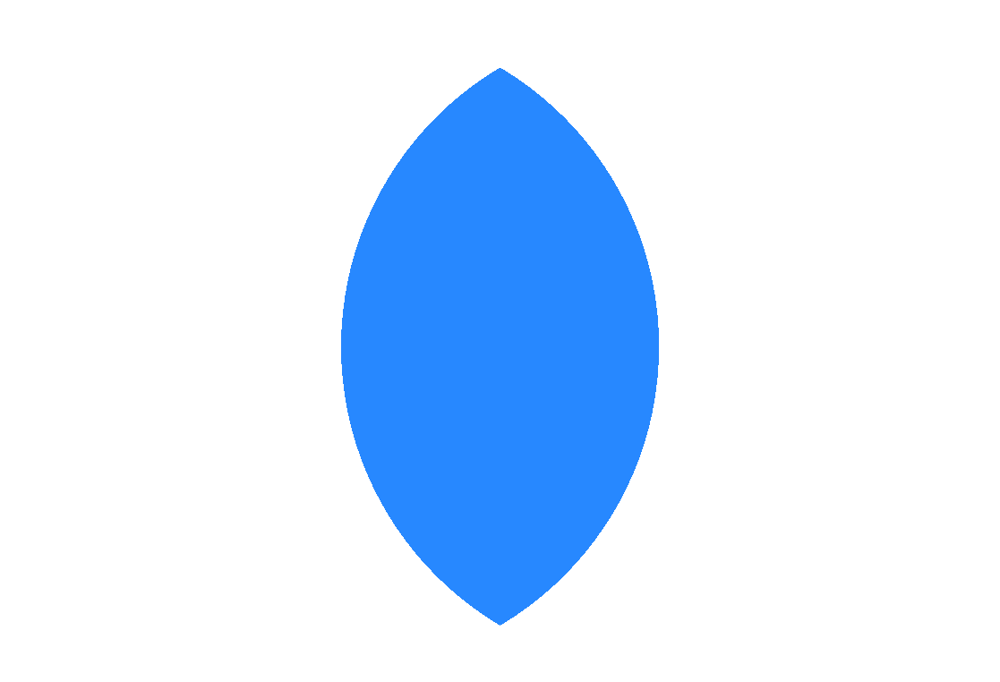

# SQL Notes

## Commands

- <h3><b style="color:#0FBAF1"> SELECT </b> & <b style="color:#0FBAF1"> FROM </b></h3>
    
  ```SQL
  -- This query returns all (*) columns in the table tableName.
  SELECT * FROM tableName

  -- This query returns specified table columns in tableName.
  SELECT tableCol1, tableCol2, ... FROM tableName
  ```
- <b style="color:#0FBAF1"> WHERE </b>
  ```SQL
  -- Returns the table with all columns but with the specified condition by WHERE
  SELECT * FROM tableName WHERE tableCol = someValue
  ```
- <b style="color:#0FBAF1"> ORDER BY </b> 
  ```SQL
  -- By default , the ordering will be ASC
  -- orders the table elements according to colName
  SELECT * FROM tableName ORDER BY colName (ASC/DESC)

  -- First orders by tCol1 then keeps that order and orders the sub rows by tCol2
  SELECT * FROM tableName ORDER BY tCol1 ASC tCol2 DESC
  ```
- <b style="color:#0FBAF1"> LIMIT </b>
  ```SQL
  -- Limits the table to the number specified
  SELECT * FROM tableName LIMIT 10
  ```
- <b style="color:#0FBAF1"> MIN </b> & <b style="color:#0FBAF1"> MAX </b>  
  ```SQL
  -- find the min value of the table col
  SELECT MIN/MAX(tableCol) FROM tableName
  ```
- <b style="color:#0FBAF1"> COUNT </b>
  ```SQL
  -- returns the number of records 
  SELECT COUNT(*) FROM tableName
  ```
- <b style="color:#0FBAF1"> AND </b>
  ```SQL
  -- chain multiple conditions 
  SELECT COUNT(*) FROM tableName WHERE tableCol1 <op> condition1 AND tableCol2 <op> condition2
  ```
- <b style="color:#0FBAF1"> AND </b>
  ```SQL
  -- chain multiple conditions 
  SELECT COUNT(*) FROM tableName WHERE tableCol1 <op> condition1 AND tableCol2 <op> condition2
  ```
- <b style="color:#0FBAF1"> BETWEEN </b>
  ```SQL
  -- between is inclusive
  SELECT COUNT(*) FROM tableName 
    WHERE 
      tableCol1 BETWEEN condition1 AND condition2
  -- is the same as
  SELECT COUNT(*) FROM tableName 
    WHERE 
      tableCol1 >= condition1 AND 
      tableCol1 <= condition2
  ```
- <b style="color:#0FBAF1"> AS </b>
  ```SQL
  -- use an alias
  SELECT 
    tableCol1 AS tableRowNewName
    FROM tableName
  ```
- <b style="color:#0FBAF1"> CASE, WHEN, THEN, ELSE </b>
  ```SQL
  -- create a new table col with own name and values that depend on conditions
  SELECT 
    CASE
      WHEN condition_1 THEN result_1
      WHEN condition_n THEN result_n
      ELSE default_result
    END AS aTableColName
  FROM tableName
  ```
- <b style="color:#0FBAF1"> WITH </b> and <b style="color:#0FBAF1"> AS </b> 
  ```SQL
  -- Returns a sub-table of tableName called newTable with respect to the condition of WHERE
  WITH newTable  AS (
    SELECT * FROM tableName WHERE tableCol1 = someValue
  )
  SELECT * FROM newTable
  ```
- <b style="color:#0FBAF1"> :: </b>
  ```SQL
  -- Casts the given tableCol current data type to the given dataType
  SELECT 
  COUNT(*)
    FROM tableName
    WHERE
    tableCol::dataType <some condition>
  ```

- <b style="color:#0FBAF1"> ROW_NUMBER() </b>
  ```SQL
  -- Returns the same amount of rows, groups them and assigns an index that depends on the grouping

  ROW_NUMBER() OVER (PARTITION BY colName1)
  ```

- <b style="color:#0FBAF1"> Order of operations </b>
  ```SQL 
  /*
    Order of execution
    FROM --> WHERE --> GROUP BY --> SELECT --> DISTINCT --> ORDER BY --> LIMIT
  */
  SELECT
  country,
  COUNT(*) AS users_count
  FROM users
  WHERE
    country IN ('us', 'ca', 'gb', 'au', 'at', 'de', 'ch')
  GROUP BY country
  ORDER BY users_count DESC
  ```
---
## Joins

<b style="color:#0FBAF1"> Syntax for joining</b>
  ```SQL 
  SELECT 
    *
  FROM 
    table_A a
  <INNER / LEFT / RIGHT/ CROSS> JOIN 
    table_B b
  ON 
    a.<col> = b.<col>
    AND
      <conditions>...
  ```

<b style="color:#0FBAF1"> LEFT JOIN</b>


<b style="color:#0FBAF1"> RIGHT JOIN</b>


<b style="color:#0FBAF1"> INNER JOIN</b>



----

## SQL Recap

### Revenue & Analytics

- <b style="color:#0FBAF1"> ROI - Return of Investment </b>
  ```SQL 
  WITH revenue AS (
    SELECT
      utm_campaign,                   /* Total made in revenue from users*/
      SUM(amount) AS total_revenue       
    FROM
      purchases p
    INNER JOIN
      users u
      ON
        p.user_id = u.id              /* Join tables on id */
        WHERE
          refunded = FALSE            /* Remove refunds */
          AND                       
          utm_campaign IS NOT NULL    /* Remove NULLS */
    GROUP BY
      1                             
  ), spends AS (
    SELECT
      utm_campaign,                   /* Total spent in marketing */
      SUM(amount) AS total_spend
    FROM
      marketing_spends
    GROUP BY
      1
  )

  SELECT 
    s.utm_campaign,                   /* ROI is the r - s / s  */
    total_spend,
    total_revenue,
    (total_revenue - total_spend) / total_spend AS ROI
    FROM 
      spends s
    LEFT JOIN 
      revenues r
      ON 
        s.utm_campaign = r.utm_campaign
  ```

- <b style="color:#0FBAF1"> ARPU - Average Revenue per User </b>
  ```SQL
  /* Free and Paying Users are counted, only distinct ones are counted */
  SELECT
    SUM(amount) / COUNT(DISTINCT(u.id)) AS ARPU
  FROM
    users u
  LEFT JOIN
    purchase p
    ON
      u.id = p.user_id
      AND
      refunded = FALSE
  WHERE
    utm_campaign IS NOT NULL
  ```

- <b style="color:#0FBAF1"> CPA - Cost Per Acquisition</b>
  ```SQL
  WITH spends AS (
    /* The amount spent on each source campaign */                  
    SELECT
      utm_source,
      SUM(amount) AS total_spend
    FROM
      marketing_spends
    GROUP BY 1
  ), 
    total_users AS (
      /* The number of users that signed up with the source */
      SELECT
        utm_source,
        COUNT(*) AS users_count
      FROM
        users
      WHERE
        utm_source IS NOT NULL
      GROUP BY 1
    )
  
  /* Join both tables together on the source and find the CPA */
  SELECT
    s.utm_source
    total_spend / users_count AS CPA
  FROM
    spends s
  INNER JOIN
    total_users u
    ON
      s.utm_source = u.utm_source
  ```
- <b style="color:#0FBAF1"> CPA - Cost Per Acquisition</b>

## AB Testing Vocab

### AB testing
<ul>
	<li>Testing two different versions of a variable.</li>
  <li>For example 2 different versions of a webpage or website and testing various different features with users</li>
</ul> 

### Name and Launch Date
<ul>
	<li>An AB test has a name : X vs Y</li>
  <li>A date that is associated with the tests in order to keep track of the tests</li>
</ul> 

### Variations, control variation
<ul>
	<li>Often A-B tests are run to test new features</li>
  <li>Therefore one of the versions is a control variation that you compare against.</li>
</ul> 

### Categorization
<ul>
	<li>This is the process of showing users different variations</li>
  <li>Behind the scenes users are randomly assigned to either use A or B versions of the variable</li>
  <li>This allows to later use it for analysis</li>
</ul> 

### Uplift
<ul>
	<li>The name given to a value for a certain metric that has improved in the A-B test</li>
  <li>For example, “the latest AB-test had an uplift of 15% in purchase rate”</li>
</ul> 

### Cohort Size
<ul>
	<li>The size of the group of people taking the A-B tests</li>
</ul> 

----

## SQL and Regex
- Regular expressions differ slightly in SQL DBs but pattern syntax is the same (POSIX).
- The boolean operator for matching regex in for PostgreSQL or Redshift is `~`

<h3>Tilde (<b style="color:#0FBAF1"> ~ </b>)</h3>

- Filters depending on the regex pattern that was used

  ```SQL
  SELECT
    *
  FROM
    table_name
  WHERE
    table_col ~ '<regex_pattern>'
  ```  

<h3><b style="color:#0FBAF1"> SUBSTRING </b><b>(<code>text_input</code>, <code>regex</code>)</b></h3>

- Extract a part of a text that matches the regex
  ```SQL
  -- The example below will return 'xyz.com'
  SELECT
    SUBSTRING('abc@xyz.com', '@(\w+.\w)')
  ```

<h3><b style="color:#0FBAF1"> REGEXP_REPLACE </b><b>(<code>text_input</code>, <code>regex</code>, <code>new_text</code>)</b></h3>

- Replace a part of the text that matches the regex

  ```SQL
  -- The example below will return '***@xyz.com'
  SELECT
    REGEXP_REPLACE('abc@xyz.com', '(.+)@', '***@')
  ```

<h3><b style="color:#0FBAF1"> REGEXP_MATCHES </b><b>(<code>text_input</code>, <code>regex</code>)</b></h3>

- All groups returned matched by a regex

  ```SQL
  -- The example below will return '{foo,bar}'
  SELECT
    REGEXP_MATCHES('foobar', '(foo)(bar)')
  ```
  ```SQL
  -- The example below will return '{foo,NULL}'
  SELECT
    REGEXP_MATCHES('foo', '(foo)(bar)?')
  ```

- Non - matching group
  ```SQL
  -- The example below will return '{foo}'
  SELECT
    REGEXP_MATCHES('foobar', '(foo)(?:bar)')
  ```
  ```SQL
  -- The example below will return '{foo}'
  SELECT
    REGEXP_MATCHES('foo', '(foo)(?:bar)?')
  ```

<h3><b style="color:#0FBAF1"> SPLIT_PART </b><b>(<code>text_input</code>, <code>delimiter</code>, <code>part_to_select</code>)</b></h3>

- Selects the part you want to keep that is separated by the delimiter
  ```SQL
  -- The example below will return 'def'
  SELECT
    SPLIT_PART('abc,def,ghi', ',', 2)
  ```


<h3>Caret (<b style="color:#0FBAF1"> ^ </b>)</h3>

- Matches the start of the text
  ```SQL
  -- The example below will return 'abc'
  SELECT
    SUBSTRING('abc@xyz.com', '^\w+')
  ```
- Negation if used inside `[]`
  ```SQL
  -- The example below will return '@'
  SELECT
    SUBSTRING('abc123@xyz.com', '[^\w]')
  ```

<h3>Dollar sign (<b style="color:#0FBAF1"> $ </b>)</h3>

- Matches the end of text

  ```SQL
  -- The example below will return 'net'
  SELECT
    SUBSTRING('abc@xyz.net', '[^\w+]')
  ```

<h3>Dot (<b style="color:#0FBAF1"> . </b> )</h3>

- Matches any character

  ```SQL
  -- The example below will return 'ab'
  SELECT
    SUBSTRING('abc@xyz.net', '.b')
  ```

<h3>Backslash (<b style="color:#0FBAF1"> \ </b>)</h3>

- A special character used for escaping other characters and other cases

  - `\n` : new line
  - `\d` : any digit (`[0-9]`)
  - `\D` : any non - digit (`[^0-9]`)
  - `\w` : any word character (`[a-zA-Z0-9_]`)

```SQL
SELECT
  SUBSTRING()
```

<h3>Curly brackets (<b style="color:#0FBAF1"> { } </b>)</h3>

- Used to specify a range

  - `a{n}` : exactly `n` number of <b>a</b> characters 
  - `a{n, }` : `n`  or more <b>a</b> characters 
  - `a{n, m}` : between `n` and `m` , <b>a</b> characters inclusive

```SQL
SELECT
  SUBSTRING()
```

<h3>Question mark, Asterisk, Plus (<b style="color:#0FBAF1"> ? </b>, <b style="color:#0FBAF1"> + </b>, <b style="color:#0FBAF1"> * </b>)</h3>

- Used to specify a range

  - `?` : matches previous token either 0 or 1 times 
  - `*` : matches previous token between 0 and &#8734;
  - `+` : matches previous token between 1 and &#8734;

```SQL
SELECT
  SUBSTRING()
```

<h3>Square Brackets (<b style="color:#0FBAF1"> [ ] </b>)</h3>

- Set of characters to match a single character
- Can define a range of characters

```SQL
SELECT
  -- The example below will return 'aclg'
  SUBSTRING('aclgeohn', '[a-l]+')
```

<h3>Parentheses (<b style="color:#0FBAF1"> ( ) </b>)</h3>

- Define a group of characters
- Allows special characters to be attached
- Multiple search patterns within a single regex and can be manipulated separately

  - `(<expr>)` : matches the first instance of the expression 

```SQL
SELECT
  SUBSTRING()
```

<h3>Pipe (<b style="color:#0FBAF1"> | </b>)</h3>

- Logical OR
- Specify multiple search patterns in a single group
```SQL
SELECT
  SUBSTRING()
```

----
## SQL at Work

- <b style="color:#0FBAF1"> 1 = 1 </b>
  ```SQL
  -- Use 1 = 1 to easily comment conditions to not let 'AND's hang
  SELECT 
    *
  FROM 
    tableA
  WHERE
    1 = 1
    AND
    tableCol1 <op> condition
    AND
    ...
  ```

  - <b style="color:#0FBAF1"> RANDOM() </b>
  ```SQL
  -- Generates a random number between [0, 1)
  SELECT 
    RANDOM() as random_number
  ```

----

## Manipulating and updating tables

- <b style="color:#0FBAF1"> INSERT INTO </b>
  ```SQL
  -- Generates a random number between [0, 1)
  INSERT INTO users (email, first_name, last_name, country)
  VALUES ('foo@example.org', 'Foo', 'Foo', 'by'), 
          ('bar@example.org', 'Bar', 'Bar', 'us');
  ```

- <b style="color:#0FBAF1"> UPDATE </b>
  ```SQL
  UPDATE users
  SET 
    signup_date = created_at::date,
    status = 'free'
  WHERE
    id IN (8391, 8392)
  ```

- <b style="color:#0FBAF1"> UPDATE </b>
  ```SQL
  DELETE 
  FROM users
  WHERE
    id IN (8391, 8392)
  ```