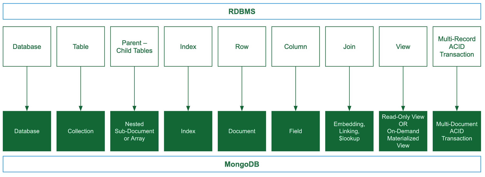

# MongoDB - M100 Notes

## Contents
[MongoDB M100 Notes](#mongodb---m100-notes)
  - [Chapter 1 - Concepts of RMDBS and MongoDB](#bchapter-1---concepts-of-rmdbs-and-mongodbb)
  - [Chapter 2 - Modelling for mongoDB](#bchapter-2---modelling-for-mongodbb)

## <b>Chapter 1 - Concepts of RMDBS and MongoDB</b>
[To the Top](#contents)
### <b>Database Terminology</b>

### <b>DB Terminology Table</b>

<table>
  <tr>
    <th>RDBMS</th>
    <th>MongoDB</th>
  </tr>
  <tr>
    <td>Database</td>
    <td>Database</td>
  </tr>
  <tr>
    <td>Table</td>
    <td>Collection</td>
  </tr>
  <tr>
    <td>Parent-Child Tables</td>
    <td>Nested Sub-Docs & Arrays</td>
  </tr>
  <tr>
    <td>Index</td>
    <td>Index</td>
  </tr>
  <tr>
    <td>Row</td>
    <td>Document</td>
  </tr>
  <tr>
    <td>Column</td>
    <td>Field</td>
  </tr>
  <tr>
    <td>Join</td>
    <td>Embedding, Linking, <code>$lookup</code></td>
  </tr>
  <tr>
    <td>View</td>
    <td>Read Only or On-demand materialized view</td>
  </tr>
  <tr>
    <td>Multi-record ACID transaction</td>
    <td>Multi-record ACID transaction</td>
  </tr>
</table>

### <b>ACID</b>
MongoDB supports ACID. A transaction guarantees ACID for multiple document writes
<ul>
	<li><b style="color:#32a852">Atomicity</b></li>
	
Transactions are all or nothing

  <li><b style="color:#32a852">Consistency</b></li>
	
Only valid data is saved

  <li><b style="color:#32a852">Isolation</b></li>
	
Transactions do not affect each other

  <li><b style="color:#32a852">Durability</b></li>
	
Written data will not be lost

</ul>
Summary
<ul>
	<li>Fewer transactions means minimal performance impact</li>
  <li>Avoid long running transactions</li>
  <li>Prefer the document model to limit updates to a single document to achieve ACID over transactions</li>
</ul>

### <b>Read/Write Operation Guarantees</b>
A guarantee that a write will not be lost is called durability
<ul>
	<li><b style="color:#32a852">writeConcern</b></li>
	
The durability guarantee for a write operation

  <li><b style="color:#32a852">readConcern</b></li>
	
The guarantee that a read operation will get durable data

  <li><b style="color:#32a852">readPreference</b></li>
	
is the preferred node to read from

</ul>

---
## <b>Chapter 2 - Modelling for mongoDB</b>
[To the Top](#contents)

### <b>Flexible modeling for a traditional Relational Database</b>

### <b>Simple Methodology</b>
<ul>
	<li><b style="color:#32a852">Phase 1: Describe the workload</b></li>
	<ul>
		<li>What operations are we modeling for</li>
    <li>Quantify and qualify the read/write operations</li>
    <li>outputs are the list of operations and which of these are important</li>
	</ul>
  <li><b style="color:#32a852">Phase 2: Model the relationships</b></li>
	<ul>
		<li>Identify the one-to-one, one-to-many, many-to-many relationships</li>
    <li>Pick between embed or linking documents for one/many - to  many </li>
	</ul>
  <li><b style="color:#32a852">Phase 3: Apply Patterns</b></li>
	<ul>
		<li>Recognize and apply any patterns that can be used</li>
    <li>Addresses problems in performance, maintenance or simplicity requirements</li>
	</ul>
</ul>

#### <b>Describing the Workload</b>
<ul>
	<li><b style="color:#32a852">Understand the workload</b></li>
	<ul>
		<li>What Query ?</li>
    <li>Quantify the query (reads-writes/time)</li>
    <li>Tolerance for the read-writes</li>
	</ul>
  <li><b style="color:#32a852">Data Staleness</b></li>
	Identify the type of staleness for the tolerance
  <ul>
		<li>Must access latest version</li>
    <li>Staleness is acceptable</li>
    <li>Staleness as product from a secondary server or computation</li>
	</ul>
  <li><b style="color:#32a852">Sizing</b></li>
	<ul>
		<li>Calculate the size of the data set, how long to hold data for, r-w operations</li>
	</ul>
</ul>

#### <b>Relationships</b>
Need to identify if to embed or reference/link.
<ul>
	<li><b style="color:#32a852">Embedding</b></li>
	<ul>
		<li>No Foreign Key</li>
    <li>No Integrity check needed</li>
    <li>Cascading deletes is implicit</li>
	</ul>
  <li><b style="color:#32a852">Referencing/Linking</b></li>
	<ul>
		<li>Similar to RDBMS</li>
    <li>Use <code>$lookup</code> to join documents</li>
    <li>Use sub queries for the second collection</li>
	</ul>
</ul>

#### <b>Rules</b>
<ul>
	<li><b style="color:#32a852">Constraint - physical constraints</b></li>
	<ul>
		<li>Reference - if "many" relationship is large</li>
    <li>Reference - physical disk limitations</li>
	</ul>
  <li><b style="color:#32a852">Integrity - R-W to maintain consistency</b></li>
	<ul>
		<li>Embed - for read operations</li>
    <li>Embed - for one-to-one & one-to-many relationships</li>
    <li>Reference - for many-to-many relationships </li>
	</ul>
  <li><b style="color:#32a852">Data Expiration</b></li>
	<ul>
		<li>Embed - data that is deleted together at a given time</li>
	</ul>
  <li><b style="color:#32a852">Default - Embed > Reference </b></li>
</ul>

#### <b>Applying Patterns - GOTO M320</b>
Just used to improve performance and migrate schemas. However be careful of data duplication and staleness

### <b>Validation</b>
<ul>
	<li>Uses JSON schemes for validation</li>
  <li>Includes the option to have required fields/types/values</li>
  <li>Validate documents with multiple versions of schemas</li>
  <li>Arrays and sub-documents are supported</li>
</ul>

### <b>Sharding</b>
<ul>
	<li>Shards contain a partition of the overall data</li>
  <li>Contains the shard key to identify which shard to r/w operations from</li>
  <li>Queries that do not use keys, will not scale</li>
  <li>Consider when to use for r/w operation and how to scale</li>
</ul>

### <b>Data Integrity</b>
<ul>
	<li>Maintaining the accuracy and freshness of the data</li>
  <li>Entities will always have a unique primary key assigned automatically</li>
  <li>No support for foreign keys across collections</li>
  <li>Foreign keys are not required in relationships modeled by embedding</li>
  <li>Data is restricted to a type and set of values</li>
  <li>Change streams for integrity checks automatically triggered on any changes</li>
</ul>