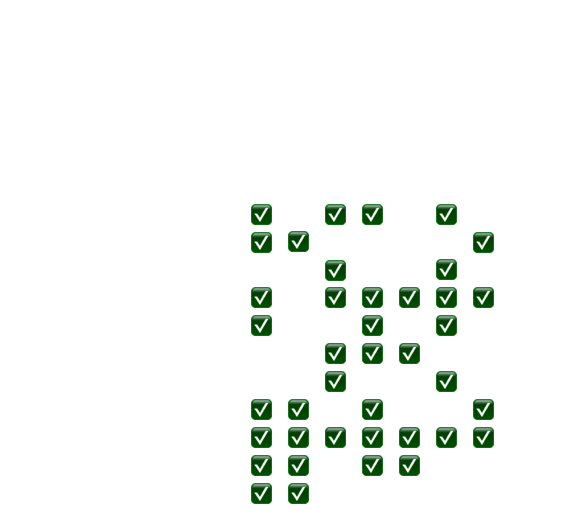

# MongoDB - M320 Notes

## Contents

[MongoDB M320 Notes](#mongodb---m320-notes)
- [Patterns](#-bpatternsb)
  - [Attribute](#battribute-patternb)
  - [Extended Reference](#bextended-reference-patternb)
  - [Subset](#bsubset-patternb)
  - [Computed](#bcomputed-patternb)
  - [Bucket](#bbucket-patternb)
  - [Schema Versioning](#bschema-versioning-patternb)
  - [Tree](#btree-patternsb)
  - [Polymorphic](#bpolymorphic-patternb)
  - [Approximation](#bapproximation-patternb)
  - [Outlier](#boutlier-patternb)
- [Summary](#bsummaryb)
## <b>Patterns</b>
---
### <b>Attribute Pattern</b>
[To the Top](#contents)

#### <b style="color:#32a852">What is the pattern for ? </b>
<ul>
	<li>Lots of similar fields</li>
  <li>Want to search across many fields at once</li>
  <li>Fields present in only a small subset of documents</li>
</ul>

#### <b style="color:#32a852">How to use pattern ? </b>
<ul>
	<li>Break the field/value pairs into a document</li>
</ul>

```JSON
{
  {"colour" : "red", "size" : "large"},
  {"colour" : "blue", "size" : "small"}
}
/* gets transformed into */
{[
  {{"k" : "color", "v":"blue"},{"k" : "size", "v":"large"}},
  {{"k" : "color", "v":"red"},{"k" : "size", "v":"small"}}
]}
```

#### <b style="color:#32a852">Use case Examples? </b>
<ul>
	<li>Characteristics of a product</li>
  <li>Set of fields all having the same value type</li>
</ul>

#### <b style="color:#32a852">Pros/Cons </b>
<ul>
	<li>Easier to index</li>
  <li>Allow for non-deterministic field names</li>
  <li>Ability to qualify the relationship of the original field and value</li>         
</ul>

#### <b style="color:#32a852">Summary </b>
<ul>
	<li>Orthogonal Pattern to Polymorphism</li>
  <li>Organization for</li>
  <ul>
    <li>Common fields that need to be searched across</li>
    <li>Fields that are rare or to help manage an influx of unpredictable fields</li>
  </ul>
  <li>Reduces the number of indexes</li>  
  <li>Transpose the key/values as an array of sub-documents</li>       
</ul>

---
### <b>Extended Reference Pattern</b>
[To the Top](#contents)

#### <b style="color:#32a852">How to manage Duplication </b>
<ul>
	<li><b style="color:#">Minimize</b></li>
	<ul>
		<li>Select the fields that do not change often</li>
    <li>Bring only fields you need</li>
	</ul>
  <li><b style="color:#">After source is updated</b></li>
	<ul>
		<li>What extended references to be changed</li>
    <li>When should the extended references be updated</li>
	</ul>
  <li><b style="color:#">Sometimes duplication may be better than a unique reference</b></li>
</ul>

#### <b style="color:#32a852">What is the pattern for ? </b>
<ul>
	<li>To avoid joining data at query time, data is pre-joined</li>
</ul>

#### <b style="color:#32a852">How to use pattern </b>
<ul>
	<li>Identify the fields on the lookup side</li>
  <li>Append those fields into the main object</li>
</ul>

#### <b style="color:#32a852">Use Case Examples ? </b>
<ul>
	<li>Mobile Applications</li>
  <li>Real-time Analytics</li>
</ul>

#### <b style="color:#32a852">Pros/Cons </b>
<ul>
	<li>Faster Reads, as the documents required are embedded in the main object</li>
  <li>Reduces the number of joins and lookups</li>
  <li>May introduce lots of duplication if extended reference fields that change a lot</li>
</ul>

---

### <b>Subset Pattern</b>
[To the Top](#contents)

#### <b style="color:#32a852">What is the pattern for ? </b>
<ul>
	<li>To reduce the size of the working set that is too large to fit in RAM</li>
  <li>Usually, a large subset of the data from a document is rarely needed</li>
</ul>

#### <b style="color:#32a852">How to use pattern </b>
<ul>
	<li><b style="color:#">Split collection into 2 sub collections</b></li>
	<ul>
		<li>Most used part (small size) and least used part (larger size) of documents</li>
	</ul>
  <li><b style="color:#">Duplicate part of a 1-N or N-N relationships</b></li>
</ul>

#### <b style="color:#32a852">Use Case Examples ? </b>
<ul>
	<li>Lists of anything that contains a lot of data to process or read or take a substantial amount of memory</li>
  <li>For example a list of reviews</li>
</ul>

#### <b style="color:#32a852">Pros/Cons </b>
<ul>
	<li>Smaller working sets so documents retrieved faster</li>
  <li>More round trips from and to server, with more space used in disk as data is duplicated</li>
</ul>

#### <b style="color:#32a852">Summary </b>
<ul>
	<li>Reduces working set by splitting information</li>    
</ul>

---

### <b>Computed Pattern</b>
[To the Top](#contents)

#### <b style="color:#32a852">Types of operations </b>
<ul>
	<li><b style="color:#">Mathematical Operations</b></li>
	<ul>
		<li>An example would be if you had to sum numerical data that changes/gets updated</li>
    <li>To reduce computations, sum data as it comes in (rolling sum) instead of calculating it from scratch</li>
    <li>Reduces the number of read and write operations</li>
	</ul>
  <li><b style="color:#">Fan Out Operations</b></li>
  To do many tasks to represent one logical task
  <ul>
		<li>It is better to fan out on writes by grouping data at write time so during read time, it does not need to fan out.</li>
  </ul>
  <li><b style="color:#">Roll up Operations</b></li>
  Merge data together
  <ul>
		<li>Grouping categories such as time based data from smaller to larger intervals </li>
    <li>Mathematical computations are roll-ups as well </li>
    <li>Doing these operations at write time, saves computational costs at read time </li>
  </ul>
</ul>

#### <b style="color:#32a852">What is the pattern for ? </b>
<ul>
	<li>To avoid repeating computational tasks at read time, especially if they are expensive</li>
  <li>Executed on data that is frequent and produces the same result</li>
</ul>

#### <b style="color:#32a852">How to use pattern </b>
<ul>
	<li>Perform the operations at write times, and store the result in an appropriate document and collection </li>
  <li>Keep the sources of data for computation if required later on, or for analytics </li>
</ul>

#### <b style="color:#32a852">Use Case Examples ? </b>
<ul>
	<li>IOT</li>
  <li>Event Sourcing</li>
  <li>Time Series Data</li>
  <li>Frequent Aggregation Framework queries</li>
</ul>

#### <b style="color:#32a852">Pros/Cons </b>
<ul>
	<li>Read queries are faster</li>
  <li>Saving on resource such as CPU and disk</li>
  <li>Use it when you need it, as it may add complexity</li>
</ul>

#### <b style="color:#32a852">Summary </b>
<ul>
	<li>Avoid performing similar operations many times</li>    
</ul>

---

### <b>Bucket Pattern</b>
[To the Top](#contents)

#### <b style="color:#32a852">What is the pattern for ? </b>
<ul>
	<li>To avoid too many documents, or large documents</li>
  <li>A 1 to many relationship that can't be embedded if the many side is boundless</li>
</ul>

#### <b style="color:#32a852">How to use pattern </b>
<ul>
	<li>Define the optimal amount of information to group together</li>
  <li>Use arrays to store information</li>
  <li>An embedded 1 to many relationship where N documents have average of many/n sub documents</li>
</ul>

#### <b style="color:#32a852">When not to use </b>
<ul>
	<li>If there are random insertions/deletions in buckets</li>
  <li>If you need to sort across buckets</li>
  <li>Works best when the "complexity" is hidden in the application</li>
</ul>

#### <b style="color:#32a852">Use Case Examples ? </b>
<ul>
	<li>IOT</li>
  <li>DW</li>
  <li>Lots of information associated to one object</li>
</ul>

#### <b style="color:#32a852">Pros/Cons </b>
<ul>
	<li>Balance between number of data and access and size of data returned</li>
  <li>Makes data more manageable</li>
  <li>Leads to poor query results if designed incorrectly or too complex for BI tools if</li>
</ul>

#### <b style="color:#32a852">Summary </b>
<ul>
	<li>Alternative to fully embedding or fulling linking a 1 to many relationship</li>
  <li>Need a good understanding of the workload</li>    
</ul>

---

### <b>Schema Versioning Pattern</b>
[To the Top](#contents)

- Used when there is need to require no downtime updating schema.
- Schema has a version number field and corresponding value to indicate the version of schema
- This tells the application using the schema to understand how to handle the data

#### <b style="color:#32a852">Application Lifecycle</b>

On the application side of things...

<ul>
	<li style="color:#32a852">Modify Application</li>
	<ul>
		<li>The application is able to read/write all versions of documents</li>
    <li>Different handlers per version</li>
    <li>Re-shape documents before processing it</li>
	</ul>
  <li style="color:#32a852">Update all application servers</li>
	<ul>
		<li>Install updated application</li>
    <li>Remove old processes</li>
	</ul>
  <li style="color:#32a852">Once migration completed</li>
	<ul>
		<li>Can remove code that processed old schema versions</li>
	</ul>
</ul>

#### <b style="color:#32a852">Document Lifecycle</b>

On the document side of things...

<ul>
	<li style="color:#32a852">New Documents</li>
	<ul>
		<li>Any new documents are written in the latest schema version</li>
	</ul>
  <li style="color:#32a852">Existing Documents</li>
	<ul>
		<li>Update documents to transform to latest version</li>
    <li>Can be done in batches, so time is not a problem</li>
    <li>Can keep old version of documents if process is long, so can use both while updating</li>
	</ul>
</ul>

#### <b style="color:#32a852">What is the pattern for ? </b>
<ul>
	<li>To avoid downtime while updating schemas</li>
  <li>For a large volume of data where downtime is unaffordable</li>
  <li>When you don't need to update all documents</li>
</ul>

#### <b style="color:#32a852">How to use pattern </b>
<ul>
	<li>Each document has a "schema_version" field</li>
  <li>Application can handle all versions</li>
  <li>Require a stratgey to migrate the documents</li>
</ul>

#### <b style="color:#32a852">Use Case Examples ? </b>
<ul>
	<li>Applications that use a database deployed solution in production and heavily used</li>
  <li>Systems with legacy data</li>
</ul>

#### <b style="color:#32a852">Pros/Cons </b>
<ul>
	<li>No downtime</li>
  <li>In control of migration</li>
  <li>Technical debt is reduced for future as it is easy to maintain</li>
</ul>

#### <b style="color:#32a852">Summary</b>
<ul>
	<li>Avoid downtime while performing schema upgrades and be in control</li>  
</ul>

---

### <b>Tree Patterns</b>

<table>
	<tr>
		<th></th>
    <th>Ancestors</th>
    <th>Reports to</th>
    <th>Nodes under</th>
    <th>Change categories </th>
	</tr>
  <tr>
		<th>Parent References</th>
    <td>Maybe</td>
    <td>Yes</td>
    <td>Maybe</td>
    <td>Yes</td>
	</tr>
  <tr>
		<th>Child References</th>
    <td>Maybe</td>
    <td>Maybe</td>
    <td>Yes</td>
    <td>Maybe</td>
	</tr>
  <tr>
		<th>Array Ancestors</th>
    <td>Yes</td>
    <td>Yes</td>
    <td>Maybe</td>
    <td>Maybe</td>
	</tr>
  <tr>
		<th>Materialized References</th>
    <td>Yes</td>
    <td>Maybe</td>
    <td>Maybe</td>
    <td>Maybe</td>
	</tr>
  <tr>
		<th>Ancestor + Parent</th>
    <td>Yes</td>
    <td>Yes</td>
    <td>Yes</td>
    <td>Yes</td>
	</tr>
</table>


#### <b style="color:#32a852">Parent References model</b>
```JSON
{
  {"nodeName" : "nameOfNode"},
  {"parent" : "parentOfNodeName"}
}
```

#### <b style="color:#32a852">Child References model</b>
```JSON
{
  {"nodeName" : "nameOfNode"},
  {"children" : ["child1", "child2", ...]}
}
```

#### <b style="color:#32a852">Array of Ancestors</b>
```JSON
{
  {"nodeName" : "nameOfNode"},
  {"ancestors" : ["ancestor1", "ancestor2", ...]}
}
```

#### <b style="color:#32a852">Materialized Paths</b>
```JSON
{
  {"nodeName" : "nameOfNode"},
  {"ancestors" : ".ancestor1.ancestor2. ..."}
}
```
#### <b style="color:#32a852">Ancestor + Parent</b>
```JSON
{
  {"nodeName" : "nameOfNode"},
  {"parent" : "parentOfNodeName"},
  {"ancestors" : ["ancestor1", "ancestor2", ...]}
}
```

#### <b style="color:#32a852">What is the pattern for ? </b>
<ul>
	<li>To model hierarchical data structures</li>
  <li>Different patterns for different purposes to navigate tree</li>
</ul>

#### <b style="color:#32a852">How to use pattern </b>
<ul>
	<li>Different patterns to navigate tree, see above</li>
</ul>

#### <b style="color:#32a852">Use Case Examples ? </b>
<ul>
	<li>Organization charts</li>
  <li>Product categories</li>
</ul>

#### <b style="color:#32a852">Pros/Cons </b>
<ul>
	<li><b style="color:#">Child</b></li>
	<ul>
		<li>Easy to navigate to children nodes or tree descending access patterns</li>
	</ul>
  <li><b style="color:#">Parent</b></li>
	<ul>
		<li>Immediate parent node discovery and tree updates</li>
	</ul>
  <li><b style="color:#">Array of Ancestors</b></li>
	<ul>
		<li>Navigate upwards on the ancestors path</li>
	</ul>
  <li><b style="color:#">Materialized path</b></li>
	<ul>
		<li>Use RegExp to find nodes in trees</li>
	</ul>
</ul>

#### <b style="color:#32a852">Summary</b>
<ul>
	<li>Documents are good data structures to represent hierarchical data</li> 
  <li>Several different patterns to represent trees</li>
  <li>Several patterns to choose from to optimize for the specific use case</li>
</ul>

---

### <b>Polymorphic Pattern</b>
Grouping similar fields together into document.

#### <b style="color:#32a852">What is the pattern for ? </b>
<ul>
	<li>When object are similar than they are different</li>
  <li>Want to keep objects in the same collection for a simplified view</li>
</ul>

#### <b style="color:#32a852">How to use pattern </b>
<ul>
	<li>A field that keeps track of the type of the sub/document</li>
  <li>Application code has document type or has subclasses</li>
</ul>

#### <b style="color:#32a852">Use Case Examples ? </b>
<ul>
	<li>Single View</li>
  <li>Product catalogs</li>
  <li>Content Management</li>
</ul>

#### <b style="color:#32a852">Pros/Cons </b>
<ul>
	<li>Easier to implement</li>
  <li>Allow to query across a single collection</li>
</ul>

#### <b style="color:#32a852">Summary</b>
<ul>
	<li>Basic pattern and a base for other patterns such as the schema pattern</li>
</ul>

---

### <b>Approximation Pattern</b>
Approximating incoming data to reduce writes

#### <b style="color:#32a852">What is the pattern for ? </b>
<ul>
	<li>Data that is expensive to calculate</li>
  <li>If precision does not matter</li>
</ul>

#### <b style="color:#32a852">How to use pattern </b>
<ul>
	<li>Few writes, higher payload</li>
</ul>

#### <b style="color:#32a852">Use Case Examples ? </b>
<ul>
	<li>Webpage counters</li>
  <li>Any counters with tolerance to imprecision</li>
  <li>Metric statistics</li>
</ul>

#### <b style="color:#32a852">Pros/Cons </b>
<ul>
	<li>Less writes</li>
  <li>Less contention on documents</li>
  <li>Statistically valid numbers</li>
  <li>However implementation is client side (application) and the numbers are not exact</li>
</ul>

---

### <b>Outlier Pattern</b>
To handle outliers in data 

#### <b style="color:#32a852">What is the pattern for ? </b>
<ul>
	<li></li>
</ul>

#### <b style="color:#32a852">How to use pattern </b>
<ul>
	<li>Implement a design that works for majority</li>
  <li>Outliers have their own field which application handles differently</li>
</ul>

#### <b style="color:#32a852">Use Case Examples ? </b>
<ul>
	<li>Social Networks</li>
</ul>

#### <b style="color:#32a852">Pros/Cons </b>
<ul>
	<li>Optimized solution for most use cases</li>
  <li>However the differences must be handled application side</li>
  <li>Difficult for aggregation or ad hoc queries</li>
</ul>

---

### <b>Summary</b>
